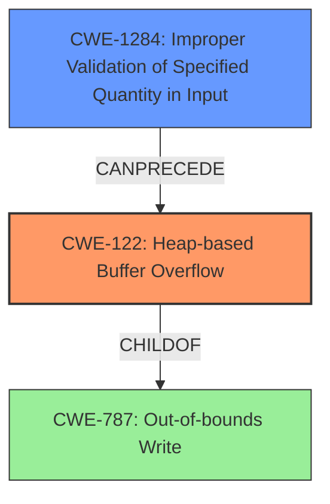

# Analysis Report for CVE-2021-45918

# Vulnerability Analysis Report: CVE-2021-45918

## Description

NHIs health insurance web service component has insufficient validation for input string length, which can result in heap-based buffer overflow attack. A remote attacker can exploit this vulnerability to flood the memory space reserved for the program, in order to terminate service without authentication, which requires a system restart to recover service.

## Vulnerability Description Key Phrases

**Rootcause:** insufficient validation for input string length
**Weakness:** heap-based buffer overflow
**Impact:** terminate service without authentication
**Attacker:** remote attacker
**Product:** NHIs health insurance web service component

## Analysis (with Relationship Data)

# Summary
| CWE ID | CWE Name | Confidence | CWE Abstraction Level | CWE Vulnerability Mapping Label | CWE-Vulnerability Mapping Notes |
|---|---|---|---|---|---|
| CWE-122 | Heap-based Buffer Overflow | 0.95 | Variant | Primary | Allowed |
| CWE-1284 | Improper Validation of Specified Quantity in Input | 0.75 | Base | Secondary | Allowed |

## Evidence and Confidence

*   **Confidence Score:** 0.85
*   **Evidence Strength:** HIGH

- **Analysis and Justification:**  
  - *Explanation:* The vulnerability description explicitly states a "**heap-based buffer overflow**" occurs due to "**insufficient validation for input string length**". This directly aligns with CWE-122 (Heap-based Buffer Overflow), which is a variant of CWE-119 (Improper Restriction of Operations within the Bounds of a Memory Buffer). The **root cause** is "**insufficient validation for input string length**", which leads to the overflow, matching CWE-1284 (Improper Validation of Specified Quantity in Input) because the input string length is a quantity that is not properly validated. The vulnerability allows a remote attacker to terminate service without authentication, highlighting the impact of the buffer overflow. The "Retriever Results" also suggest CWE-122 and CWE-1284 as potential matches. MITRE mapping guidance for CWE-122 and CWE-1284 indicates that both are ALLOWED.

  - *Relationship Analysis:* CWE-122 is a variant of CWE-119. CWE-1284 can precede CWE-122 because the lack of proper input validation leads to the buffer overflow.

- **Confidence Score:**
  - Confidence: 0.95 (High confidence due to explicit mention of "heap-based buffer overflow" and "insufficient validation")
---

## Criticism of Analysis

Okay, let's review the CWE analysis provided, focusing on the completeness, accuracy, and justification of the CWE mappings, especially considering the full CWE specifications.

**Overall Assessment:**

The analysis is generally good and identifies the key CWEs involved. The confidence scores are reasonable, and the explanations are mostly sound. The primary CWE mapping to CWE-122 (Heap-based Buffer Overflow) is correct.  The secondary mapping to CWE-1284 (Improper Validation of Specified Quantity in Input) is also a good and relevant choice.

**Detailed Review:**

| CWE ID | CWE Name | Confidence | Critique | Suggestions |
|---|---|---|---|---|
| CWE-122 | Heap-based Buffer Overflow | 0.95 |   *   **Strengths:** Correctly identifies the core vulnerability.  The explanation is clear and aligns with the CWE description. The observed examples provided in the specifications are relevant. *   **Weaknesses:**  While the relationship to CWE-787 is mentioned in the specifications, the analysis doesn't explicitly tie CWE-122 to CWE-787 (Out-of-bounds Write). While technically a child of CWE-787, this relationship could be strengthened.  The provided potential mitigations for CWE-122 are quite general.  The MITRE site is specific in stating *Carefully read both the name and description to ensure that this mapping is an appropriate fit. Do not try to 'force' a mapping to a lower-level Base/Variant simply to comply with this preferred level of abstraction.* In this case the evidence explicitly maps to heap usage, making CWE-122 correct. |   *   Explicitly mention the relationship to CWE-787 in the explanation.  *   Consider mentioning more specific mitigations related to memory management and bounds checking *within the context of heap allocation*. E.g., using `calloc` to initialize memory, smart pointers, or hardened allocators.  |
| CWE-1284 | Improper Validation of Specified Quantity in Input | 0.75 |   *   **Strengths:** A very valid and crucial supporting CWE. The explanation that insufficient validation of the input string length (the quantity) *directly leads* to the heap buffer overflow is accurate. This highlights the root cause. *   **Weaknesses:**  The analysis could benefit from more emphasis on the *type* of input being validated. Is it a length? A size? More precision would improve the mapping.  The mitigations provided for CWE-1284 are very general input validation principles. |   *   Clarify that the quantity is the "input string length".   *   Add a mitigation specifically targeted at validating the *maximum* length of the input string before allocating memory and copying the data.  Consider adding the strategy of using "accept known good" input validation, transforming it to something that does. This might include truncating the input or rejecting it. |

**Additional CWE Considerations (Based on Retriever Results and CWE Specifications):**

*   **CWE-787 (Out-of-bounds Write):**  As the parent of CWE-122, this is inherently present. While CWE-122 is more specific, consider *briefly* acknowledging CWE-787 in the explanation for completeness. The provided mitigations may be helpful.
*   **CWE-130 (Improper Handling of Length Parameter Inconsistency):** This could potentially be relevant if the *format* of the input message includes a length field that is inconsistent with the actual data length.  However, based on the description, it seems less directly relevant than CWE-1284, which focuses on the *absence* of validation. Omit for the moment, unless more details emerge.
*   **CWE-190 (Integer Overflow or Wraparound):** This *could* be a contributing factor *if* the code uses integer arithmetic to calculate buffer sizes and an overflow occurs, resulting in a smaller-than-expected buffer allocation. This is less likely *unless* further details emerge to support this. Omit unless further details emerge.
*   **CWE-770 (Allocation of Resources Without Limits or Throttling):** This *could* be a contributing factor. If the allocation size is based on the length of the input string without any limits, an attacker could cause excessive memory allocation. Consider it if there are no other size limits.
*   **CWE-125 (Out-of-bounds Read):** This would generally occur after a write out-of-bounds, when the corrupted memory is read. The analysis is focused on the root cause, so this isn't necessary, but out-of-bounds writes may result in reads.

**Justification for Not Including Other Suggested CWEs:**

*   **CWE-130 (Improper Handling of Length Parameter Inconsistency):** Unless the input *protocol* itself contains a length field that is manipulated, this is less relevant. The problem is more the *lack* of validation, not an inconsistency within the message.
*   **CWE-190 (Integer Overflow or Wraparound):** While possible, it's less direct than CWE-1284. Focus on the primary cause (lack of length validation) unless there's evidence of flawed arithmetic.
*   **CWE-193 (Off-by-one Error):** This is a *possible* contributing factor *within* the buffer overflow itself (e.g., writing one byte past the end). However, it's a *detail* of the exploitation, not a primary cause. Focus on the higher-level CWEs.
*   **CWE-121 (Stack-based Buffer Overflow), CWE-126 (Buffer Over-read):** The vulnerability is described as heap-based and focused on the overflow, respectively. While potentially related as consequences, focusing on the root cause is more valuable.

**Revised Summary Table:**

| CWE ID | CWE Name | Confidence | CWE Abstraction Level | CWE Vulnerability Mapping Label | CWE-Vulnerability Mapping Notes |
|---|---|---|---|---|---|
| CWE-122 | Heap-based Buffer Overflow | 0.95 | Variant | Primary | Allowed |
| CWE-1284 | Improper Validation of Specified Quantity in Input | 0.75 | Base | Secondary | Allowed |
| CWE-787 | Out-of-bounds Write | 0.30 | Base | Supporting | Allowed, parent of CWE-122, acknowledging root cause of overflow |

**In summary:**

The analysis is strong and correctly identifies the main CWEs. Adding a bit more detail, especially in the mitigations and the relationship to CWE-787, would further improve the analysis. The rationale for *not* including the other suggested CWEs is valid based on the information provided.

## Final Resolution

# Summary
| CWE ID | CWE Name | Confidence | CWE Abstraction Level | CWE Vulnerability Mapping Label | CWE-Vulnerability Mapping Notes |
|---|---|---|---|---|---|
| CWE-122 | Heap-based Buffer Overflow | 0.95 | Variant | Primary | Allowed |
| CWE-1284 | Improper Validation of Specified Quantity in Input | 0.75 | Base | Secondary | Allowed |

## Evidence and Confidence

*   **Confidence Score:** 0.90
*   **Evidence Strength:** HIGH

## Relationship Analysis
The primary weakness is **CWE-122 (Heap-based Buffer Overflow)**, which is a variant of **CWE-787 (Out-of-bounds Write)**. **CWE-1284 (Improper Validation of Specified Quantity in Input)** is a **rootcause** that **CanPrecede** the buffer overflow. The analysis correctly identified these relationships. The abstraction levels are appropriate: **CWE-122** is a Variant providing specificity, and **CWE-1284** is a Base CWE.

## Vulnerability Chain
The vulnerability chain starts with **CWE-1284 (Improper Validation of Specified Quantity in Input)**. The lack of proper input validation leads to an oversized input string being processed. This, in turn, results in **CWE-122 (Heap-based Buffer Overflow)** when the program attempts to allocate or copy the string into a heap buffer. The impact is service termination due to memory corruption.

## Summary of Analysis
The initial analysis and criticism are both accurate and well-justified. The vulnerability description explicitly mentions a "**heap-based buffer overflow**" due to "**insufficient validation for input string length**". This direct evidence supports the selection of **CWE-122 (Heap-based Buffer Overflow)** as the primary **WEAKNESS** and **CWE-1284 (Improper Validation of Specified Quantity in Input)** as the **ROOTCAUSE**.

The relationships between the CWEs are also important. **CWE-122** is a variant of **CWE-787**, highlighting the general class of out-of-bounds write vulnerabilities. **CWE-1284** being able to precede **CWE-122** indicates it as a **ROOTCAUSE** in the chain.

The selected CWEs are at the optimal level of specificity. **CWE-122** specifies that the overflow occurs on the heap, which is a key detail from the vulnerability description. **CWE-1284** identifies the lack of input validation as the precise **ROOTCAUSE**.

*Report generated on 2025-03-18 04:06:55*
