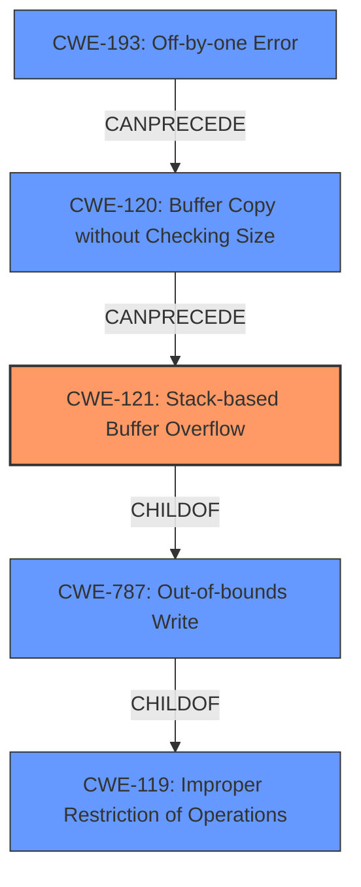

# Final Resolution for CVE-2021-45926

# Summary
| CWE ID | CWE Name | Confidence | CWE Abstraction Level | CWE Vulnerability Mapping Label | CWE-Vulnerability Mapping Notes |
|---|---|---|---|---|---|
| CWE-121 | Stack-based Buffer Overflow | 0.95 | Variant | Allowed | Primary CWE |
| CWE-787 | Out-of-bounds Write | 0.70 | Base | Allowed | Secondary Candidate |
| CWE-120 | Buffer Copy without Checking Size of Input ('Classic Buffer Overflow') | 0.60 | Base | Allowed-with-Review | Secondary Candidate |
| CWE-193 | Off-by-one Error | 0.40 | Base | Allowed | Contributory factor if incorrect size calculation is involved |

## Evidence and Confidence

*   **Confidence Score:** 0.93
*   **Evidence Strength:** HIGH

## Relationship Analysis
The primary CWE, CWE-121 (**CWE-121: Stack-based Buffer Overflow**), is a variant of CWE-787 (**CWE-787: Out-of-bounds Write**), which in turn is a child of CWE-119 (**CWE-119: Improper Restriction of Operations Within the Bounds of a Memory Buffer**). This hierarchical relationship supports the selection of CWE-121 as the most specific and appropriate classification. CWE-120 (**CWE-120: Buffer Copy without Checking Size**) represents a potential cause, and the suggestion to consider CWE-193 (**CWE-193: Off-by-one Error**) is relevant if there's an indication of an incorrect size calculation. These relationships form a vulnerability chain where an incorrect size calculation (CWE-193) could lead to a buffer copy without size checking (CWE-120), ultimately resulting in a stack-based buffer overflow (CWE-121) and an out-of-bounds write (CWE-787).

## Vulnerability Chain
The vulnerability chain starts with a potential **ROOTCAUSE** of CWE-193 (**CWE-193: Off-by-one Error**) if the buffer size calculation is flawed. This leads to CWE-120 (**CWE-120: Buffer Copy without Checking Size**), where data is copied without adequate size validation. The lack of bounds checking results in CWE-121 (**CWE-121: Stack-based Buffer Overflow**), causing data to be written beyond the allocated buffer on the stack, which is described in CWE-787 (**CWE-787: Out-of-bounds Write**). The **IMPACT** of this overflow could lead to arbitrary code execution if critical data, such as the return address, is overwritten.

## Summary of Analysis
The initial analysis correctly identifies CWE-121 (**CWE-121: Stack-based Buffer Overflow**) as the primary weakness, supported by the explicit mention of "stack-based buffer overflow" in the vulnerability description. The criticism offers valuable insights into potential causes and consequences of the overflow, specifically suggesting the inclusion of CWE-193 (**CWE-193: Off-by-one Error**) and CWE-170 (**CWE-170: Improper Null Termination**).

The final determination maintains CWE-121 as the primary CWE due to the clear evidence in the vulnerability description: "MDB Tools (aka mdbtools) 0.9.2 has a stack-based buffer overflow (at 0x7ffd0c689be0) in mdb_numeric_to_string (called from mdb_xfer_bound_data and _mdb_attempt_bind)."

The relationship analysis reinforces this decision, as CWE-121 is a variant of CWE-787 (**CWE-787: Out-of-bounds Write**) and a child of CWE-119 (**CWE-119: Improper Restriction of Operations**), indicating the appropriate level of specificity.

The inclusion of CWE-193 (**CWE-193: Off-by-one Error**) as a potential contributing factor is based on the possibility of an incorrect size calculation. However, without explicit evidence of this, it remains a secondary consideration. CWE-170 (**CWE-170: Improper Null Termination**) is not included as there is no specific mention of null termination issues.

The selected CWEs are at the optimal level of specificity, with CWE-121 providing the most accurate description of the vulnerability based on the available evidence.