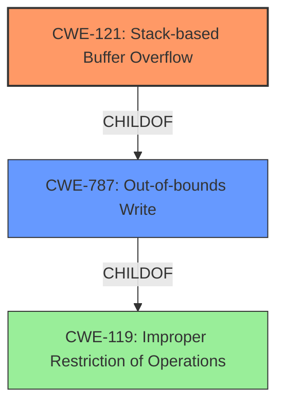

# Final Resolution for CVE-2021-45927

# Summary
| CWE ID | CWE Name | Confidence | CWE Abstraction Level | CWE Vulnerability Mapping Label | CWE-Vulnerability Mapping Notes |
|---|---|---|---|---|---|
| CWE-121 | Stack-based Buffer Overflow | 0.90 | Variant | Primary | Allowed, Stack allocation |
| CWE-787 | Out-of-bounds Write | 0.75 | Base | Secondary | Allowed, General buffer overflow |

## Evidence and Confidence

*   **Confidence Score:** 0.88
*   **Evidence Strength:** HIGH

## Relationship Analysis
The primary relationship influencing the decision is the parent-child relationship between CWE-787 (Out-of-bounds Write) and CWE-121 (Stack-based Buffer Overflow). The vulnerability description explicitly mentions "stack-based," making CWE-121 the more specific and appropriate choice. While CWE-787 describes the general condition, CWE-121 provides a more precise classification. CWE-119 was considered but correctly deemed too broad, as more specific CWEs are available.

## Vulnerability Chain
The vulnerability chain starts with the lack of proper bounds checking when processing numeric data in the `mdb_numeric_to_string` function. This leads to writing data outside the intended buffer on the stack (**CWE-121** / **CWE-787**). The consequences can include overwriting adjacent stack variables, potentially leading to arbitrary code execution.

## Summary of Analysis
The initial analysis and criticism both correctly identified CWE-121 as the primary weakness due to the explicit mention of a stack-based buffer overflow in the vulnerability description. The selection is further supported by the MITRE mapping guidance, which allows CWE-121 for stack-based buffer overflows. The relationship analysis confirms that CWE-121 is a variant of CWE-787 and a child of CWE-119, providing a more specific classification. The confidence score is increased to 0.90 due to the strong evidence and clear justification. The inclusion of CWE-787 as a secondary weakness acknowledges the general out-of-bounds write condition but prioritizes the stack-based nature of the vulnerability.

The decision is based on the provided evidence: "MDB Tools (aka mdbtools) 0.9.2 has a **stack-based buffer overflow** (at 0x7ffd6e029ee0) in mdb_numeric_to_string (called from mdb_xfer_bound_data and _mdb_attempt_bind)." This statement directly supports the choice of CWE-121.