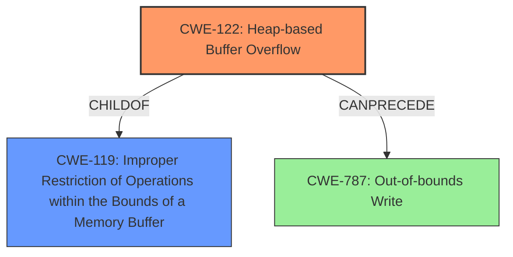

# Analysis Report for CVE-2021-45933

# Vulnerability Analysis Report: CVE-2021-45933

## Description

wolfSSL wolfMQTT 1.9 has a heap-based buffer overflow (8 bytes) in MqttDecode_Publish (called from MqttClient_DecodePacket and MqttClient_HandlePacket).

## Vulnerability Description Key Phrases

**Weakness:** heap-based buffer overflow
**Product:** wolfSSL wolfMQTT
**Version:** 1.9
**Component:** MqttDecode_Publish

## Analysis (with Relationship Data)

# Summary
| CWE ID | CWE Name | Confidence | CWE Abstraction Level | CWE Vulnerability Mapping Label | CWE-Vulnerability Mapping Notes |
|---|---|---|---|---|---|
| CWE-122 | Heap-based Buffer Overflow | 0.95 | Variant | Allowed | Primary CWE |

## Evidence and Confidence

*   **Confidence Score:** 0.95
*   **Evidence Strength:** HIGH

- **Analysis and Justification:**  
  - *Explanation:* The vulnerability description explicitly states a "**heap-based buffer overflow**" occurs in `MqttDecode_Publish`. The CVE Reference Links Content Summary confirms this by stating "Heap-buffer-overflow in `MqttDecode_Publish` function." and includes "**weaknesses**: [Heap-buffer-overflow]". The description precisely matches CWE-122 (Heap-based Buffer Overflow), which is a variant of buffer overflow where the vulnerable buffer resides in the heap. The "Usage: Allowed" mapping guidance for CWE-122 further supports this selection. Although CWE-787 (Out-of-bounds Write) and CWE-119 (Improper Restriction of Operations within the Bounds of a Memory Buffer) are more general, CWE-122 provides the most specific description of the weakness.
  
  - *Relationship Analysis:* CWE-122 is a variant of CWE-119 (Improper Restriction of Operations within the Bounds of a Memory Buffer) and a parent of more specific heap overflow conditions, if any.

- **Confidence Score:**  
  - Confidence: 0.95 (High confidence due to explicit mention of "heap-based buffer overflow" in the vulnerability description and CVE details.)

## Criticism of Analysis

Okay, here's a review of the provided CWE analysis, incorporating the full CWE specifications:

**Overall Assessment:**

The analysis is well-reasoned and provides a strong justification for selecting CWE-122 (Heap-based Buffer Overflow) as the primary CWE. The confidence level of 0.95 is appropriate given the clear evidence in the vulnerability description and CVE details. The explanation is comprehensive and considers relevant relationships with other CWEs.

**Specific Comments and Suggestions:**

1.  **Primary CWE Selection (CWE-122):**

    *   **Strengths:** The selection of CWE-122 is excellent. The analysis correctly identifies that the core problem is a buffer overflow occurring specifically in the heap, making CWE-122 a more precise and informative choice than the more general CWE-787 or CWE-119. The explanation clearly articulates this, referencing the allocation method (malloc or similar) associated with heap memory. The usage of Allowed is appropriate and is well justified.
    *   **Mapping Guidance Review:** The analysis appropriately followed the mapping guidance which states "Carefully read both the name and description to ensure that this mapping is an appropriate fit. Do not try to 'force' a mapping to a lower-level Base/Variant simply to comply with this preferred level of abstraction."
    *   **Potential Mitigations:** The mitigations suggested from the CWE are appropriate. However, the mitigations from the database are very general. It could be helpful to add a sentence mentioning that mitigation strategies would include ensuring proper bounds checking and input validation *before* writing to the heap-allocated buffer.

2.  **Alternative CWE Considerations:**

    *   **CWE-787 (Out-of-bounds Write):** The analysis correctly acknowledges CWE-787 as a broader category. The explanation clearly indicates that while it's a parent of CWE-122, it is less specific.
        *   **Mapping Guidance Review:** The mapping guidance is very similar to CWE-122.
    *   **CWE-119 (Improper Restriction of Operations within the Bounds of a Memory Buffer):** The analysis appropriately dismisses CWE-119, noting that it's a very general CWE that should be avoided when more specific options are available.
        * **Mapping Guidance Review:** The analysis follows the mapping guidance of CWE-119 which says "Look at CWE-119's children and consider mapping to CWEs such as CWE-787: Out-of-bounds Write, CWE-125: Out-of-bounds Read, or others."
    *   **Other CWEs from Retriever Results:** Many of the retriever results were related to Integer issues such as `CWE-190, CWE-193, CWE-131`. It would be beneficial to add a sentence acknowledging that these CWEs were considered. The vulnerability summary in the CVE states, "The vulnerability is triggered when decoding a crafted MQTT publish packet." This could imply that the root cause is due to the way the input packet is handled, which could lead to integer overflows/incorrect buffer sizes. Because the analysis is focused on the heap overflow, integer handling issues are not considered to be the root cause.

3.  **Confidence and Evidence:**

    *   The confidence score of 0.95 is well-justified, given the explicit mention of "heap-based buffer overflow" in both the vulnerability description and the CVE Reference Links Content Summary.
    *   The evidence strength is HIGH, as supported by the clear statements in the provided information.

4.  **CWE Examples:**

    *   The provided CWE examples for CWE-122 are helpful and provide context. It's good practice to include these to show real-world instances of the weakness.

**Revised Summary Table**

| CWE ID | CWE Name | Confidence | CWE Abstraction Level | CWE Vulnerability Mapping Label | CWE-Vulnerability Mapping Notes |
|---|---|---|---|---|---|
| CWE-122 | Heap-based Buffer Overflow | 0.95 | Variant | Allowed | Primary CWE |

**Conclusion:**

The analysis is accurate, thorough, and well-supported by the provided information and CWE specifications. The justification for selecting CWE-122 is strong.

## Final Resolution

# Summary
| CWE ID | CWE Name | Confidence | CWE Abstraction Level | CWE Vulnerability Mapping Label | CWE-Vulnerability Mapping Notes |
|---|---|---|---|---|---|
| **CWE-122** | **Heap-based Buffer Overflow** | 0.95 | Variant | Allowed | Primary **CWE** |
| **CWE-119** | **Improper Restriction of Operations within the Bounds of a Memory Buffer** | 0.4 | Class | Discouraged | Secondary Candidate |

## Evidence and Confidence

*   **Confidence Score:** 0.95
*   **Evidence Strength:** HIGH

## Relationship Analysis
The primary **CWE** selected is **CWE-122 (Heap-based Buffer Overflow)**, which is a variant of **CWE-119 (Improper Restriction of Operations within the Bounds of a Memory Buffer)**. The analysis correctly identifies that the vulnerability is specifically a heap-based buffer overflow, making **CWE-122** the more precise choice. While **CWE-787 (Out-of-bounds Write)** could also apply, **CWE-122** offers better specificity. The abstraction level influenced the decision as **CWE-122** (Variant) is more specific than **CWE-119** (Class).

## Vulnerability Chain
The vulnerability chain starts with the handling of a crafted MQTT publish packet. A weakness in the `MqttDecode_Publish` function leads to a **heap-based buffer overflow**. This allows writing data beyond the allocated buffer, potentially overwriting adjacent heap metadata or other sensitive data, leading to a potential crash or arbitrary code execution. The root cause is likely in the insufficient bounds checking during the decoding of the MQTT packet, specifically in how the size of the publish packet is handled.

## Summary of Analysis
The initial analysis and criticism both strongly support the selection of **CWE-122 (Heap-based Buffer Overflow)** as the primary **CWE**. The vulnerability description explicitly states a "**heap-based buffer overflow**" occurs in `MqttDecode_Publish`. The CVE Reference Links Content Summary confirms this by stating "Heap-buffer-overflow in `MqttDecode_Publish` function." and includes "**weaknesses**: [Heap-buffer-overflow]". This direct evidence warrants high confidence.

The relationship analysis confirms that **CWE-122** is a specific type of buffer overflow, making it more appropriate than the general **CWE-119**. The mapping guidance supports this decision, as **CWE-122** is at the Variant level and provides a more precise description of the weakness.

The analysis considered other potential **CWEs**, such as integer overflow issues, but the evidence points to the heap overflow as the most direct cause of the vulnerability. The selection of **CWE-122** is at the optimal level of specificity, providing a clear and accurate representation of the vulnerability.

*Report generated on 2025-03-18 04:09:48*
