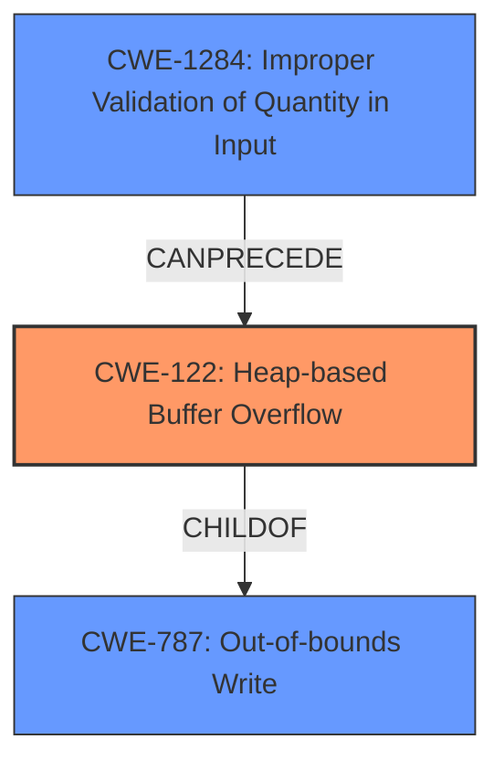

# Final Resolution for CVE-2021-45934

# Summary

| CWE ID | CWE Name | Confidence | CWE Abstraction Level | CWE Vulnerability Mapping Label | CWE-Vulnerability Mapping Notes |
|---|---|---|---|---|---|
| CWE-122 | Heap-based Buffer Overflow | 0.95 | Variant | Allowed | Primary CWE. The vulnerability is explicitly described as a heap-based buffer overflow. |
| CWE-787 | Out-of-bounds Write | 0.80 | Base | Allowed | Secondary CWE. Heap-based buffer overflows are a type of out-of-bounds write. |
| CWE-1284 | Improper Validation of Quantity in Input | 0.70 | Base | Allowed | Secondary CWE. The overflow occurs during MQTT packet decoding due to insufficient bounds checking or improper handling of length. |

## Evidence and Confidence

*   **Confidence Score:** 0.90
*   **Evidence Strength:** MEDIUM

## Relationship Analysis

The primary relationship is that CWE-122 (Heap-based Buffer Overflow) is a specific type of CWE-787 (Out-of-bounds Write). CWE-1284 (Improper Validation of Quantity in Input) can precede CWE-122, as improper validation of input length can lead to a buffer overflow.

## Vulnerability Chain

The vulnerability chain starts with the **ROOTCAUSE** of improper input validation (**CWE-1284**), which leads to a **WEAKNESS**, a heap-based buffer overflow (**CWE-122**), which is a type of out-of-bounds write (**CWE-787**).

## Summary of Analysis

The initial analysis correctly identified CWE-122 as the primary **WEAKNESS** due to the explicit description of a "heap-based buffer overflow" in the vulnerability. The criticism highlighted the need to focus on the **ROOTCAUSE** and to avoid speculative mappings.

Based on the vulnerability description and the criticism, I've updated the secondary CWEs:

*   CWE-787 (Out-of-bounds Write) is retained as a secondary **WEAKNESS** because heap-based buffer overflows are fundamentally out-of-bounds writes. Confidence is increased to 0.80 because it's a direct consequence of the primary **WEAKNESS**.
*   CWE-1284 (Improper Validation of Quantity in Input) is added as a secondary **WEAKNESS** with a confidence of 0.70. The vulnerability description mentions that the overflow occurs during MQTT packet decoding. This suggests that the **ROOTCAUSE** involves issues with parsing and validating the packet contents, specifically related to the quantity of the data being processed. This aligns with CWE-1284, which covers scenarios where a product receives input that is expected to specify a quantity (such as size or length) but does not validate or incorrectly validates that quantity.
*   CWE-125 (Out-of-bounds Read) and CWE-131 (Incorrect Calculation of Buffer Size) are removed. As the criticism noted, there is no concrete evidence to support these mappings. CWE-125 was speculative, and CWE-131 lacked specific evidence connecting it to the **ROOTCAUSE**.

The selected CWEs are at the optimal level of specificity. CWE-122 accurately captures the type of buffer overflow (heap-based), while CWE-787 provides a broader context (out-of-bounds write). CWE-1284 addresses a plausible **ROOTCAUSE** related to input validation during packet decoding.