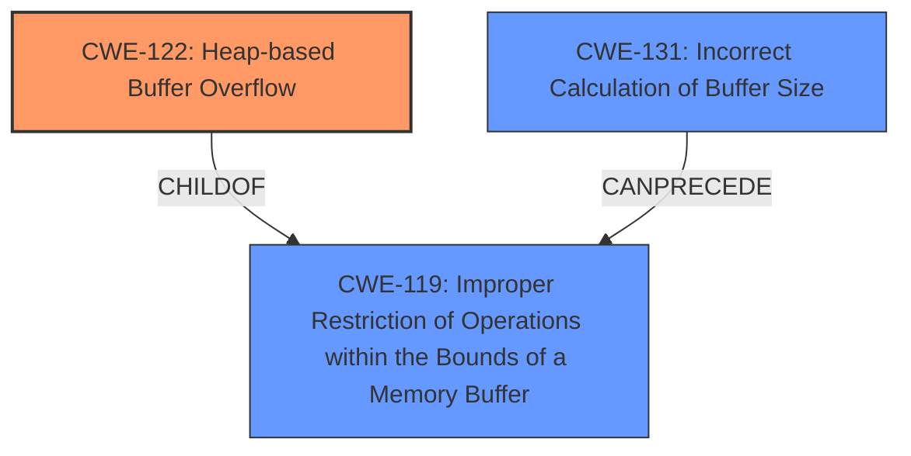

# Final Resolution for CVE-2021-45935

# Summary
| CWE ID | CWE Name | Confidence | CWE Abstraction Level | CWE Vulnerability Mapping Label | CWE-Vulnerability Mapping Notes |
|---|---|---|---|---|---|
| CWE-122 | **CWE-122: Heap-based Buffer Overflow** | 0.95 | Variant | Allowed | Primary **WEAKNESS** |
| CWE-131 | **CWE-131: Incorrect Calculation of Buffer Size** | 0.70 | Base | Allowed | Secondary Candidate **ROOTCAUSE** |

## Evidence and Confidence

*   **Confidence Score:** 0.90
*   **Evidence Strength:** HIGH

## Relationship Analysis
The primary relationship impacting the decision is the parent-child relationship between **CWE-122** and **CWE-119** (**CWE-119: Improper Restriction of Operations within the Bounds of a Memory Buffer**). **CWE-122** is a variant of **CWE-119**, making it a more specific classification for a heap-based buffer overflow. **CWE-131** can precede **CWE-119**, indicating that an incorrect buffer size calculation can lead to a buffer overflow. The abstraction levels influenced the selection by prioritizing the variant (**CWE-122**) for its specificity while acknowledging the base-level **CWE-131** as a potential underlying cause.

## Vulnerability Chain
The vulnerability chain starts with a potential **ROOTCAUSE** of **CWE-131** (**CWE-131: Incorrect Calculation of Buffer Size**). This leads to **CWE-119** (**CWE-119: Improper Restriction of Operations within the Bounds of a Memory Buffer**), and eventually results in **CWE-122** (**CWE-122: Heap-based Buffer Overflow**). The sequence flows from incorrect size calculation to a general buffer overflow and then to a specific heap-based overflow.

## Summary of Analysis
The initial analysis correctly identified **CWE-122** as the primary **WEAKNESS** due to the explicit mention of a "heap-based buffer overflow" in the vulnerability description. The criticism suggested lowering the confidence score for **CWE-131**, which was adopted in the final assessment.

The decision is primarily based on the provided evidence, specifically the vulnerability description: "Grok 9.5.0 has a heap-based buffer overflow in openhtj2kT1OpenHTJ2Kdecompress (called from std__1__packaged_task_func<std__1__bind<grkT1DecompressSchedulerdeco and std__1packaged_task<int)." This statement directly supports the selection of **CWE-122**.

The graph relationships influenced the selection by confirming that **CWE-122** is a specific type of **CWE-119**, making it the optimal choice for this vulnerability. The selected CWEs are at the optimal level of specificity because **CWE-122** accurately describes the **WEAKNESS** as a heap-based overflow, while **CWE-131** represents a plausible but unconfirmed **ROOTCAUSE**.