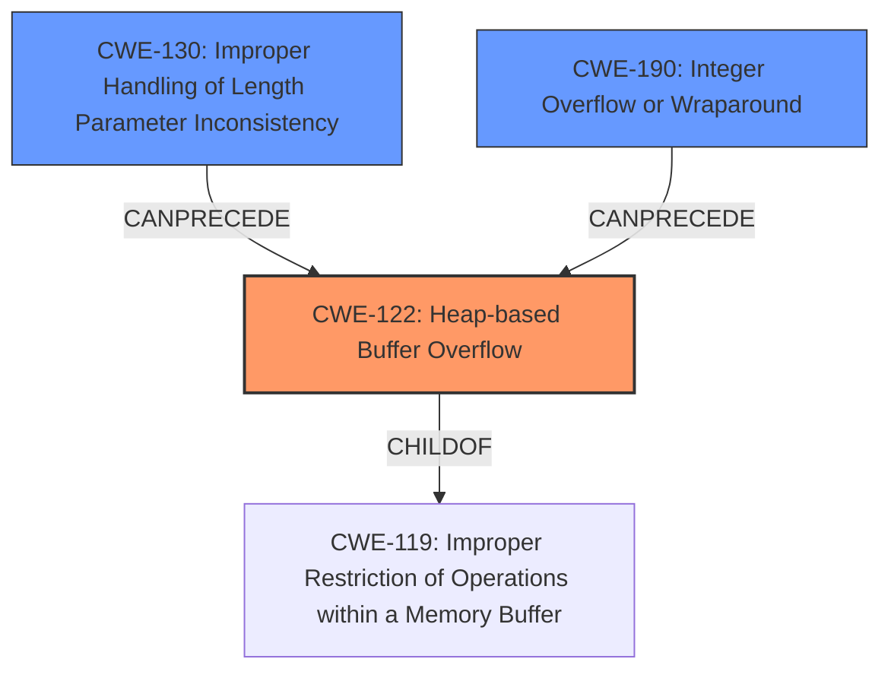

# Analysis Report for CVE-2021-45936

# Vulnerability Analysis Report: CVE-2021-45936

## Description

wolfSSL wolfMQTT 1.9 has a heap-based buffer overflow in MqttDecode_Disconnect (called from MqttClient_DecodePacket and MqttClient_WaitType).

## Vulnerability Description Key Phrases

**Weakness:** heap-based buffer overflow
**Product:** wolfSSL wolfMQTT
**Version:** 1.9
**Component:** MqttDecode_Disconnect

## Analysis (with Relationship Data)

# Summary
| CWE ID | CWE Name | Confidence | CWE Abstraction Level | CWE Vulnerability Mapping Label | CWE-Vulnerability Mapping Notes |
|---|---|---|---|---|---|
| CWE-122 | Heap-based Buffer Overflow | 0.95 | Variant | Allowed | Primary CWE |

## Evidence and Confidence

*   **Confidence Score:** 0.95
*   **Evidence Strength:** HIGH

- **Analysis and Justification:**  
  - *Explanation:* The vulnerability description explicitly states a "**heap-based buffer overflow**" in the `MqttDecode_Disconnect` function of the wolfMQTT library. The CVE Reference Links Content Summary confirms this by stating "**Heap-buffer-overflow** in the MqttDecode_Disconnect function within the wolfMQTT library." and lists "**Heap-buffer-overflow**" as one of the weaknesses. CWE-122 (Heap-based Buffer Overflow) directly addresses this type of vulnerability, where a buffer allocated on the heap is overwritten due to a lack of proper bounds checking. This aligns perfectly with the provided information. The usage for CWE-122 is ALLOWED. While other CWEs like CWE-120 (Buffer Copy without Checking Size of Input) and CWE-126 (Buffer Over-read) are related to buffer overflows, CWE-122 is the most specific and accurate representation of the stated vulnerability.
  
  - *Relationship Analysis:* CWE-122 is a variant of a buffer overflow. It's most directly related to buffer manipulation issues. This weakness can lead to various impacts, including denial of service or potentially arbitrary code execution.

- **Confidence Score:**  
  - Confidence: 0.95 (The evidence directly points to a heap-based buffer overflow, making CWE-122 the most appropriate choice).

## Criticism of Analysis

## Critique of the Analysis

Overall, the analysis is **very good and accurate**. The selection of CWE-122 (Heap-based Buffer Overflow) as the primary CWE is highly appropriate and well-justified. The confidence score of 0.95 is also reasonable. Here's a detailed breakdown:

**Strengths:**

*   **Correct Identification:** The analysis correctly identifies the core weakness as a heap-based buffer overflow.  The description of the vulnerability and the supporting CVE reference clearly point to CWE-122.
*   **Solid Justification:**  The reasoning behind choosing CWE-122 is sound and clearly explained. It acknowledges the relationship to other buffer overflow-related CWEs (CWE-120, CWE-126) but correctly argues that CWE-122 is the most specific and relevant.
*   **Evidence Strength:** The evidence strength is rated HIGH, which aligns perfectly with the explicit statement in the vulnerability description and the CVE summary.
*   **Relationship Analysis:** The relationship analysis accurately describes the nature of CWE-122 as a variant of a buffer overflow and its potential consequences.
*   **CWE Examples:** Including examples from the CWE database reinforces the understanding of the selected CWE and provides context.
*   **Thoroughness:** The analysis includes relevant CWE specifications, demonstrating a strong understanding of the CWE framework.

**Potential Minor Improvements and Considerations:**

*   **Exploring Potential Chains:** While CWE-122 is the primary weakness, it might be valuable to briefly explore potential *causes* of the heap overflow. The Retriever results suggest considerations for CWE-193, CWE-190, CWE-131, and CWE-130. Is it possible that the overflow is triggered by an integer overflow that leads to an undersized buffer allocation (CWE-190 -> CWE-131 -> CWE-122), or perhaps a length parameter inconsistency (CWE-130) that is mishandled, eventually leading to the overflow? While these are secondary, mentioning the possibility helps paint a more complete picture. Adding this consideration doesn't change the primary CWE, but adds depth.
*   **CWE-120 vs CWE-122:** The analysis does a good job of distinguishing these, but it's worth reiterating that CWE-120 is more about *how* the overflow occurs (uncontrolled copy) while CWE-122 specifies *where* the buffer resides (heap).  The core problem is a heap buffer overflow, making CWE-122 the better choice.
*   **Mitigation Discussion:** While not strictly required, briefly mentioning relevant mitigations for CWE-122 could further enhance the analysis.  For instance, you could mention the use of safer string handling functions, compiler-based buffer overflow detection mechanisms, or language-level memory safety features.  This would demonstrate a practical understanding of how to address the vulnerability.
*   **Retriever Result Relevance:** While the analysis correctly identifies CWE-122 as the primary issue, the high rankings of other CWEs in the retriever results (CWE-193, CWE-190, CWE-126) suggests there might be related aspects worth briefly addressing.  For example:
    *   **CWE-193 (Off-by-one Error):** Is an off-by-one error involved in the buffer allocation or copy operation? While not the primary issue, it could be a contributing factor.
    *   **CWE-190 (Integer Overflow or Wraparound):** Could an integer overflow in calculating the buffer size be a precursor to the heap overflow?  If so, it's worth mentioning as part of a potential exploitation chain.
    *   **CWE-126 (Buffer Over-read):** Although the primary issue is a write (overflow), is a read involved *before* the write that contributes to the vulnerability (e.g., reading a length from a packet and then using that to allocate space for a buffer without proper validation.)?
*   **CWE-119: (Broader Scope):** It's good that the analysis avoided CWE-119, as it is too broad.

**Specific Feedback on Retriever Results and Other CWEs:**

*   **CWE-193 (Off-by-one Error):**  A possible contributing factor during the copy operation. For example, `strncpy` without proper handling of null termination.
*   **CWE-190 (Integer Overflow or Wraparound):** As mentioned above, this is a common cause of buffer overflows. If the size of the Disconnect packet's payload is derived from user-controlled data and an integer overflow occurs during size calculation, it could lead to a smaller-than-expected buffer allocation, resulting in the overflow.
*   **CWE-126 (Buffer Over-read):** While the main issue is a write, consider whether an out-of-bounds *read* is involved in determining the size of the data to be copied.
*   **CWE-681 (Incorrect Conversion between Numeric Types):**  If there's a conversion between different numeric types during size calculations, this could be a contributing factor, especially if the conversion leads to truncation or loss of precision.
*   **CWE-130 (Improper Handling of Length Parameter Inconsistency):** In the MQTT protocol, length fields are used to indicate the size of data. If the code doesn't properly handle inconsistencies between the declared length and the actual data size, it could lead to the buffer overflow. This is especially relevant as the attack vector is sending a crafted MQTT Disconnect packet.
*   **CWE-131 (Incorrect Calculation of Buffer Size):** This is closely related to CWE-190. If the buffer size calculation is flawed (e.g., forgetting to account for a null terminator), it can lead to the overflow.

**Revised Summary Table (No Change in Primary CWE):**

| CWE ID    | CWE Name                         | Confidence | CWE Abstraction Level | CWE Vulnerability Mapping Label | CWE-Vulnerability Mapping Notes                                                                                                                                                                                             |
| --------- | -------------------------------- | ---------- | --------------------- | ------------------------------- | --------------------------------------------------------------------------------------------------------------------------------------------------------------------------------------------------------------------------- |
| CWE-122   | Heap-based Buffer Overflow       | 0.95       | Variant               | Allowed                         | Primary CWE                                                                                                                                                                                                                 |
| CWE-130   | Improper Handling of Length Parameter Inconsistency | 0.4 | Base | Allowed | Contributing factor: Malformed MQTT packet might have length parameter inconsistency. |
| CWE-190   | Integer Overflow or Wraparound | 0.3 | Base | Allowed | Contributing factor: Integer overflow in buffer size calculation possible. |

**Conclusion:**

The analysis is excellent in identifying and justifying CWE-122 as the primary weakness. The suggestions above are aimed at making the analysis even more comprehensive by exploring potential contributing factors and mitigations. The core assessment remains highly accurate.

## Final Resolution

# Summary
| CWE ID | CWE Name | Confidence | CWE Abstraction Level | CWE Vulnerability Mapping Label | CWE-Vulnerability Mapping Notes |
|---|---|---|---|---|---|
| CWE-122 | Heap-based Buffer Overflow | 0.95 | Variant | Allowed | Primary CWE |
| CWE-130 | Improper Handling of Length Parameter Inconsistency | 0.4 | Base | Allowed | Contributing factor: Malformed MQTT packet might have length parameter inconsistency. |
| CWE-190 | Integer Overflow or Wraparound | 0.3 | Base | Allowed | Contributing factor: Integer overflow in buffer size calculation possible. |

## Evidence and Confidence

*   **Confidence Score:** 0.9
*   **Evidence Strength:** MEDIUM

## Relationship Analysis
The primary relationship is that CWE-122 (Heap-based Buffer Overflow) is a variant of the broader class of buffer overflows. The suggested secondary CWEs, CWE-130 (Improper Handling of Length Parameter Inconsistency) and CWE-190 (Integer Overflow or Wraparound), can potentially precede CWE-122 in a vulnerability chain, where incorrect length handling or integer overflows during size calculations can lead to undersized buffer allocation and subsequent heap overflows. The abstraction levels (Variant for CWE-122, Base for CWE-130 and CWE-190) reflect an appropriate level of specificity.

## Vulnerability Chain
The vulnerability chain starts with a potential **ROOTCAUSE** in the form of CWE-190 (**Integer Overflow or Wraparound**) or CWE-130 (**Improper Handling of Length Parameter Inconsistency**). An integer overflow during buffer size calculation (CWE-190) or mishandling of length parameters in the MQTT packet (CWE-130) can lead to an undersized buffer being allocated on the heap. Subsequently, when data is copied into this buffer without proper bounds checking, a **WEAKNESS** occurs: CWE-122 (**Heap-based Buffer Overflow**), which leads to memory corruption and potential arbitrary code execution.

## Summary of Analysis
The initial analysis correctly identified CWE-122 as the primary **WEAKNESS**. The criticism provided valuable insights by suggesting potential contributing factors, specifically CWE-130 and CWE-190, which can precede CWE-122 in a vulnerability chain. The evidence for CWE-122 is strong, as the vulnerability description explicitly mentions a heap-based buffer overflow. The decision to include CWE-130 and CWE-190 as secondary CWEs is based on the possibility that these issues contribute to the overflow by causing an undersized buffer to be allocated.

The inclusion of CWE-130 is justified by the context of the vulnerability, which involves handling MQTT packets. The size of the data to be copied into the buffer is likely derived from length fields within the packet. If these length fields are not properly validated or if there are inconsistencies between the declared length and the actual data size, it can lead to the overflow.

The inclusion of CWE-190 is justified by the potential for integer overflows during buffer size calculations. If the code calculates the size of the buffer by adding multiple values together, an integer overflow can occur, resulting in a smaller-than-expected buffer being allocated.

The selected CWEs are at the optimal level of specificity. CWE-122 is a variant that specifically describes heap-based buffer overflows. CWE-130 and CWE-190 are base-level CWEs that describe specific types of errors that can contribute to the overflow.

The evidence strength is rated as MEDIUM due to the lack of explicit confirmation that CWE-130 or CWE-190 are present. However, the context of the vulnerability and the potential for these issues to contribute to the overflow warrant their inclusion as secondary CWEs. The overall confidence score is reduced to 0.9 to reflect the uncertainty regarding the presence of CWE-130 and CWE-190.

*Report generated on 2025-03-18 04:12:34*
