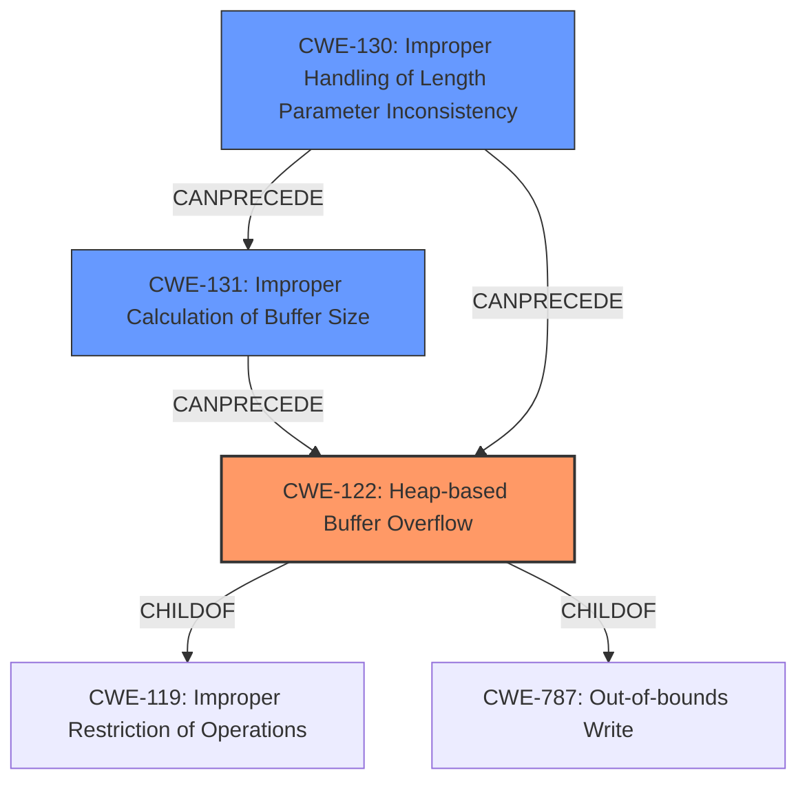

# Analysis Report for CVE-2021-45938

# Vulnerability Analysis Report: CVE-2021-45938

## Description

wolfSSL wolfMQTT 1.9 has a heap-based buffer overflow in MqttClient_DecodePacket (called from MqttClient_WaitType and MqttClient_Unsubscribe).

## Vulnerability Description Key Phrases

**Weakness:** heap-based buffer overflow
**Product:** wolfSSL wolfMQTT
**Version:** 1.9
**Component:** MqttClient_DecodePacket

## Analysis (with Relationship Data)

# Summary
| CWE ID  | CWE Name                      | Confidence | CWE Abstraction Level | CWE Vulnerability Mapping Label | CWE-Vulnerability Mapping Notes |
|---------|-------------------------------|------------|-----------------------|---------------------------------|-------------------------------|
| CWE-122 | Heap-based Buffer Overflow | 0.85       | Variant               | Allowed                         | Primary CWE                    |

## Evidence and Confidence

*   **Confidence Score:** 0.85
*   **Evidence Strength:** HIGH

- **Analysis and Justification:**  
  - *Explanation:* The vulnerability description clearly states a "**heap-based buffer overflow**" in `MqttClient_DecodePacket`. CWE-122 (Heap-based Buffer Overflow) is a Variant-level CWE that precisely describes this type of vulnerability. The description specifies that the overflow occurs in the heap portion of memory, aligning perfectly with the CWE definition. The retriever results also list CWE-122. CWE-787 (Out-of-bounds Write) is a parent of CWE-122, but CWE-122 is more specific in this case.
  
  - *Relationship Analysis:* CWE-122 is a variant of CWE-119 (Improper Restriction of Operations within the Bounds of a Memory Buffer). The vulnerability involves writing data past the end of a buffer allocated on the heap. This could potentially lead to overwriting adjacent heap metadata or other data structures, resulting in unpredictable behavior or allowing an attacker to execute arbitrary code.

- **Confidence Score:**  
  - *Example:* Confidence: 0.85 (High confidence due to direct match with the CWE description and vulnerability details)

## Criticism of Analysis

## Critique of the Analysis

The analysis is generally very good, demonstrating a strong understanding of CWEs and their relationships. The confidence score of 0.85 for CWE-122 is well-justified, given the information provided. However, there are a few areas where the analysis could be slightly improved.

**Strengths:**

*   **Accurate CWE Mapping:** The selection of CWE-122 (Heap-based Buffer Overflow) as the primary CWE is accurate and well-supported by the vulnerability description. The analysis clearly explains why it's a more specific and appropriate choice than its parent CWE-787 (Out-of-bounds Write) or CWE-119 (Improper Restriction of Operations within the Bounds of a Memory Buffer).
*   **Detailed Justification:** The reasoning behind the confidence score and the evidence strength is well-articulated, highlighting the direct match between the vulnerability description and the CWE definition.
*   **Relationship Analysis:** The explanation of the relationship between CWE-122 and CWE-119 is helpful, illustrating the broader context of buffer overflow vulnerabilities.
*   **CWE Examples:** The inclusion of observed examples for CWE-122 provides further context and validates the mapping.
*   **Relevant CWE Specifications:** The inclusion of the relevant CWE specifications enables a comprehensive review.

**Areas for Improvement:**

1.  **Retriever Results Consideration:** While the analysis correctly identifies CWE-122, it could benefit from a more thorough discussion of the retriever results. The retriever results include several CWEs with surprisingly high scores, such as CWE-193 (Off-by-one Error) and CWE-190 (Integer Overflow or Wraparound). The analysis should briefly explain why these CWEs were not chosen, even though they have relatively high retriever scores. For example, is there a possibility that an off-by-one error or an integer overflow *contributes* to the heap overflow, even though it is not the *primary* cause? Even a brief dismissal would strengthen the analysis.

2.  **Mitigation Suggestions:** The "Potential Mitigations" section could be expanded to include mitigations specific to MQTT and embedded systems where wolfMQTT is commonly used. Consider the following points based on the CWE specifications:

    *   **Language Selection:** While a full rewrite in a memory-safe language might be impractical, the analysis could acknowledge the inherent risks of C and suggest using safer alternatives for new development or components.
    *   **Libraries or Frameworks:** The analysis could suggest using safe string libraries or memory allocation tools, even within the C context, to mitigate the risk of buffer overflows. For example, using `strncpy` instead of `strcpy` even though `strncpy` must be used carefully to avoid creating new vulnerabilities.
    *   **Environment Hardening:**  The analysis should suggest compiler-based buffer overflow detection mechanisms (e.g., AddressSanitizer) during development and testing.
    *   **Input Validation:** Because MQTT is often used to pass data, especially length/size parameters, the review should suggest input validation, such as verifying that the length of a message does not exceed the buffer size, and checking for integer overflows in calculating sizes.

3.  **Attack Vector Expansion:** While the analysis mentions that an attacker needs to send crafted MQTT messages, it could elaborate on potential attack vectors, based on the known context. Does the MQTT protocol have any specific fields where a malicious length can be provided? Is there a specific sequence of MQTT commands that can trigger the vulnerability? Mentioning these specific details based on the context of MQTT will strengthen the analysis.

4. **CWE Chaining Possibilities**: Could there be other CWEs that contribute to the possibility of this Heap Overflow? Given the MQTT context, consider the possibility of a length-parameter inconsistency (CWE-130) which leads to an incorrect calculation of the buffer size (CWE-131), which leads to the heap overflow (CWE-122).

**Revised Summary Table:**

| CWE ID  | CWE Name                      | Confidence | CWE Abstraction Level | CWE Vulnerability Mapping Label | CWE-Vulnerability Mapping Notes |
|---------|-------------------------------|------------|-----------------------|---------------------------------|-------------------------------|
| CWE-122 | Heap-based Buffer Overflow    | 0.85       | Variant               | Allowed                         | Primary CWE                    |
| CWE-130 | Improper Handling of Length Parameter Inconsistency    | 0.30       | Base               | Allowed                         | Contributing Factor                    |
| CWE-131 | Incorrect Calculation of Buffer Size  | 0.30       | Base               | Allowed                         | Contributing Factor                    |

**Specific Recommendations Based on CWE Specifications:**

*   **CWE-122 (Heap-based Buffer Overflow):**

    *   The analysis correctly maps to this CWE.
    *   Based on the specification, emphasize the use of ASan and similar tools for runtime detection.
    *   In the context of MQTT, suggest reviewing the `malloc()` calls and the size calculations involved before copying data into the heap buffers.

*   **CWE-130 (Improper Handling of Length Parameter Inconsistency):**

    *   Given the MQTT protocol's nature, check if length fields are used in messages. If so, are they validated against actual data length?
    *   Mitigation 1 mentioned in the CWE specification talks about resolving inconsistencies between the size field and the actual size of the data.

*   **CWE-131 (Incorrect Calculation of Buffer Size):**

    *   Related to MQTT, were the possible transformation processes that could be converting the input data into different encoded format?
    *   Check Mitigation 1, which suggests allocating enough memory for the transformation of the data.
    *   Also, the code needs to pay close attention to byte size discrepancies.

By addressing these points, the analysis can provide a more nuanced and actionable assessment of the vulnerability, taking into account the context of the affected product and potential mitigation strategies.

## Final Resolution

# Summary
| CWE ID  | CWE Name                      | Confidence | CWE Abstraction Level | CWE Vulnerability Mapping Label | CWE-Vulnerability Mapping Notes |
|---------|-------------------------------|------------|-----------------------|---------------------------------|-------------------------------|
| CWE-122 | Heap-based Buffer Overflow | 0.85       | Variant               | Allowed                         | Primary CWE                    |
| CWE-131 | Improper Calculation of Buffer Size  | 0.40       | Base               | Allowed                         | Contributing Factor                    |
| CWE-130 | Improper Handling of Length Parameter Inconsistency    | 0.40       | Base               | Allowed                         | Contributing Factor                    |

## Evidence and Confidence

*   **Confidence Score:** 0.80
*   **Evidence Strength:** MEDIUM

## Relationship Analysis
The initial analysis correctly identified **CWE-122 (Heap-based Buffer Overflow)** as the primary issue. This is a variant of **CWE-119 (Improper Restriction of Operations within the Bounds of a Memory Buffer)** and a specific type of **out-of-bounds write (CWE-787)**. The criticism highlighted the potential for **CWE-130 (Improper Handling of Length Parameter Inconsistency)** and **CWE-131 (Improper Calculation of Buffer Size)** to contribute to the vulnerability. The analysis has now been updated to include these as contributing factors. **CWE-130** can precede **CWE-131**, as an inconsistent length parameter can lead to an incorrect buffer size calculation. Both **CWE-130** and **CWE-131** can precede **CWE-122**, as they create the conditions for a heap overflow. The abstraction levels influenced the selection, with **CWE-122** chosen for its specificity, and **CWE-130** and **CWE-131** added at the Base level to capture the root causes.

## Vulnerability Chain
The vulnerability chain starts with an **improper handling of a length parameter inconsistency (CWE-130)**, potentially within an MQTT message. This leads to an **incorrect calculation of the buffer size (CWE-131)**. Subsequently, when data is copied into the heap buffer, a **heap-based buffer overflow (CWE-122)** occurs due to insufficient buffer size. This can result in overwriting adjacent heap metadata or other data structures, leading to unpredictable behavior or potentially allowing an attacker to execute arbitrary code. There is no missing link in this chain, as each step logically follows from the previous one.

## Summary of Analysis
The initial analysis correctly identified **CWE-122 (Heap-based Buffer Overflow)** as the primary **WEAKNESS**, based on the vulnerability description that clearly states a "**heap-based buffer overflow**" in `MqttClient_DecodePacket`. The **ROOTCAUSE** of this overflow, however, might be related to how the buffer size is calculated or how the length parameter is handled.

The criticism raised important points about considering other relevant CWEs. Specifically, it suggested considering **CWE-130 (Improper Handling of Length Parameter Inconsistency)** and **CWE-131 (Improper Calculation of Buffer Size)**. These CWEs are relevant because MQTT involves parsing messages with length fields, and inconsistencies or errors in handling these fields could lead to an incorrect buffer size calculation, ultimately resulting in a heap overflow.

The inclusion of **CWE-130** and **CWE-131** is justified by the context of MQTT and the potential for length-related errors. While the vulnerability description does not explicitly mention these errors, their relevance to the protocol and the potential contribution to the **HEAP OVERFLOW** warrant their inclusion. Therefore, these have been added as contributing factors.

The selected CWEs are at the optimal level of specificity. **CWE-122** accurately describes the type of buffer overflow, while **CWE-130** and **CWE-131** capture potential root causes related to length handling and buffer size calculation in the MQTT context.

*Report generated on 2025-03-18 04:13:54*
