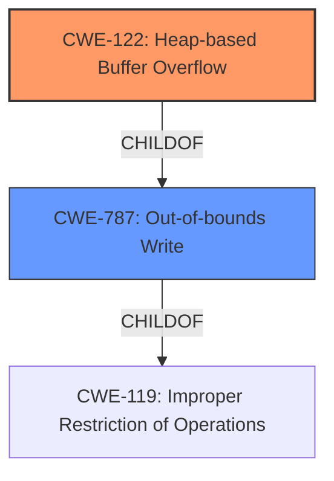

# Final Resolution for CVE-2021-45939

# Summary
| CWE ID | CWE Name | Confidence | CWE Abstraction Level | CWE Vulnerability Mapping Label | CWE-Vulnerability Mapping Notes |
|---|---|---|---|---|---|
| CWE-122 | Heap-based Buffer Overflow | 0.85 | Variant | Allowed | Primary CWE: The vulnerability description explicitly states "heap-based buffer overflow." |
| CWE-787 | Out-of-bounds Write | 0.4 | Base | Allowed | Secondary Candidate: Buffer overflows are a type of out-of-bounds write, but less specific than CWE-122 |

## Evidence and Confidence

*   **Confidence Score:** 0.80
*   **Evidence Strength:** MEDIUM

## Relationship Analysis
The primary relationship influencing the decision is the parent-child relationship between CWE-787 (**Out-of-bounds Write**) and CWE-122 (**Heap-based Buffer Overflow**). CWE-122 is a specific type of CWE-787, providing a more precise classification due to the heap allocation context. The abstraction levels also guided the selection, with CWE-122 being a Variant and CWE-787 being a Base. Although both are allowed, the Variant level offers better specificity for this particular vulnerability.

## Vulnerability Chain
The vulnerability chain starts with a **heap-based buffer overflow** (CWE-122) in the `MqttClient_DecodePacket` function. This **WEAKNESS** allows an attacker to write data beyond the allocated buffer in the heap, potentially leading to arbitrary code execution or denial of service. The **ROOTCAUSE** could be an incorrect size calculation or a missing bounds check. The final impact is a crash or arbitrary code execution.

## Summary of Analysis
The initial analysis correctly identified CWE-122 (**Heap-based Buffer Overflow**) as the primary **WEAKNESS**, given the explicit mention of "heap-based buffer overflow" in the vulnerability description. The inclusion of CWE-787 (**Out-of-bounds Write**) is valid, as it represents a broader category encompassing buffer overflows. However, the confidence score for CWE-787 was lowered to 0.4 to reflect its lower specificity compared to CWE-122.

The vulnerability description "wolfSSL wolfMQTT 1.9 has a heap-based buffer overflow in MqttClient_DecodePacket (called from MqttClient_WaitType and MqttClient_Subscribe)" provides direct evidence for classifying this as CWE-122. The graph relationships reinforce this decision, as CWE-122 is a child of CWE-787, making it a more specific and appropriate classification. The other potential CWEs (CWE-193, CWE-190, CWE-131) are potential contributing factors but lack explicit evidence in the vulnerability description to warrant their inclusion as primary or secondary CWEs.

The selected CWEs are at the optimal level of specificity, with CWE-122 providing a precise description of the **heap-based buffer overflow** and CWE-787 acknowledging the more general nature of out-of-bounds writes.