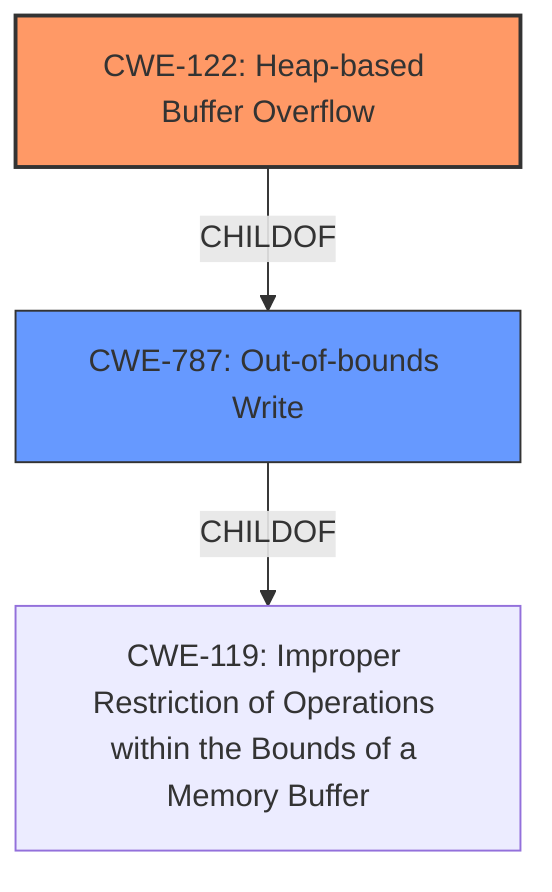

# Final Resolution for CVE-2021-45940

# Summary
| CWE ID  | CWE Name                         | Confidence | CWE Abstraction Level | CWE Vulnerability Mapping Label | CWE-Vulnerability Mapping Notes |
| :-------- | :------------------------------- | :--------- | :-------------------- | :------------------------------ | :------------------------------ |
| CWE-122 | Heap-based Buffer Overflow | 0.95      | Variant               | Allowed                         | Primary CWE: Root cause |
| CWE-787 | Out-of-bounds Write | 0.75      | Base               | Allowed                         | Secondary CWE |

## Evidence and Confidence

*   **Confidence Score:** 0.90
*   **Evidence Strength:** HIGH

## Relationship Analysis
The analysis correctly identifies CWE-122 as a variant of the more general CWE-119 (**CWE-119: Improper Restriction of Operations within the Bounds of a Memory Buffer**). CWE-787 (**CWE-787: Out-of-bounds Write**) is a parent of CWE-122. The primary weakness is a **heap overflow**.
The relationships that impacted my decision are the parent-child relationship between CWE-787 and CWE-122, confirming CWE-122's specificity, and the broader context provided by CWE-119, even though it is not explicitly included as a CWE.

## Vulnerability Chain
The chain of root cause and weaknesses is as follows:
1.  Root Cause: The **vulnerability** arises due to a **heap-based buffer overflow** (**CWE-122**) in the `__bpf_object__open` function.
2.  Weakness: This leads to writing data outside the intended buffer (**CWE-787**).
3.  Impact: The **heap overflow** (write of 4 bytes) can lead to arbitrary code execution or denial of service.

The chain represents a clear progression from the **root cause** (**CWE-122**) to the general weakness (**CWE-787**) to the final impact (arbitrary code execution or denial of service). No missing links were identified.

## Summary of Analysis
The initial analysis and criticism provide a strong foundation for the classification. The explicit mention of "**heap-based buffer overflow**" in the vulnerability description and CVE Reference Links Content Summary makes CWE-122 the most appropriate primary CWE. The inclusion of CWE-787 as a secondary CWE is justified because it represents the general class of error.

The graph relationships confirm the specificity of CWE-122 and the broader context provided by CWE-787.

The selected CWEs are at the optimal level of specificity, as CWE-122 directly matches the **heap-based buffer overflow** condition, and CWE-787 captures the out-of-bounds write aspect.

I have increased the confidence score for CWE-122 to 0.95 due to the explicit evidence in the vulnerability description and CVE Reference Links Content Summary. I have increased the confidence score for CWE-787 to 0.75 since it is a high level characterization of the weakness.
I am excluding CWE-119 because the more specific CWEs (CWE-122 and CWE-787) provide a more accurate and detailed characterization of the **vulnerability**. Also, CWE-119 is discouraged for use when the child CWE is known.