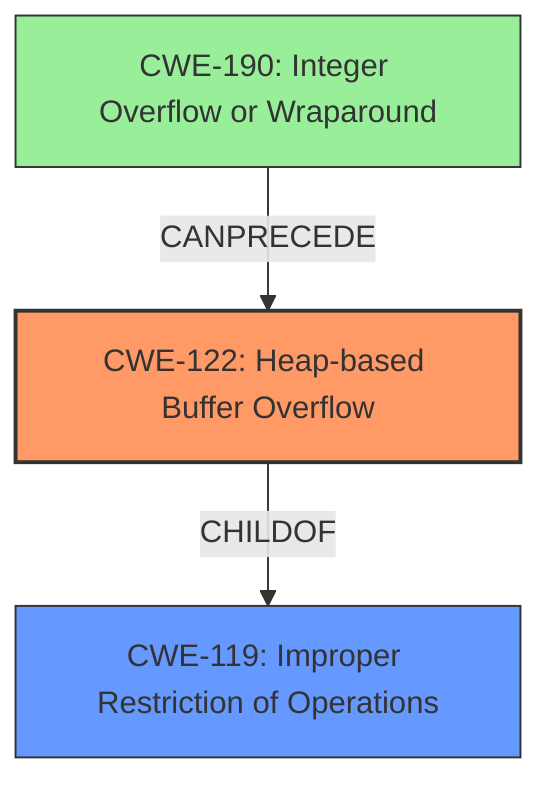

# Final Resolution for CVE-2021-45941

# Summary
| CWE ID | CWE Name | Confidence | CWE Abstraction Level | CWE Vulnerability Mapping Label | CWE-Vulnerability Mapping Notes |
|---|---|---|---|---|---|
| CWE-122 | Heap-based Buffer Overflow | 0.98 | Variant | Allowed | Acceptable-Use |
| CWE-190 | Integer Overflow or Wraparound | 0.3 | Base | Allowed | Acceptable-Use |

  - The Primary CWE should be first and noted as the Primary CWEs
  - The secondary candidate CWEs should be next and noted as secondary candidates.
  - The confidence is a confidence score 0 to 1 to rate your confidence in your assessment for that CWE.
  - The CWE Abstraction Level as one of these values: Base, Variant, Pillar, Class, Compound
  - The Mapping Notes Usage as one of these values: Allowed, Allowed-with-Review, Prohibited, Discouraged

## Evidence and Confidence

*   **Confidence Score:** 0.98
*   **Evidence Strength:** HIGH

## Relationship Analysis
The primary relationship influencing the decision is the parent-child relationship between CWE-119 (Improper Restriction of Operations within the Bounds of a Memory Buffer) and CWE-122 (**Heap-based Buffer Overflow**). CWE-122 is a variant of CWE-119, offering a more specific classification. The analysis also considered other potential CWEs based on the retriever results, but those were deemed less relevant based on the evidence provided in the vulnerability description. The abstraction level of CWE-122 (Variant) is preferred over CWE-119 (Class) due to its higher specificity. Additionally, while not explicitly stated in the original analysis, CWE-190 (**Integer Overflow or Wraparound**) can *precede* a buffer overflow by causing an incorrect calculation of the buffer size. This makes it a possible contributing factor but less likely the primary cause without explicit evidence.

## Vulnerability Chain
The vulnerability chain starts with a potential incorrect size calculation, possibly influenced by CWE-190 (**Integer Overflow or Wraparound**), leading to insufficient memory allocation on the heap (CWE-131). This then results in a **heap-based buffer overflow** (CWE-122) when data larger than the allocated buffer is written. The final impact is a crash due to the overflow.

## Summary of Analysis
The initial analysis correctly identified CWE-122 (**Heap-based Buffer Overflow**) as the primary **weakness**. The criticism highlighted the importance of explaining why other suggested CWEs are *not* the right fit and explicitly referencing the *discouraged* mapping guidance of CWE-119 (Improper Restriction of Operations within the Bounds of a Memory Buffer). The original analysis stated, "The vulnerability description clearly states a "**heap-based buffer overflow**" in `__bpf_object__open`. The CVE Reference Links Content Summary confirms this with the phrase "**Heap-buffer-overflow** in `__bpf_object__open`" and further specifies the impact as "Crash (**Heap-buffer-overflow** WRITE 8)". "

This assessment builds upon that by incorporating the suggestions from the criticism. While the evidence strongly points to CWE-122, there's a slight possibility that CWE-190 (**Integer Overflow or Wraparound**) could be a contributing factor, although there is no direct evidence of this. Thus it is added as a tertiary consideration. The decision to classify this as CWE-122 is based on the explicit description of a **heap-based buffer overflow**, making it the most accurate and specific classification available. The chosen CWE is at the optimal level of specificity because it's a variant that directly matches the vulnerability, and using the class CWE-119 is discouraged when a more specific CWE is available.