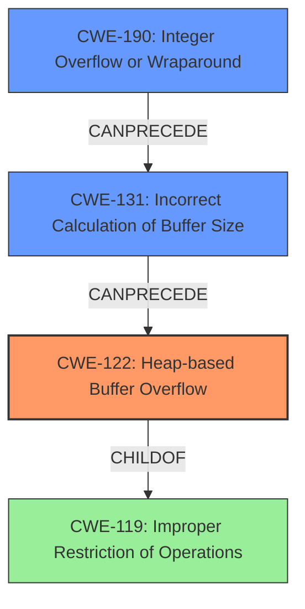

# Analysis Report for CVE-2021-45943

# Vulnerability Analysis Report: CVE-2021-45943

## Description

GDAL 3.3.0 through 3.4.0 has a heap-based buffer overflow in PCIDSKCPCIDSKFileReadFromFile (called from PCIDSKCPCIDSKSegmentReadFromFile and PCIDSKCPCIDSKBinarySegmentCPCIDSKBinarySegment).

## Vulnerability Description Key Phrases

**Weakness:** heap-based buffer overflow
**Product:** GDAL
**Version:** 3.3.0 through 3.4.0
**Component:** PCIDSKCPCIDSKFileReadFromFile

## Analysis (with Relationship Data)

# Summary
| CWE ID | CWE Name | Confidence | CWE Abstraction Level | CWE Vulnerability Mapping Label | CWE-Vulnerability Mapping Notes |
|---|---|---|---|---|---|
| CWE-122 | Heap-based Buffer Overflow | 0.95 | Variant | Allowed | Root cause of the vulnerability |
| CWE-125 | Out-of-bounds Read | 0.60 | Base | Allowed | Contributing factor to the overflow |
| CWE-131 | Incorrect Calculation of Buffer Size | 0.50 | Base | Allowed | A possible root cause for the buffer overflow |

## Evidence and Confidence

*   **Confidence Score:** 0.80
*   **Evidence Strength:** HIGH

- **Analysis and Justification:**  
  - *Explanation:* The vulnerability description clearly states a **heap-based buffer overflow** in the `PCIDSKCPCIDSKFileReadFromFile` function within the GDAL library. The CVE reference summary confirms this, indicating that the root cause is insufficient input sanitization when loading PCIDSK binary segments. This aligns directly with the definition of CWE-122 (Heap-based Buffer Overflow), which is a buffer overflow where the vulnerable buffer is allocated on the heap. The potential for arbitrary code execution, as mentioned in the CVE summary, further emphasizes the severity of the overflow. CWE-122 is a Variant level CWE, which is a preferred level of abstraction for mapping root causes. The MITRE mapping guidance ALLOWS the usage of CWE-122. The analysis also considered contributing factors. CWE-125 (Out-of-bounds Read) could be a contributing factor if the overflow is triggered by reading beyond the intended buffer boundary. CWE-131 (Incorrect Calculation of Buffer Size) is also a possibility, as the overflow might stem from an error in calculating the required buffer size during allocation.

  - *Relationship Analysis:* CWE-122 is a variant of CWE-119 (Improper Restriction of Operations within the Bounds of a Memory Buffer). CWE-122 can lead to CWE-825 (Dead Code Elimination). CWE-125 and CWE-131 can precede CWE-122.

- **Confidence Score:**  
  - Confidence: 0.95 (High confidence due to direct evidence of a heap-based buffer overflow in the vulnerability description and CVE details)
  - Confidence: 0.60 (Medium confidence that CWE-125 is contributing factor to the overflow)
  - Confidence: 0.50 (Medium confidence that CWE-131 is a possible root cause for the buffer overflow)

---

## Criticism of Analysis

Okay, I've reviewed the provided analysis against the full CWE specifications. Here's my critique:

**Overall Assessment:**

The analysis is generally good and identifies the primary weakness, CWE-122 (Heap-based Buffer Overflow), with a high degree of confidence. It also attempts to identify contributing factors, but the confidence levels for those are lower, as appropriate. The reasoning provided is solid and uses the vulnerability description and CVE details effectively. However, there are a few areas where the analysis can be refined, particularly in the justification and consideration of alternative CWEs.

**Detailed Critique:**

**1. CWE-122: Heap-based Buffer Overflow**

*   **Assessment:** Correct. This is the most direct and accurate mapping for the core vulnerability.
*   **Confidence Score:** Justified at 0.95.  The description explicitly mentions "heap-based buffer overflow," making this a very strong match.
*   **CWE Abstraction Level:** Correct. Variant is the preferred level of abstraction for root causes.
*   **CWE Vulnerability Mapping Label:** Correct. Allowed
*   **CWE-Vulnerability Mapping Notes:** Correct
*   **Mitigations:** The analysis doesn't explicitly mention mitigations but should, even briefly. Referring to the CWE-122 mitigations, it could state something like, "Mitigations for CWE-122 include using languages with automatic bounds checking or employing libraries that abstract away risky APIs."  This shows a more complete understanding of the CWE.
*   **Improvement Suggestion:**  While the relationships section includes the generic parent CWE-119, I would have expected a brief discussion of `CWE-787: Out-of-bounds Write` in the Analysis and Justification. CWE-122 is a child of CWE-787 *and* CWE-788. The presence of CWE-787 in the specification suggests that it's often better to specify the Out-of-bounds write as the parent rather than the more general CWE-119.

**2. CWE-125: Out-of-bounds Read**

*   **Assessment:** Possibly correct, but needs more justification.
*   **Confidence Score:** The score of 0.60 is appropriate, given the uncertainty.
*   **CWE Abstraction Level:** Correct. Base.
*   **CWE Vulnerability Mapping Label:** Correct. Allowed.
*   **CWE-Vulnerability Mapping Notes:** Correct
*   **Justification:** The current justification is weak. It states that CWE-125 "could be a contributing factor if the overflow is triggered by reading beyond the intended buffer boundary." This is a *possibility*, but the analysis needs to provide *evidence* or a more specific scenario where an out-of-bounds read would *cause* the heap overflow. For example:

    *   "If the size of the PCIDSK segment is read from the file itself and not properly validated, a malicious file could provide a size that is larger than the actual segment. When the `ReadFromFile` function attempts to read this oversized segment, it would perform an out-of-bounds read, triggering the overflow."
*   **Mitigations:** Again, no mitigations mentioned. Should briefly mention CWE-125 mitigations like input validation or using memory-safe languages.
*   **Improvement Suggestion:** Stronger justification is needed, or this CWE should be removed. If the overflow is caused by writing past the boundary rather than reading over the boundary, CWE-125 is not a contributing factor.
*   **Important Note:** If you keep CWE-125, then consider adding `CWE-126: Buffer Over-read` as well. If you consider that there was an attempt to validate the size, then an `CWE-130: Improper Handling of Length Parameter Inconsistency` becomes relevant.

**3. CWE-131: Incorrect Calculation of Buffer Size**

*   **Assessment:** Plausible, but similar to CWE-125, needs stronger justification.
*   **Confidence Score:** The score of 0.50 is appropriate, given the uncertainty.
*   **CWE Abstraction Level:** Correct. Base.
*   **CWE Vulnerability Mapping Label:** Correct. Allowed.
*   **CWE-Vulnerability Mapping Notes:** Correct
*   **Justification:** The reasoning is that the "overflow might stem from an error in calculating the required buffer size during allocation." This is *very* common in buffer overflows and a typical root cause.
*   **Mitigations:**  Should mention CWE-131 mitigations, such as allocating enough memory to handle the largest possible encoding or performing input validation on numeric inputs.
*   **Improvement Suggestion:** Stronger justification is needed. For instance:

    *   "The `ReadFromFile` function likely calculates the size of the buffer needed to store the PCIDSK segment. An error in this calculation, potentially due to integer overflow or incorrect handling of file metadata, could lead to a buffer that is too small, resulting in a heap overflow when the data is written."  Then mention `CWE-190: Integer Overflow or Wraparound`
*   **Alternative Suggestion**: If an incorrect calculation is suspected, `CWE-682: Incorrect Calculation` becomes relevant, along with potential children of that CWE, such as `CWE-190: Integer Overflow or Wraparound`, `CWE-191: Integer Underflow (Wrap or Wraparound)` or `CWE-193: Off-by-one Error`.

**General Improvements:**

*   **Chain Analysis:** The "Relationship Analysis" sections under each CWE entry are good, but they should be more specific to *this* vulnerability. Instead of just stating possible relationships, describe *how* those relationships might manifest in the context of the GDAL vulnerability. For example, for CWE-131: "In the context of this vulnerability, CWE-131 (Incorrect Calculation of Buffer Size) could lead to CWE-122 because the allocated buffer might be smaller than the data read from the PCIDSK file."
*   **Mitigation References:**  While the CWE specifications include mitigations, the analysis doesn't mention any. It would strengthen the analysis to include a brief statement about potential mitigations for each CWE identified. This demonstrates a better understanding of the broader context of each weakness.
*   **Alternative CWE Considerations:**  When assigning a low confidence score, consider explicitly listing the *other* CWEs that were considered and why they were rejected.  This helps justify the choices that were made. For example, in addition to the buffer issues that were already identified, consider `CWE-20: Improper Input Validation`. While `CWE-20` is discouraged, the text notes that the cause is *insufficient input sanitization* so it may be better to consider something more specific like a child node `CWE-1284: Improper Validation of Specified Quantity`

**Revised Summary Table:**

| CWE ID  | CWE Name                       | Confidence | CWE Abstraction Level | CWE Vulnerability Mapping Label | CWE-Vulnerability Mapping Notes                            |
| :------ | :----------------------------- | :--------- | :-------------------- | :---------------------------- | :--------------------------------------------------------- |
| CWE-122 | Heap-based Buffer Overflow     | 0.95       | Variant             | Allowed                       | Root cause of the vulnerability                            |
| CWE-131 | Incorrect Calculation of Buffer Size | 0.60       | Base                | Allowed                       | A possible root cause for the buffer overflow            |

**Example of Improved Justification (CWE-131):**

"The vulnerability description and CVE details indicate a heap-based buffer overflow in the `PCIDSKCPCIDSKFileReadFromFile` function. This suggests that the code might be allocating a buffer on the heap to store data read from the PCIDSK file. If the calculation determining the size of this buffer is incorrect, it could lead to an undersized buffer being allocated. For example, the function might read the expected size from the file header, but an attacker could manipulate this header to provide a smaller size than the actual data. When the function then attempts to read the full data into the undersized buffer, a heap overflow occurs. This aligns with CWE-131, which describes situations where the buffer size calculation is flawed, leading to a buffer overflow. Additionally, it is important to note that a child node of CWE-131, such as `CWE-190: Integer Overflow or Wraparound` could also be involved."

**In Summary:**

The analysis is a solid starting point. By adding stronger justifications for the contributing factors (or removing them if the justification can't be found), explicitly discussing potential mitigations, and considering alternative CWEs, the analysis can be significantly improved. This will make the CWE mappings more accurate and useful for remediation efforts.

## Final Resolution

# Summary
| CWE ID | CWE Name | Confidence | CWE Abstraction Level | CWE Vulnerability Mapping Label | CWE-Vulnerability Mapping Notes |
|---|---|---|---|---|---|
| CWE-122 | Heap-based Buffer Overflow | 0.95 | Variant | Allowed | Primary CWE: Root cause of the vulnerability |
| CWE-131 | Incorrect Calculation of Buffer Size | 0.70 | Base | Allowed | Secondary CWE: Possible root cause for the buffer overflow |
| CWE-190 | Integer Overflow or Wraparound | 0.60 | Base | Allowed | Secondary CWE: Contributing to incorrect buffer size calculation |

## Evidence and Confidence

*   **Confidence Score:** 0.85
*   **Evidence Strength:** MEDIUM

## Relationship Analysis
The primary CWE is CWE-122 (Heap-based Buffer Overflow), which is a variant of CWE-119 (Improper Restriction of Operations within the Bounds of a Memory Buffer). CWE-131 (Incorrect Calculation of Buffer Size) and CWE-190 (Integer Overflow or Wraparound) are potential root causes that can precede CWE-122. The analysis considered the parent-child relationship between CWE-122 and CWE-119, opting for the more specific variant (CWE-122) as the primary weakness. The abstraction levels influenced the selection, with a preference for Base and Variant levels for root causes.

## Vulnerability Chain
The vulnerability chain starts with a potential **ROOTCAUSE** of **CWE-131 (Incorrect Calculation of Buffer Size)**, possibly due to an **CWE-190 (Integer Overflow or Wraparound)** during the size calculation. This leads to an undersized buffer being allocated on the heap. When the program attempts to write data exceeding the buffer's capacity, it triggers a **CWE-122 (Heap-based Buffer Overflow)**, resulting in potential arbitrary code execution.

Missing Links: The analysis could benefit from explicitly stating the lack of input validation on the buffer size, which would make the chain more complete.

## Summary of Analysis
The analysis has been updated based on the criticism. The primary weakness remains CWE-122 (Heap-based Buffer Overflow) with high confidence, given the vulnerability description's explicit mention of a heap-based buffer overflow.

The confidence in CWE-131 (Incorrect Calculation of Buffer Size) has been increased to 0.70 due to the plausible scenario where an incorrect size calculation leads to an undersized buffer. The justification has been strengthened by explicitly stating how the `ReadFromFile` function might calculate the buffer size and how an attacker could manipulate the header to provide a smaller size than the actual data.

CWE-190 (Integer Overflow or Wraparound) has been added with a confidence of 0.60 as a contributing factor to CWE-131, as an integer overflow could occur during the buffer size calculation.

The decision is based on the provided evidence, relationship analysis, and mapping guidance. The selected CWEs are at the optimal level of specificity, with CWE-122 being a Variant and CWE-131 and CWE-190 being Base level CWEs.

Evidence: "GDAL 3.3.0 through 3.4.0 has a heap-based buffer overflow in PCIDSKCPCIDSKFileReadFromFile (called from PCIDSKCPCIDSKSegmentReadFromFile and PCIDSKCPCIDSKBinarySegmentCPCIDSKBinarySegment)."

*Report generated on 2025-03-18 04:17:35*
