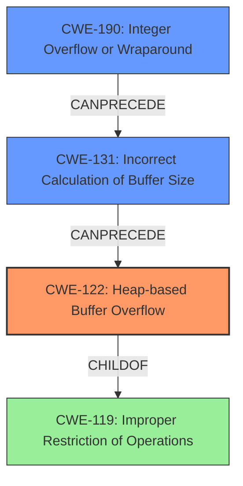

# Final Resolution for CVE-2021-45943

# Summary
| CWE ID | CWE Name | Confidence | CWE Abstraction Level | CWE Vulnerability Mapping Label | CWE-Vulnerability Mapping Notes |
|---|---|---|---|---|---|
| CWE-122 | Heap-based Buffer Overflow | 0.95 | Variant | Allowed | Primary CWE: Root cause of the vulnerability |
| CWE-131 | Incorrect Calculation of Buffer Size | 0.70 | Base | Allowed | Secondary CWE: Possible root cause for the buffer overflow |
| CWE-190 | Integer Overflow or Wraparound | 0.60 | Base | Allowed | Secondary CWE: Contributing to incorrect buffer size calculation |

## Evidence and Confidence

*   **Confidence Score:** 0.85
*   **Evidence Strength:** MEDIUM

## Relationship Analysis
The primary CWE is CWE-122 (Heap-based Buffer Overflow), which is a variant of CWE-119 (Improper Restriction of Operations within the Bounds of a Memory Buffer). CWE-131 (Incorrect Calculation of Buffer Size) and CWE-190 (Integer Overflow or Wraparound) are potential root causes that can precede CWE-122. The analysis considered the parent-child relationship between CWE-122 and CWE-119, opting for the more specific variant (CWE-122) as the primary weakness. The abstraction levels influenced the selection, with a preference for Base and Variant levels for root causes.

## Vulnerability Chain
The vulnerability chain starts with a potential **ROOTCAUSE** of **CWE-131 (Incorrect Calculation of Buffer Size)**, possibly due to an **CWE-190 (Integer Overflow or Wraparound)** during the size calculation. This leads to an undersized buffer being allocated on the heap. When the program attempts to write data exceeding the buffer's capacity, it triggers a **CWE-122 (Heap-based Buffer Overflow)**, resulting in potential arbitrary code execution.

Missing Links: The analysis could benefit from explicitly stating the lack of input validation on the buffer size, which would make the chain more complete.

## Summary of Analysis
The analysis has been updated based on the criticism. The primary weakness remains CWE-122 (Heap-based Buffer Overflow) with high confidence, given the vulnerability description's explicit mention of a heap-based buffer overflow.

The confidence in CWE-131 (Incorrect Calculation of Buffer Size) has been increased to 0.70 due to the plausible scenario where an incorrect size calculation leads to an undersized buffer. The justification has been strengthened by explicitly stating how the `ReadFromFile` function might calculate the buffer size and how an attacker could manipulate the header to provide a smaller size than the actual data.

CWE-190 (Integer Overflow or Wraparound) has been added with a confidence of 0.60 as a contributing factor to CWE-131, as an integer overflow could occur during the buffer size calculation.

The decision is based on the provided evidence, relationship analysis, and mapping guidance. The selected CWEs are at the optimal level of specificity, with CWE-122 being a Variant and CWE-131 and CWE-190 being Base level CWEs.

Evidence: "GDAL 3.3.0 through 3.4.0 has a heap-based buffer overflow in PCIDSKCPCIDSKFileReadFromFile (called from PCIDSKCPCIDSKSegmentReadFromFile and PCIDSKCPCIDSKBinarySegmentCPCIDSKBinarySegment)."