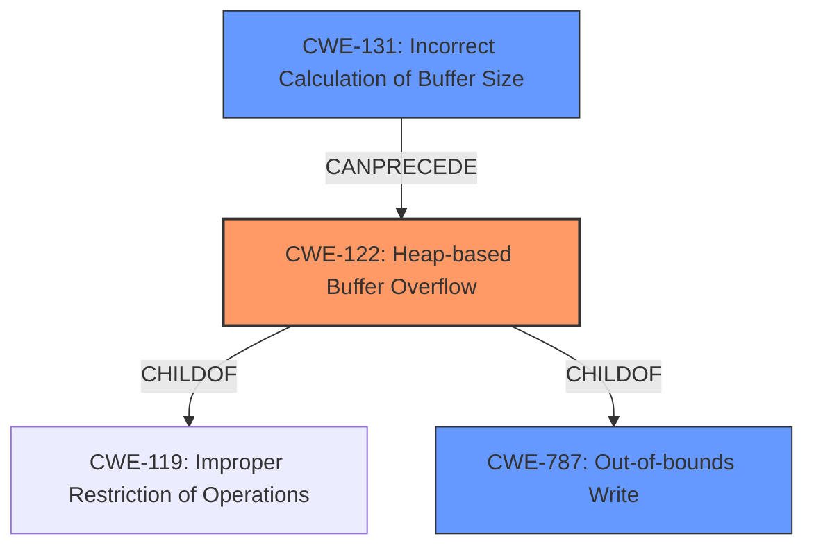

# Analysis Report for CVE-2021-45948

# Vulnerability Analysis Report: CVE-2021-45948

## Description

Open Asset Import Library (aka assimp) 5.1.0 and 5.1.1 has a heap-based buffer overflow in _m3d_safestr (called from m3d_load and AssimpM3DWrapperM3DWrapper).

## Vulnerability Description Key Phrases

**Weakness:** heap-based buffer overflow
**Product:** Open Asset Import Library (aka assimp)
**Version:** 5.1.0 and 5.1.1
**Component:** _m3d_safestr

## Analysis (with Relationship Data)

# Summary
| CWE ID | CWE Name | Confidence | CWE Abstraction Level | CWE Vulnerability Mapping Label | CWE-Vulnerability Mapping Notes |
|---|---|---|---|---|---|
| CWE-122 | Heap-based Buffer Overflow | 1.0 | Variant | Allowed | Primary CWE |
| CWE-193 | Off-by-one Error | 0.4 | Base | Allowed | Secondary Candidate |
| CWE-787 | Out-of-bounds Write | 0.4 | Base | Allowed | Secondary Candidate |

## Evidence and Confidence

*   **Confidence Score:** 0.9
*   **Evidence Strength:** HIGH

- **Analysis and Justification:**  
  - *Explanation:* The vulnerability description explicitly states a "**heap-based buffer overflow**" in the `_m3d_safestr` function of the assimp library. The CVE Reference Links Content Summary confirms this, detailing a write operation beyond the allocated buffer on the heap. CWE-122 (Heap-based Buffer Overflow) directly addresses this specific type of buffer overflow, making it the most appropriate primary mapping. The CWE description aligns perfectly: "A heap overflow condition is a buffer overflow, where the buffer that can be overwritten is allocated in the heap portion of memory, generally meaning that the buffer was allocated using a routine such as malloc()." MITRE mapping guidance allows this mapping.
  - *Explanation:* While the root cause is a heap buffer overflow, there's a possibility that the size calculation for the buffer is off by one, leading to the overflow. CWE-193 (Off-by-one Error) is a potential secondary weakness if the overflow stems from such a calculation.
  - *Explanation:* CWE-787 (Out-of-bounds Write) is also considered as a potential root cause, as the vulnerability is a **heap-based buffer overflow**. It refers to the action of writing data past the end of the intended buffer.

  - *Relationship Analysis:* CWE-122 is a variant of CWE-119 (Improper Restriction of Operations within the Bounds of a Memory Buffer), providing a more specific classification. CWE-122 is also a child of CWE-787, indicating a potential relationship with out-of-bounds write issues.

- **Confidence Score:**  
  - Confidence: 1.0 (The vulnerability description and CVE details provide strong evidence for CWE-122).
  - Confidence: 0.4 (CWE-193 and CWE-787 are secondary candidates because there's no direct evidence about the root cause.)

## Criticism of Analysis

Okay, here's a detailed review of the provided analysis, considering the full CWE specifications:

**Overall Assessment:**

The primary mapping to CWE-122 (Heap-based Buffer Overflow) is correct and well-justified. The analysis provides a strong rationale based on the vulnerability description and CVE details. The consideration of secondary candidates (CWE-193 and CWE-787) shows a good understanding of potential root causes or related weaknesses, although their confidence levels are appropriately lower.

**Detailed Critique:**

**1. CWE-122: Heap-based Buffer Overflow (Primary Mapping)**

*   **Correctness:** The mapping is accurate. The description of the vulnerability aligns perfectly with the definition of CWE-122. The fact that the overflow occurs in memory allocated on the heap is explicitly stated.
*   **Justification:** The justification is thorough. It clearly explains how the vulnerability description and CVE summary point to a heap-based buffer overflow.  The reference to `malloc()`-like routines in the CWE definition is pertinent.
*   **Confidence:**  The confidence score of 1.0 is justified. The evidence is direct and unambiguous.
*   **Mapping Guidance Compliance:** The analysis follows the mapping guidance for CWE-122, which allows its use at the Variant level.
*   **Mitigations:** The analysis doesn't specifically discuss mitigations, but the CWE-122 specification provides useful suggestions:
    *   Using languages with automatic bounds checking (mitigation 1)
    *   Using abstraction libraries for risky APIs (mitigation 2)
    *   Employing compiler-based buffer overflow detection mechanisms (mitigation 3) (e.g. /GS flag in Visual Studio, FORTIFY_SOURCE in GCC).

**2. CWE-193: Off-by-one Error (Secondary Candidate)**

*   **Correctness:** This is a reasonable secondary candidate.  It's plausible that the buffer size calculation within `_m3d_safestr` could have an off-by-one error, leading to the overflow.
*   **Justification:** The analysis correctly identifies that the size calculation *might* be off by one. It's a hypothesis rather than a definitive finding, which is reflected in the lower confidence score.
*   **Confidence:** A confidence score of 0.4 is appropriate given the lack of direct evidence.
*   **Mapping Guidance Compliance:** The analysis follows the mapping guidance for CWE-193, which allows its use at the Base level.
*   **Mitigations:** The CWE-193 specification provides the following mitigations:
    *  When copying character arrays or using character manipulation methods, the correct size parameter must be used to account for the null terminator that needs to be added at the end of the array.

**3. CWE-787: Out-of-bounds Write (Secondary Candidate)**

*   **Correctness:** The mapping to CWE-787 is accurate because a heap overflow involves writing data past the allocated buffer.
*   **Justification:** Acknowledges that the *action* of the vulnerability is writing beyond buffer boundaries.
*   **Confidence:** The confidence score of 0.4 is appropriate given the lack of direct evidence. This is more of a description of the consequence than the root cause itself.
*   **Mapping Guidance Compliance:** The analysis follows the mapping guidance for CWE-787, which allows its use at the Base level.
*   **Mitigations:** The CWE-787 specification provides the following mitigations:
        *   Use a language that does not allow this weakness to occur or provides constructs that make this weakness easier to avoid.
        *   Use a vetted library or framework that does not allow this weakness to occur or provides constructs that make this weakness easier to avoid.
        *   Use automatic buffer overflow detection mechanisms that are offered by certain compilers or compiler extensions.

**Improvements and Suggestions:**

1.  **Explore Potential Chains:**  While the analysis mentions the relationship between CWE-122 and CWE-787, it could benefit from exploring potential *chains* more explicitly.  For example:
    *   **CWE-131 (Incorrect Calculation of Buffer Size) -> CWE-122 (Heap-based Buffer Overflow)**: This chain suggests the overflow could be caused by a flawed calculation of the necessary buffer size before allocation.
    *   **CWE-190 (Integer Overflow or Wraparound) -> CWE-122**: An integer overflow might result in allocating a smaller-than-required buffer, leading to the overflow. Though less likely, it's worth considering.
    *   **CWE-20 (Improper Input Validation) -> CWE-122**: If the size of the input string is not validated before being copied into the heap-allocated buffer, it might trigger the overflow.
    *   **CWE-170 (Improper Null Termination) -> CWE-122**:  If the code doesn't ensure null termination, a later string operation might read beyond the intended boundary, potentially leading to further writes outside the buffer.

2.  **Consider CWE-120:** While CWE-122 is a better fit, *if* the `_m3d_safestr` function involves a direct buffer copy *without any size checks*, then CWE-120 (Buffer Copy without Checking Size of Input) could be considered.  However, this is less likely if any kind of size or length calculation is involved, even if flawed.

3.  **Relationship to CWE-682 (Incorrect Calculation):** Since buffer overflows often stem from incorrect calculations, consider an implicit relationship to CWE-682 (Incorrect Calculation), although this is a very high-level CWE.

4.  **Specificity in Mitigation Discussion:** The analysis could be strengthened by briefly mentioning some of the mitigations recommended by the CWE specifications for each of the mapped CWEs. This would demonstrate a more complete understanding of the vulnerability and potential remediation strategies. For example, when discussing CWE-122, mentioning compiler flags like `/GS` or `FORTIFY_SOURCE` adds practical value.

**Revised Summary Table (with Mitigation considerations)**

| CWE ID  | CWE Name                        | Confidence | CWE Abstraction Level | CWE Vulnerability Mapping Label | CWE-Vulnerability Mapping Notes                                                                                                                                                                                                                                                                                        | Mitigations                                                                                                                                                                            |
| ------- | --------------------------------- | ---------- | ----------------------- | --------------------------------- | ----------------------------------------------------------------------------------------------------------------------------------------------------------------------------------------------------------------------------------------------------------------------------------------------------------------- | --------------------------------------------------------------------------------------------------------------------------------------------------------------------------------------- |
| CWE-122 | Heap-based Buffer Overflow          | 1.0        | Variant               | Allowed                           | Primary CWE                                                                                                                                                                                                                                                                                                       | Use safer languages, abstraction libraries, compiler-based overflow detection (`/GS`, `FORTIFY_SOURCE`).                                                                              |
| CWE-193 | Off-by-one Error                  | 0.4        | Base                    | Allowed                           | Secondary Candidate                                                                                                                                                                                                                                                                                             | Verify correct size parameters when copying strings, account for null terminators.                                                                                                 |
| CWE-787 | Out-of-bounds Write               | 0.4        | Base                    | Allowed                           | Secondary Candidate (describes the consequence)                                                                                                                                                                                                                                                                   | Use safer languages/libraries, employ automatic buffer overflow detection mechanisms, input validation on length arguments, sentinel values.                                         |

**Conclusion:**

The original analysis is good and correctly identifies the primary vulnerability. The inclusion of secondary candidates demonstrates a thoughtful approach. Incorporating the suggested improvements, particularly regarding potential chains and specific mitigations, would further enhance the analysis's completeness and usefulness.

## Final Resolution

# Summary
| CWE ID | CWE Name | Confidence | CWE Abstraction Level | CWE Vulnerability Mapping Label | CWE-Vulnerability Mapping Notes |
|---|---|---|---|---|---|
| CWE-122 | **Heap-based Buffer Overflow** | 1.0 | Variant | Allowed | Primary CWE |
| CWE-131 | **Incorrect Calculation of Buffer Size** | 0.5 | Base | Allowed | Secondary Candidate |
| CWE-787 | **Out-of-bounds Write** | 0.4 | Base | Allowed | Secondary Candidate |

## Evidence and Confidence

*   **Confidence Score:** 0.9
*   **Evidence Strength:** MEDIUM

## Relationship Analysis
The primary relationship that impacted the decision was the hierarchical relationship between CWE-122 (**Heap-based Buffer Overflow**) and its parent CWE-119 (**Improper Restriction of Operations within the Bounds of a Memory Buffer**). CWE-122 is a variant of CWE-119, making it a more specific and accurate classification for this vulnerability. The possibility of a vulnerability chain involving CWE-131 (**Incorrect Calculation of Buffer Size**) leading to CWE-122 was also considered. CWE-787 (**Out-of-bounds Write**) is a parent of CWE-122, but it is too general and represents more of the consequence of the overflow rather than the root cause.

## Vulnerability Chain
The vulnerability chain starts with a potential **incorrect calculation of the buffer size (CWE-131)**. This could lead to a **heap-based buffer overflow (CWE-122)**, resulting in an **out-of-bounds write (CWE-787)**.

## Summary of Analysis
The initial analysis correctly identifies CWE-122 (**Heap-based Buffer Overflow**) as the primary weakness. The vulnerability description explicitly mentions a heap-based buffer overflow.

The criticism provided valuable suggestions, particularly exploring potential vulnerability chains. Based on this, CWE-131 (**Incorrect Calculation of Buffer Size**) is added as a secondary candidate with increased confidence, as it's a plausible root cause for the overflow. "The product does not correctly calculate the size to be used when allocating a buffer, which could lead to a buffer overflow." This aligns with the possibility that the `_m3d_safestr` function might have a flawed size calculation.

CWE-787 (**Out-of-bounds Write**) remains a secondary candidate, but it's more descriptive of the consequence of the overflow.

The selected CWEs are at the optimal level of specificity. CWE-122 is a variant that specifically addresses heap-based overflows, while CWE-131 is a base CWE that captures the potential root cause of an incorrect size calculation.

The final decision is primarily based on the vulnerability description stating a heap-based buffer overflow, along with the understanding that such overflows often stem from incorrect size calculations.

*Report generated on 2025-03-18 04:18:21*
