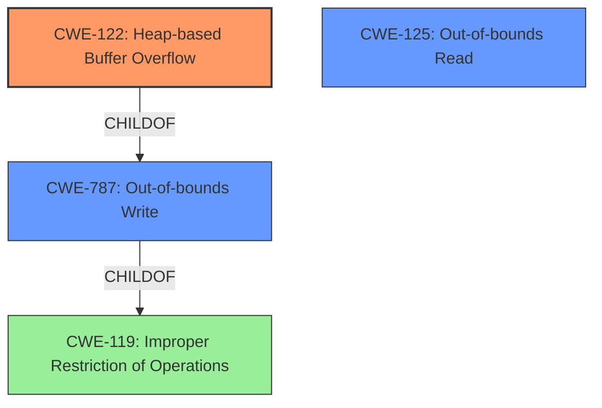

# Analysis Report for CVE-2021-45949

# Vulnerability Analysis Report: CVE-2021-45949

## Description

Ghostscript GhostPDL 9.50 through 9.54.0 has a heap-based buffer overflow in sampled_data_finish (called from sampled_data_continue and interp).

## Vulnerability Description Key Phrases

**Weakness:** heap-based buffer overflow
**Product:** Ghostscript GhostPDL
**Version:** 9.50 through 9.54.0
**Component:** sampled_data_finish

## Analysis (with Relationship Data)

# Summary
| CWE ID  | CWE Name                     | Confidence | CWE Abstraction Level | CWE Vulnerability Mapping Label | CWE-Vulnerability Mapping Notes |
| :------- | :--------------------------- | :--------- | :-------------------- | :------------------------------ | :------------------------------ |
| CWE-122 | Heap-based Buffer Overflow   | 0.95       | Variant               | Allowed                         | Primary CWE                     |
| CWE-125 | Buffer Over-read             | 0.65       | Base               | Allowed                         | Secondary Candidate             |
| CWE-787 | Out-of-bounds Write          | 0.65       | Base               | Allowed                         | Secondary Candidate             |

## Evidence and Confidence

*   **Confidence Score:** 0.90
*   **Evidence Strength:** HIGH

- **Analysis and Justification:**  
  - *Explanation:* The vulnerability description explicitly states a **heap-based buffer overflow** in the `sampled_data_finish` function within Ghostscript GhostPDL. This directly corresponds to CWE-122 (Heap-based Buffer Overflow). The CVE Reference Links Content Summary reinforces this, identifying a heap-buffer-overflow as the root cause. The description indicates that data is written beyond the boundaries of an allocated heap buffer. CWE-122 is a Variant-level CWE, which is a preferred level of abstraction.

  - *Relationship Analysis:* CWE-122 is a variant of CWE-119 (Improper Restriction of Operations within the Bounds of a Memory Buffer). CWE-787 (Out-of-bounds Write) is a parent of CWE-122, but CWE-122 is more specific to the heap. CWE-125 (Buffer Over-read) is also related as it could indicate an attempt to prevent a crash.

- **Confidence Score:**  
  - Confidence: 0.95 (High confidence due to direct evidence from the vulnerability description and CVE reference summary)

---

## Criticism of Analysis

Okay, here's a breakdown of the provided CWE analysis, incorporating the full CWE specifications, and identifying areas for critique and improvement:

**Overall Assessment:**

The analysis is generally well-reasoned and accurate, particularly in identifying CWE-122 as the primary vulnerability. The analysis considers alternative CWEs and explains why they are less suitable. However, there is room for improvement in discussing secondary CWEs and their relationships, as well as referencing specific mitigation strategies. The retriever results seem to be noisy and don't correlate well with the vulnerability.

**Detailed Critique:**

**1. CWE-122: Heap-based Buffer Overflow (Primary CWE)**

*   **Confidence:** Excellent. The analysis explicitly links the "heap-based buffer overflow" in the vulnerability description to CWE-122. The CVE Reference Links Content Summary further reinforces this.
*   **Justification:** The justification is clear and directly reflects the vulnerability description.  The reference to CWE-119 and CWE-787 are valid, explaining their relationships to CWE-122.
*   **Mapping Guidance:** The analysis correctly notes that CWE-122 is a Variant, which aligns with the "Allowed" usage in the CWE specification.
*   **Potential Mitigations:** The analysis could be strengthened by explicitly mentioning potential mitigations from the CWE-122 specification. For example:
    *   **Language Selection:** "Pre-design: Use a language or compiler that performs automatic bounds checking." This is a broad, long-term strategy, but relevant.
    *   **Architectural Mitigations:** "Use an abstraction library to abstract away risky APIs. Not a complete solution."
    *   **Compiler-Based Mitigations:** "Use automatic buffer overflow detection mechanisms that are offered by certain compilers or compiler extensions."
*   **Observed Examples:** The analysis contains several observed examples, which helps illustrate the nature of the weakness.

**2. CWE-125: Out-of-bounds Read (Secondary Candidate)**

*   **Confidence:** Moderate (0.65). The rationale for suggesting this as a secondary candidate is relatively weak ("could indicate an attempt to prevent a crash"). This connection isn't strongly supported by the vulnerability description.
*   **Justification:** Needs strengthening.  The analysis needs to provide a more compelling scenario where an out-of-bounds read might be related to this particular heap-based buffer overflow.  Is there a possibility of reading beyond the allocated buffer size in an attempt to determine the size or contents of nearby memory regions before writing? This is speculative, and the link needs to be explicitly stated and justified.
*   **Mapping Guidance:** CWE-125 is a Base level CWE and its usage is "Allowed".
*   **Potential Mitigations:** If CWE-125 is included, the analysis should reference its mitigations, such as:
    *   **Input Validation:** "Assume all input is malicious. Use an 'accept known good' input validation strategy." This is a good general mitigation.  The analysis should explain how better input validation could have prevented the out-of-bounds read (if it's believed to be present).
    *   **Language Selection:** "Use a language that provides appropriate memory abstractions."
*   **Observed Examples:** The analysis includes several examples, but their relevance to the specific vulnerability should be made clear.

**3. CWE-787: Out-of-bounds Write (Secondary Candidate)**

*   **Confidence:** Moderate (0.65). This is a more reasonable secondary candidate, as CWE-122 (Heap-based Buffer Overflow) is a *child* of CWE-787 (Out-of-bounds Write).
*   **Justification:** Good, because CWE-122 is a specific type of CWE-787.
*   **Mapping Guidance:** CWE-787 is a Base level CWE and its usage is "Allowed".
*   **Potential Mitigations:** The analysis could include potential mitigations for CWE-787:
    *   **Language Selection**: Choosing safer languages with memory management can prevent these issues.
    *   **Libraries or Frameworks**: Using libraries designed to prevent out-of-bounds writes.
    *   **Compiler Options**: Using compiler options like `/GS` or `FORTIFY_SOURCE` to detect buffer overflows.
*   **Observed Examples:** The examples that have been included in the analysis are useful.

**4. General Improvements:**

*   **Relationship Analysis:** The "Relationship Analysis" sections could be more precise.  Instead of simply stating relationships (e.g., "CWE-122 is a variant of CWE-119"), explain how these relationships *manifest* in the context of this specific vulnerability.  For example:  "Because this is a heap-based buffer overflow (CWE-122), it falls under the broader category of Improper Restriction of Operations within the Bounds of a Memory Buffer (CWE-119). Specifically, this means..."
*   **Retriever Results:** The retriever results at the top of the analysis are not very relevant. CWEs like "Off-by-one Error" and "Integer Overflow or Wraparound" are often contributing factors to buffer overflows, but they aren't directly the vulnerability itself in this case. Including these might be confusing.  It would be more helpful to include CWEs related to input validation or buffer size calculation if those details were known.
*   **Evidence Strength:** While the evidence strength is currently marked as HIGH, the analysis could further strengthen its position by referencing specific lines of code (if available) or more detailed exploit information (if available).
*   **Negative Constraints:** The analysis could explicitly state why other common buffer overflow-related CWEs *don't* apply. For example, "CWE-121 (Stack-based Buffer Overflow) is not applicable because the overflow occurs in memory allocated on the heap, not the stack."

**Revised Summary Table Example:**

| CWE ID  | CWE Name                     | Confidence | CWE Abstraction Level | CWE Vulnerability Mapping Label | CWE-Vulnerability Mapping Notes                                                                                                                                                                               |
| :------- | :--------------------------- | :--------- | :-------------------- | :------------------------------ | :------------------------------------------------------------------------------------------------------------------------------------------------------------------------------------------------------------- |
| CWE-122 | Heap-based Buffer Overflow   | 0.95       | Variant               | Allowed                         | Primary CWE. Data is written beyond the boundaries of an allocated heap buffer.                                                                                                                          |
| CWE-787 | Out-of-bounds Write          | 0.70       | Base               | Allowed                         | Secondary Candidate. CWE-122 is a specialized instance of CWE-787. The vulnerability involves writing data beyond the intended bounds of a memory buffer.                                                    |
| CWE-125 | Buffer Over-read             | 0.50       | Base               | Allowed                         | Secondary Candidate. (Weak connection) Possibly related to attempts to read buffer metadata or prevent crashes by reading beyond boundaries.  Requires further investigation of specific code behavior. |

By incorporating these suggestions, the analysis will become more comprehensive, more defensible, and more useful to developers seeking to understand and remediate the vulnerability.

## Final Resolution

# Summary
| CWE ID  | CWE Name                     | Confidence | CWE Abstraction Level | CWE Vulnerability Mapping Label | CWE-Vulnerability Mapping Notes |
| :------- | :--------------------------- | :--------- | :-------------------- | :------------------------------ | :------------------------------ |
| CWE-122 | Heap-based Buffer Overflow   | 0.95       | Variant               | Allowed                         | Primary CWE. Data is written beyond the boundaries of an allocated heap buffer. |
| CWE-787 | Out-of-bounds Write          | 0.70       | Base               | Allowed                         | Secondary Candidate. CWE-122 is a specialized instance of CWE-787. The vulnerability involves writing data beyond the intended bounds of a memory buffer. |
| CWE-125 | Out-of-bounds Read             | 0.50       | Base               | Allowed                         | Secondary Candidate. (Weak connection) Possibly related to attempts to read buffer metadata or prevent crashes by reading beyond boundaries.  Requires further investigation of specific code behavior. |

## Evidence and Confidence

*   **Confidence Score:** 0.92
*   **Evidence Strength:** HIGH

## Relationship Analysis
The primary CWE is CWE-122 (**Heap-based Buffer Overflow**), which is a variant of CWE-119 (**Improper Restriction of Operations within the Bounds of a Memory Buffer**). CWE-787 (**Out-of-bounds Write**) is a parent of CWE-122, indicating that CWE-122 is a more specific type of out-of-bounds write that occurs on the heap. The relationship between CWE-122 and CWE-787 influenced the decision to include CWE-787 as a secondary candidate because the vulnerability description explicitly mentions a heap-based buffer overflow, which falls under the broader category of out-of-bounds writes. CWE-125 (**Out-of-bounds Read**) was considered due to a potential, albeit weak, connection to prevent crashes, but requires further investigation.

## Vulnerability Chain
The vulnerability chain starts with the **ROOTCAUSE**, a **flaw** in the `sampled_data_finish` function. This flaw leads to a **CWE-122 (Heap-based Buffer Overflow)**, where data is written beyond the allocated buffer on the heap. The consequence is a potential crash or arbitrary code execution. There is a possibility of **CWE-125 (Out-of-bounds Read)** being involved if the code attempts to read beyond boundaries to prevent crashes.

## Summary of Analysis
The initial analysis correctly identified CWE-122 (**Heap-based Buffer Overflow**) as the primary weakness based on the vulnerability description: "Ghostscript GhostPDL 9.50 through 9.54.0 has a heap-based buffer overflow in sampled_data_finish (called from sampled_data_continue and interp)." The decision is also reinforced by the CVE Reference Links Content Summary, which identifies a heap-buffer-overflow as the root cause.

CWE-787 (**Out-of-bounds Write**) was added as a secondary candidate because CWE-122 is a specific type of out-of-bounds write occurring on the heap. This aligns with the parent-child relationship between these CWEs. CWE-125 (**Out-of-bounds Read**) was included as a possible secondary candidate, but its connection is weak and requires further investigation.

The selected CWEs are at the optimal level of specificity. CWE-122 is a Variant, providing a specific classification for heap-based buffer overflows, while CWE-787 is a Base CWE representing the broader category of out-of-bounds writes.

*Report generated on 2025-03-18 04:19:05*
