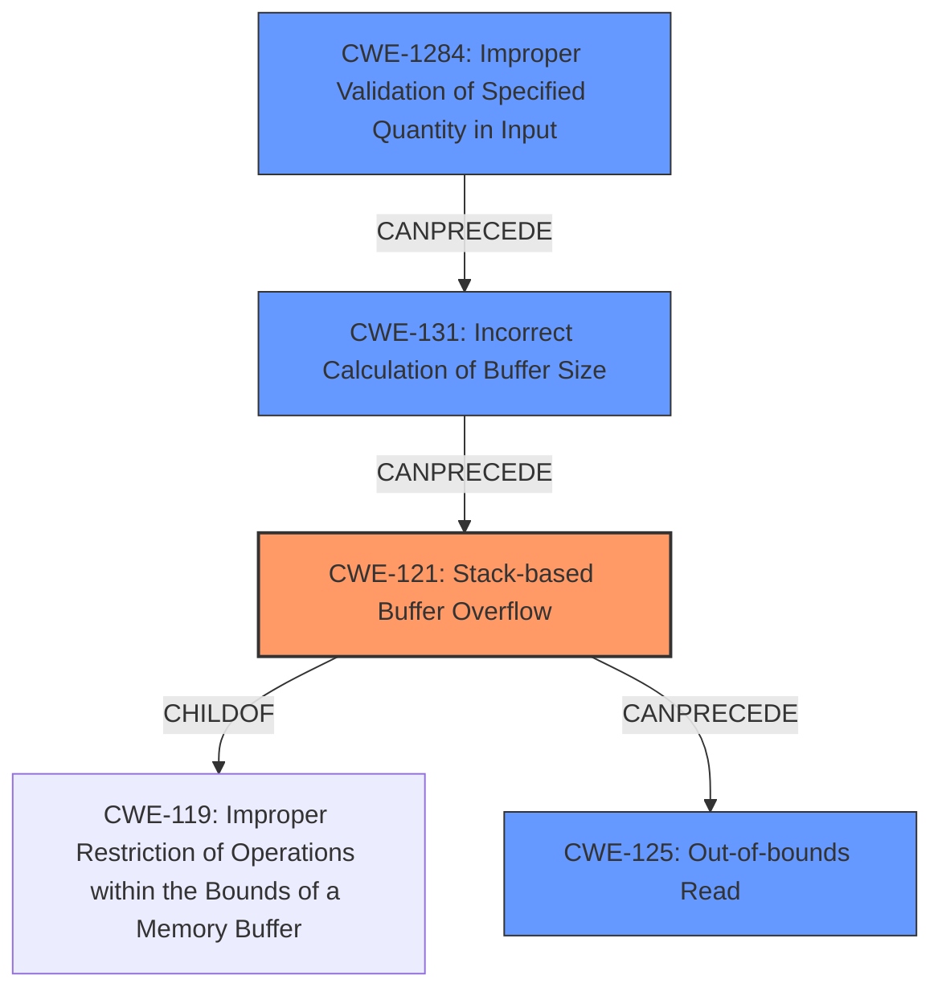

# Final Resolution for CVE-2021-45972

# Summary
| CWE ID | CWE Name | Confidence | CWE Abstraction Level | CWE Vulnerability Mapping Label | CWE-Vulnerability Mapping Notes |
|---|---|---|---|---|---|
| CWE-121 | Stack-based Buffer Overflow | 0.95 | Variant | Allowed | The vulnerability is explicitly described as a stack-based buffer overflow. |
| CWE-1284 | Improper Validation of Specified Quantity in Input | 0.85 | Base | Allowed | The program receives the extension data size from the input file, but does not validate that it is within acceptable bounds (<=5). |
| CWE-131 | Incorrect Calculation of Buffer Size | 0.75 | Base | Allowed | The size is read from the input file without proper validation, leading to an implicit incorrect calculation of the required buffer size. |
| CWE-125 | Out-of-bounds Read | 0.7 | Base | Allowed | The overflow results in the program attempting to read beyond the allocated buffer, potentially triggering a crash. |

  - The Primary CWE should be first and noted as the Primary CWEs
  - The secondary candidate CWEs should be next and noted as secondary candidates.
  - The confidence is a confidence score 0 to 1 to rate your confidence in your assessment for that CWE.
  - The CWE Abstraction Level as one of these values: Base, Variant, Pillar, Class, Compound
  - The Mapping Notes Usage as one of these values: Allowed, Allowed-with-Review, Prohibited, Discouraged

## Evidence and Confidence

*   **Confidence Score:** 0.9
*   **Evidence Strength:** HIGH

## Relationship Analysis
The primary **WEAKNESS** is `CWE-121: Stack-based Buffer Overflow`. This is a variant of `CWE-119: Improper Restriction of Operations within the Bounds of a Memory Buffer`. The **ROOTCAUSE** involves a lack of input validation (`CWE-1284: Improper Validation of Specified Quantity in Input`) which leads to an incorrect buffer size calculation (`CWE-131: Incorrect Calculation of Buffer Size`). The buffer overflow (`CWE-121`) can then result in an out-of-bounds read (`CWE-125: Out-of-bounds Read`). The abstraction levels are appropriate, with `CWE-121` being a Variant (specific location), and the others being Base level **WEAKNESSES**.

## Vulnerability Chain
The vulnerability chain starts with `CWE-1284`, where the program fails to validate the size of the extension data read from the input file. This leads to `CWE-131` because the program implicitly assumes this size is safe without any checks. Then the unchecked size is used in a copy operation, leading to `CWE-121`, a stack-based buffer overflow. This overflow can cause `CWE-125`, an out-of-bounds read if the program attempts to continue processing past the buffer.

## Summary of Analysis
The initial analysis correctly identified `CWE-121` as the primary **WEAKNESS**. The criticism raised valid points about strengthening the justifications for `CWE-125` and `CWE-131`, and suggesting the inclusion of `CWE-1284`. The revised analysis incorporates these suggestions. The vulnerability description explicitly mentions a stack-based buffer overflow, which strongly supports the selection of `CWE-121`. The lack of input validation on the size parameter directly contributes to the incorrect calculation of the buffer size and the subsequent overflow, making `CWE-1284` and `CWE-131` relevant contributing factors. The potential for an out-of-bounds read as a consequence of the overflow justifies the inclusion of `CWE-125`. These CWEs are at the optimal level of specificity, with `CWE-121` being a `Variant` that specifies the location of the overflow, and the other **WEAKNESSES** being at the `Base` level to represent the underlying causes and potential impacts. The evidence is strong, as the vulnerability description provides clear technical details about the overflow and its causes.