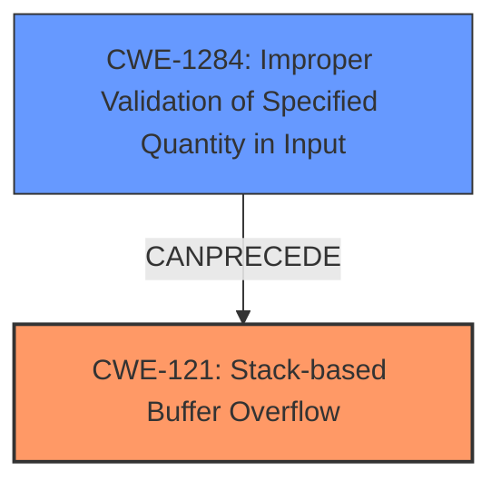

# Analysis Report for CVE-2021-45988

# Vulnerability Analysis Report: CVE-2021-45988

## Description

Tenda routers G1 and G3 v15.11.0.17(9502)_CN were discovered to contain a stack overflow in the function formAddDnsForward. This vulnerability allows attackers to cause a Denial of Service (DoS) via the DnsForwardRule parameter.

## Vulnerability Description Key Phrases

**Weakness:** stack overflow
**Impact:** Denial of Service (DoS)
**Vector:** DnsForwardRule parameter
**Attacker:** attackers
**Product:** Tenda routers G1 and G3
**Version:** v15.11.0.17(9502)_CN
**Component:** formAddDnsForward function

## Analysis (with Relationship Data)

# Summary
| CWE ID | CWE Name | Confidence | CWE Abstraction Level | CWE Vulnerability Mapping Label | CWE-Vulnerability Mapping Notes |
|---|---|---|---|---|---|
| CWE-121 | Stack-based Buffer Overflow | 0.95 | Variant | Allowed | Primary CWE: The description explicitly mentions a stack overflow. |

## Evidence and Confidence

*   **Confidence Score:** 0.95
*   **Evidence Strength:** HIGH

- **Analysis and Justification:**  
  - *Explanation:* The vulnerability description clearly states a "**stack overflow**" in the `formAddDnsForward` function of Tenda routers. This directly aligns with the definition of CWE-121, which is "A stack-based buffer overflow condition is a condition where the buffer being overwritten is allocated on the stack." The vulnerability is triggered via the `DnsForwardRule` parameter, leading to a denial-of-service (DoS). The Retriever Results also list CWE-121 as a candidate with a high score. Given the explicit mention of "stack overflow," CWE-121 is the most appropriate and specific mapping. MITRE's mapping guidance designates CWE-121 as ALLOWED, which further supports this choice.

  - *Relationship Analysis:* While other CWEs like CWE-119 (Improper Restriction of Operations within the Bounds of a Memory Buffer) could be considered, CWE-121 is more specific because it identifies the location of the buffer (stack). There are no direct relationships to other CWEs described in the provided information that would influence this selection.

- **Confidence Score:**  
  - Confidence: 0.95 (High confidence due to the explicit mention of "stack overflow" and the direct applicability of CWE-121's definition.)

## Criticism of Analysis

Okay, I've reviewed the analysis and the provided CWE specifications. Here's my critique:

**Overall Assessment:**

The analysis is very good and strongly justifies the selection of CWE-121 (Stack-based Buffer Overflow) as the primary weakness. The confidence score of 0.95 is warranted. The reasoning is clear, and it accurately reflects the vulnerability description. The analysis also correctly considers and dismisses alternatives like CWE-119.

**Specific Points:**

*   **CWE-121 Justification:**
    *   The analysis correctly identifies that the explicit mention of "stack overflow" in the vulnerability description directly maps to CWE-121's definition.
    *   The inclusion of the fact that CWE-121 is "ALLOWED" based on MITRE's mapping guidance reinforces the choice.
    *   The example CVE (CVE-2021-35395) is a relevant example to show how the vulnerability is similar.

*   **Alternative Considerations:**
    *   The discussion of CWE-119 is accurate. While the vulnerability *is* an improper restriction of operations within the bounds of a memory buffer, CWE-121 is more specific because it identifies the *location* of the vulnerable buffer (the stack).
    *   The analysis also acknowledges that the `DnsForwardRule` parameter allows a vector for the attacker. This vector is a vulnerability itself, which could map to other CWEs.

*   **Retriever Results:**
    * It is good that the analysis recognizes that the Retriever Results listed CWE-121 as a candidate with a high score.
    * In general, all of the Retriever Results could be justified as an associated CWE if the vulnerability is part of a larger vulnerability chain. However, this is not clear from the original vulnerability description and should not be included.

*   **Confidence Score:**
    *   The confidence score of 0.95 is very accurate. The use of the term "stack overflow" is a very strong indicator that CWE-121 is the correct mapping.

**Suggestions for Improvement:**

*   **Briefly mention CWE-1284 (Improper Validation of Specified Quantity in Input).** Since the `DnsForwardRule` parameter is the attack vector, the root cause of the vulnerability is most likely caused by a lack of input validation of the size or length. This could be briefly mentioned as a potential "weak signal" in the Retriever Results to show that the parameter was not validated.
*   **Consider a vulnerability chaining diagram.** Since there are many vulnerabilities in the Retriever Results, a visualization diagram is a great way to show how the root cause leads to other vulnerabilities. This could help solidify that CWE-121 is the correct root cause mapping.

**Critique of other CWEs from Retriever Results:**
Here's a brief analysis of why the other CWEs from the Retriever Results are not as appropriate as CWE-121, with consideration of their specifications:

*   **CWE-1284: Improper Validation of Specified Quantity in Input:** While this *could* be a contributing factor (the length of the DnsForwardRule is not validated), the primary issue is *where* the buffer is located. The vulnerability description is *explicit* about a stack overflow.  CWE-1284 is more about *how* the size is validated (or not).

*   **CWE-78: Improper Neutralization of Special Elements used in an OS Command ('OS Command Injection'):**  This is unlikely. The description doesn't mention command injection at all. It's possible the router's firmware *could* execute commands based on the DNS forwarding rule, but this is speculation not supported by the provided information.

*   **CWE-193: Off-by-one Error:**  Again, this isn't explicitly mentioned or implied. While an off-by-one error *could* lead to a buffer overflow, it's not the central issue here. The description focuses on the overflow itself.

*   **CWE-190: Integer Overflow or Wraparound:** Similar to CWE-193, integer overflow *could* be involved if the size of the input is used to calculate a buffer size, but it's not the primary characteristic of the vulnerability as described.

*   **CWE-789: Memory Allocation with Excessive Size Value / CWE-770: Allocation of Resources Without Limits or Throttling:** These are related to resource exhaustion. While a stack overflow *can* lead to DoS, these CWEs are better suited for cases where the *intent* is to exhaust resources (e.g., by repeatedly allocating memory).

*   **CWE-401: Missing Release of Memory after Effective Lifetime:** Memory leaks are different from buffer overflows. They don't directly cause the DoS in the same way.

*   **CWE-77: Improper Neutralization of Special Elements used in a Command ('Command Injection'):** Very similar to CWE-78, this is unlikely unless there's specific evidence of command injection.

*   **CWE-835: Loop with Unreachable Exit Condition ('Infinite Loop'):**  This is not likely given the description of a stack overflow.

**In summary,** the analysis is strong. With some minor revisions, this could be improved.

## Final Resolution

# Summary 
| CWE ID | CWE Name | Confidence | CWE Abstraction Level | CWE Vulnerability Mapping Label | CWE-Vulnerability Mapping Notes |
|---|---|---|---|---|---|
| CWE-121 | Stack-based Buffer Overflow | 0.95 | Variant | Allowed | Primary CWE |
| CWE-1284 | Improper Validation of Specified Quantity in Input | 0.60 | Base | Allowed | Secondary Candidate |

## Evidence and Confidence

*   **Confidence Score:** 0.90
*   **Evidence Strength:** MEDIUM

## Relationship Analysis
The primary relationship is that CWE-1284 can precede CWE-121. The analysis focuses on the direct evidence of a "stack overflow," making CWE-121 the primary classification. The suggestion to include CWE-1284 acknowledges the potential root cause of the overflow related to input validation. However, the vulnerability description focuses on the stack overflow itself.

## Vulnerability Chain
The vulnerability chain starts with **CWE-1284 (Improper Validation of Specified Quantity in Input)**, where the `DnsForwardRule` parameter's size or length is not properly validated. This leads to **CWE-121 (Stack-based Buffer Overflow)** when an oversized `DnsForwardRule` is copied onto the stack, causing a buffer overflow. The impact is a denial of service (DoS).

## Summary of Analysis
The initial analysis correctly identifies **CWE-121 (Stack-based Buffer Overflow)** as the primary **WEAKNESS** due to the explicit mention of "stack overflow" in the vulnerability description: "Tenda routers G1 and G3 v15.11.0.17(9502)_CN were discovered to contain a stack overflow in the function formAddDnsForward." This is strong evidence directly supporting **CWE-121**.

The criticism suggested including **CWE-1284 (Improper Validation of Specified Quantity in Input)** as a contributing factor, which is a valid point. Since the `DnsForwardRule` parameter is the attack vector, it is highly likely that the root cause involves a lack of input validation. While the description emphasizes the stack overflow, the root cause may lie in the missing or insufficient validation of the input that triggers the overflow.

The graph relationships influenced the final selection by highlighting the potential chain from input validation to buffer overflow. While **CWE-121** remains the primary **WEAKNESS** due to the explicit evidence, acknowledging **CWE-1284** provides a more complete picture of the vulnerability.

The selected CWEs are at an appropriate level of specificity. **CWE-121** is a Variant that accurately describes the type of buffer overflow. **CWE-1284** is a Base CWE that identifies the lack of input validation as a potential **ROOTCAUSE**. Together, they provide a comprehensive understanding of the vulnerability.

The confidence score is adjusted to 0.90 to reflect the inclusion of **CWE-1284** as a secondary contributing factor. While the evidence for **CWE-121** is strong, acknowledging the potential **ROOTCAUSE** in **CWE-1284** slightly reduces the confidence in **CWE-121** as the sole classification.

*Report generated on 2025-03-18 04:21:10*
