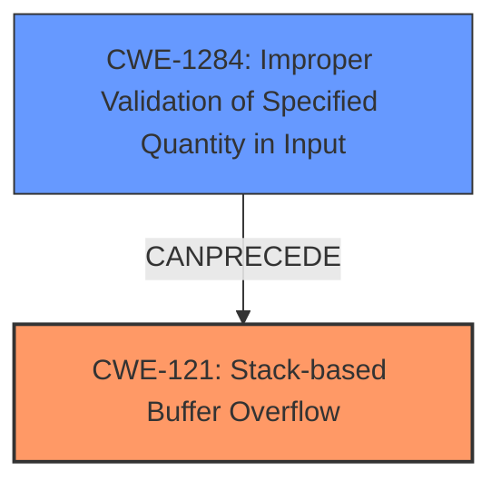

# Final Resolution for CVE-2021-45991

# Summary
| CWE ID | CWE Name | Confidence | CWE Abstraction Level | CWE Vulnerability Mapping Label | CWE-Vulnerability Mapping Notes |
|---|---|---|---|---|---|
| CWE-121 | Stack-based Buffer Overflow | 0.95 | Variant | Primary CWE | The vulnerability description explicitly mentions a **stack overflow**. |
| CWE-1284 | Improper Validation of Specified Quantity in Input | 0.6 | Base | Secondary Candidate | The size of the `vpnUsers` input is likely not properly validated, which allows the overflow to occur. |

## Evidence and Confidence

*   **Confidence Score:** 0.9
*   **Evidence Strength:** MEDIUM

## Relationship Analysis
The primary relationship considered was the potential for CWE-1284 to **precede** CWE-121. This suggests that a lack of input validation (CWE-1284) could directly enable the stack-based buffer overflow (CWE-121). While CWE-121 is the direct result, CWE-1284 represents a contributing factor by failing to validate the size of the `vpnUsers` input, which then allows an overly large input to cause a stack overflow.

## Vulnerability Chain
The vulnerability chain starts with **CWE-1284 (Improper Validation of Specified Quantity in Input)**, where the size of the `vpnUsers` parameter is not validated. This allows an attacker to provide a large input, leading to **CWE-121 (Stack-based Buffer Overflow)** when the oversized input is written to a stack buffer. The impact is a Denial of Service (DoS).

## Summary of Analysis
The initial analysis correctly identifies **CWE-121 (Stack-based Buffer Overflow)** as the primary issue, given the explicit mention of "stack overflow" in the vulnerability description: "Tenda routers G1 and G3 v15.11.0.17(9502)_CN were discovered to contain a **stack overflow** in the function formAddVpnUsers."

The criticism highlights the potential for **CWE-1284 (Improper Validation of Specified Quantity in Input)** as a contributing factor, suggesting that the lack of input validation on the `vpnUsers` parameter's size enables the overflow. The retriever results support this with a similarity score for CWE-1284.

The graph relationships influenced the final selection by highlighting the chain relationship between input validation and buffer overflows. While CWE-121 is the direct result, CWE-1284 represents a contributing factor.

The selected CWEs are at the optimal level of specificity. CWE-121 is a Variant that accurately describes the type of buffer overflow (stack-based). CWE-1284 is a Base CWE that addresses the root cause of missing input validation, which allows the overflow to occur.

The assessment is primarily based on the provided evidence, specifically the vulnerability description and the retriever results. The relationships between CWEs, as highlighted in the criticism, further support the inclusion of CWE-1284 as a contributing factor.