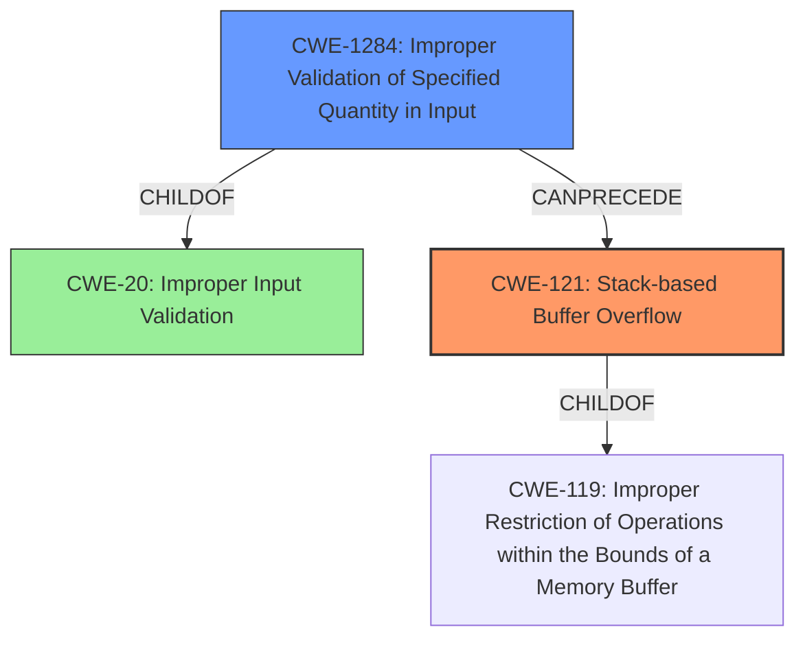

# Final Resolution for CVE-2021-45993

# Summary
| CWE ID | CWE Name | Confidence | CWE Abstraction Level | CWE Vulnerability Mapping Label | CWE-Vulnerability Mapping Notes |
|---|---|---|---|---|---|
| CWE-121 | Stack-based Buffer Overflow | 0.9 | Variant | Primary | Result of insufficient input validation; Allowed |
| CWE-1284 | Improper Validation of Specified Quantity in Input | 0.8 | Base | Contributing | Root cause; insufficient input length validation on `IPMacBindRuleIP` and `IPMacBindRuleMac` parameters |

## Evidence and Confidence

*   **Confidence Score:** 0.85
*   **Evidence Strength:** HIGH

## Relationship Analysis
The primary weakness is CWE-121 (**Stack-based Buffer Overflow**), a child of CWE-119 (**Improper Restriction of Operations within the Bounds of a Memory Buffer**). However, the root cause is the lack of input validation, specifically CWE-1284 (**Improper Validation of Specified Quantity in Input**), which is a child of CWE-20 (**Improper Input Validation**). The vulnerability chain progresses from CWE-1284 to CWE-121.

## Vulnerability Chain
The vulnerability chain begins with the **ROOTCAUSE** CWE-1284 (**Improper Validation of Specified Quantity in Input**). This leads to CWE-121 (**Stack-based Buffer Overflow**), because the `IPMacBindRuleIP` and `IPMacBindRuleMac` parameters are not validated for length before being copied to a stack buffer. The lack of validation allows an attacker to supply an overly long string, leading to a **stack overflow** and a Denial of Service (DoS).

## Summary of Analysis
The initial analysis correctly identified CWE-121 (**Stack-based Buffer Overflow**) as the primary vulnerability based on the vulnerability description. However, the criticism correctly pointed out that the root cause was missing. The vulnerability description mentions that the **overflow** occurs via the `IPMacBindRuleIP` and `IPMacBindRuleMac` parameters, indicating a failure to properly validate the length or content of these input parameters before they are copied into the stack buffer. Therefore, the refined analysis includes CWE-1284 (**Improper Validation of Specified Quantity in Input**) as a contributing factor and root cause.

The relationship analysis supports this decision. CWE-121 is a type of buffer overflow, making it a child of CWE-119 (**Improper Restriction of Operations within the Bounds of a Memory Buffer**). CWE-1284 is a child of CWE-20 (**Improper Input Validation**) and can precede CWE-121, creating a vulnerability chain.

The final selection reflects the optimal level of specificity. CWE-121 directly describes the **stack overflow**, while CWE-1284 identifies the lack of input validation as the underlying cause. CWE-119 is avoided because it is too general, as the analysis is able to identify a more specific child CWE.