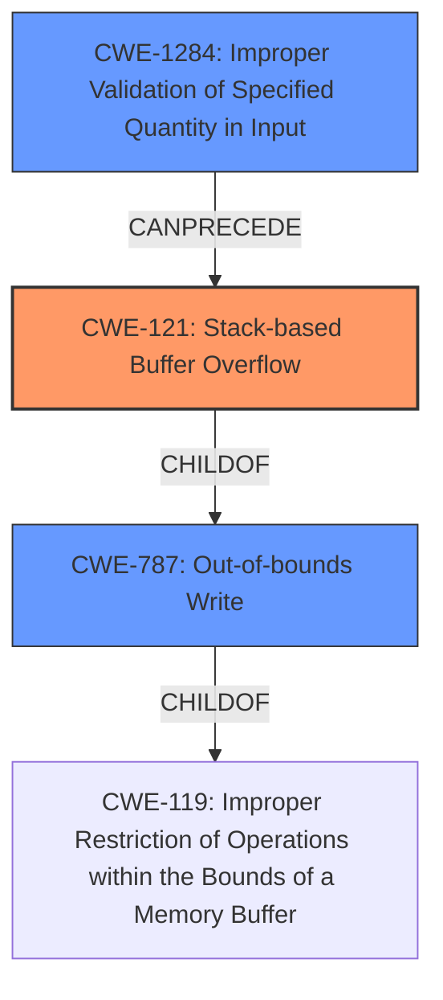

# Final Resolution for CVE-2021-45994

# Summary
| CWE ID | CWE Name | Confidence | CWE Abstraction Level | CWE Vulnerability Mapping Label | CWE-Vulnerability Mapping Notes |
|---|---|---|---|---|---|
| CWE-121 | Stack-based Buffer Overflow | 0.9 | Variant | Primary | Allowed |
| CWE-1284 | Improper Validation of Specified Quantity in Input | 0.7 | Base | Secondary Candidate | Allowed |
| CWE-787 | Out-of-bounds Write | 0.6 | Base | Secondary Candidate | Allowed |

## Evidence and Confidence

*   **Confidence Score:** 0.8
*   **Evidence Strength:** HIGH

## Relationship Analysis
The primary weakness is a **stack overflow**, which is a specific type of **out-of-bounds write**. The **root cause** is likely due to improper validation of the `delDhcpIndex` parameter.

- CWE-121 (Stack-based Buffer Overflow) is a variant of CWE-787 (Out-of-bounds Write) and a child of CWE-119 (Improper Restriction of Operations within the Bounds of a Memory Buffer).
- CWE-1284 (Improper Validation of Specified Quantity in Input) can precede CWE-121, as lack of input validation can lead to a buffer overflow.
- The abstraction levels influenced the decision, prioritizing the most specific weakness (CWE-121) while also acknowledging the broader context (CWE-787) and **root cause** (CWE-1284).

## Vulnerability Chain
The vulnerability chain starts with the **root cause**, an **Improper Validation of Specified Quantity in Input (CWE-1284)**, specifically the `delDhcpIndex` parameter. This lack of validation leads to a **Stack-based Buffer Overflow (CWE-121)** when the index is used to access a buffer on the stack. The overflow results in an **Out-of-bounds Write (CWE-787)**, causing a denial of service (DoS).

## Summary of Analysis
The initial analysis correctly identified CWE-121 as the primary weakness due to the explicit mention of "stack overflow" in the vulnerability description. The criticism suggested adding CWE-1284 to represent the **root cause** of the vulnerability. This is a valuable addition because it highlights the importance of input validation in preventing buffer overflows.

The graph relationships influenced the final selection by illustrating the hierarchical relationship between CWE-121 and CWE-787, and the chain relationship between CWE-1284 and CWE-121. The abstraction levels were also considered, prioritizing the most specific weakness (CWE-121) while also acknowledging the broader context (CWE-787) and **root cause** (CWE-1284).

The selected CWEs are at the optimal level of specificity because they accurately represent the vulnerability based on the available evidence. CWE-121 is the most specific weakness identified in the description ("stack overflow"). CWE-1284 represents the likely **root cause**, and CWE-787 provides a broader context.