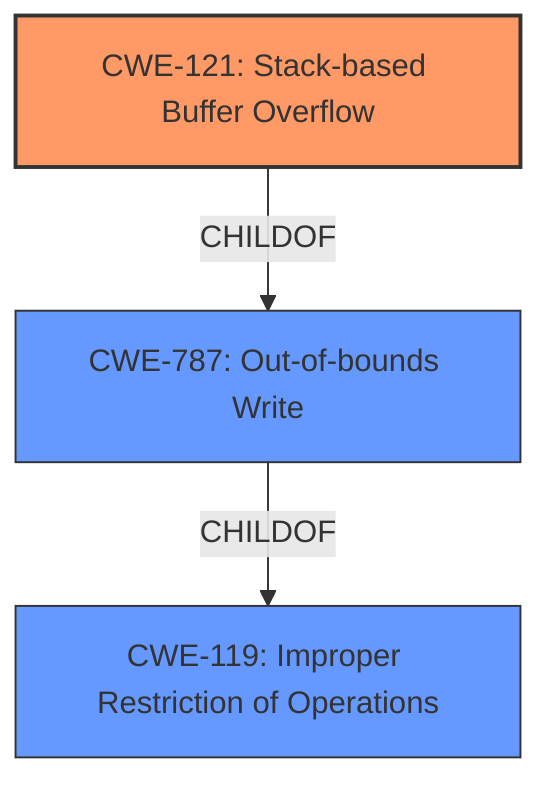

# Analysis Report for CVE-2021-45996

# Vulnerability Analysis Report: CVE-2021-45996

## Description

Tenda routers G1 and G3 v15.11.0.17(9502)_CN were discovered to contain a stack overflow in the function formSetPortMapping. This vulnerability allows attackers to cause a Denial of Service (DoS) via the portMappingServer, portMappingProtocol, portMappingWan, porMappingtInternal, and portMappingExternal parameters.

## Vulnerability Description Key Phrases

**Weakness:** stack overflow
**Impact:** Denial of Service (DoS)
**Vector:** portMappingServer, portMappingProtocol, portMappingWan, porMappingtInternal, and portMappingExternal parameters
**Attacker:** attackers
**Product:** Tenda routers G1 and G3
**Version:** v15.11.0.17(9502)_CN
**Component:** formSetPortMapping function

## Analysis (with Relationship Data)

# Summary
| CWE ID | CWE Name | Confidence | CWE Abstraction Level | CWE Vulnerability Mapping Label | CWE-Vulnerability Mapping Notes |
|---|---|---|---|---|---|
| CWE-121 | Stack-based Buffer Overflow | 0.95 | Variant | Allowed | Primary CWE |

## Evidence and Confidence

*   **Confidence Score:** 0.95
*   **Evidence Strength:** HIGH

- **Analysis and Justification:**  
  - *Explanation:* The vulnerability description explicitly states that there is a "**stack overflow**" in the `formSetPortMapping` function of Tenda routers G1 and G3. This **stack overflow** can be triggered by providing malicious input via the `portMappingServer`, `portMappingProtocol`, `portMappingWan`, `porMappingtInternal`, and `portMappingExternal` parameters, leading to a Denial of Service (DoS). CWE-121, "Stack-based Buffer Overflow," directly addresses this type of vulnerability. The description aligns perfectly with the CWE definition, and the "Variant" level is appropriate as it specifies the location of the overflow (stack). The retriever results also list CWE-121 with a high score.
  
  - *Relationship Analysis:* CWE-121 is a variant of CWE-119 (Improper Restriction of Operations within the Bounds of a Memory Buffer). Since the vulnerability is specifically a **stack overflow**, CWE-121 is more specific and appropriate than its parent, CWE-119.

- **Confidence Score:**  
  - Confidence: 0.95 (Direct evidence of a **stack overflow** from the vulnerability description)

## Criticism of Analysis

Okay, let's review the provided CWE analysis, focusing on its accuracy and alignment with CWE specifications.

**Overall Assessment:**

The analysis is generally good, and the choice of CWE-121 (Stack-based Buffer Overflow) as the primary CWE is appropriate given the vulnerability description. The confidence score of 0.95 is justified. The explanations are clear and link the vulnerability directly to the CWE definition.

**Detailed Review:**

*   **CWE-121: Stack-based Buffer Overflow**

    *   **Correctness:**  The analysis accurately identifies CWE-121 as the most specific and appropriate CWE for a "stack overflow" vulnerability. The description clearly states the location of the overflow (stack), which aligns with the CWE-121 definition.
    *   **Abstraction Level:** The "Variant" level is correct. CWE-121 is a variant of the more general CWE-787. This is the appropriate abstraction level.
    *   **Mapping Guidance:** The analysis correctly mentions that CWE-121 is at the Variant level, a preferred level for mapping root causes. The guidance is also followed in that the name and description are carefully read and deemed to be an appropriate fit.
    *   **Mitigations:** The identified mitigations are consistent with the CWE description:
        * Compiler-based overflow detection mechanisms
        * Abstraction libraries
        * Input Bounds checking
    *   **Relationship Analysis:** The relationship analysis is correct in identifying that CWE-121 is a variant of CWE-119, but as the vulnerability is specifically a stack overflow, CWE-121 is the more specific and appropriate choice.

*   **Retriever Results Considerations:**

    *   The retriever results provide a good starting point, but the analysis correctly prioritizes CWE-121 based on the explicit mention of "stack overflow" in the vulnerability description.
    *   The analysis implicitly acknowledges that the retriever results are suggestions, not definitive answers.

*   **CWE-787 Considerations**
    * CWE-787 is included in the retriever results with a high count, while CWE-121 is a child of CWE-787, it is important that the CWE-121 was chosen because the location of the vulnerability (stack) was specified, making it more applicable than the general CWE-787.

*   **CWE-119 Considerations**
    * As stated, CWE-119 is a more general CWE and the analysis correctly prioritizes the more specific CWE-121.
    * The analysis also correctly acknowledges the mapping guidance for CWE-119.

**Suggestions for Improvement (Minor):**

*   **Example CVEs:** The analysis could benefit from including a few example CVEs that are mapped to CWE-121 to provide further context. These are provided within the full CWE specifications.
*   **Input Validation Discussion:** It could be helpful to briefly mention the role of input validation in preventing buffer overflows, even though the primary cause is the lack of bounds checking during the buffer copy operation. This could provide a more complete picture of the vulnerability.
    * One could add a sentence that this vulnerability can be mitigated by implementing robust input validation on the `portMappingServer`, `portMappingProtocol`, `portMappingWan`, `porMappingtInternal`, and `portMappingExternal` parameters to prevent excessively large inputs from reaching the `formSetPortMapping` function.

**In Summary:**

This is a well-reasoned and accurate CWE analysis. The selection of CWE-121 is justified by the vulnerability description, and the analysis demonstrates a good understanding of CWE specifications and mapping guidance. The suggestions for improvement are minor and aimed at providing additional context and completeness.

## Final Resolution

# Summary
| CWE ID | CWE Name | Confidence | CWE Abstraction Level | CWE Vulnerability Mapping Label | CWE-Vulnerability Mapping Notes |
|---|---|---|---|---|---|
| CWE-121 | Stack-based Buffer Overflow | 0.95 | Variant | Allowed | Primary CWE |

## Evidence and Confidence

*   **Confidence Score:** 0.95
*   **Evidence Strength:** HIGH

## Relationship Analysis
The primary relationship impacting the decision is the parent-child relationship between CWE-119 (**CWE-119: Improper Restriction of Operations within the Bounds of a Memory Buffer**) and CWE-121 (**CWE-121: Stack-based Buffer Overflow**). CWE-121 is a variant of CWE-119, making it more specific when the overflow occurs on the stack. The vulnerability description explicitly mentions a "stack overflow," justifying the selection of CWE-121 over its parent.

## Vulnerability Chain
The vulnerability chain begins with the lack of input validation on the `portMappingServer`, `portMappingProtocol`, `portMappingWan`, `porMappingtInternal`, and `portMappingExternal` parameters. This leads to an excessively large input being passed to the `formSetPortMapping` function. The `formSetPortMapping` function then attempts to write this data to a buffer on the stack without proper bounds checking, resulting in a **CWE-121: Stack-based Buffer Overflow**. The final impact is a Denial of Service (DoS).

## Summary of Analysis
The initial analysis and criticism are well-aligned. The vulnerability description provides direct evidence of a "**stack overflow**" in the `formSetPortMapping` function, triggered by specific parameters. This aligns perfectly with the definition of **CWE-121: Stack-based Buffer Overflow**.

The relationship analysis confirms that CWE-121 is the most specific and appropriate choice, given the available information. While other CWEs like **CWE-787: Out-of-bounds Write** and **CWE-119: Improper Restriction of Operations within the Bounds of a Memory Buffer** are related, they are less specific than **CWE-121**. The provided evidence is strong, justifying the high confidence score of 0.95.

The selected CWE is at the optimal level of specificity because the vulnerability description explicitly mentions that the overflow occurs on the stack, making CWE-121 a precise fit.

*Report generated on 2025-03-18 04:35:33*
