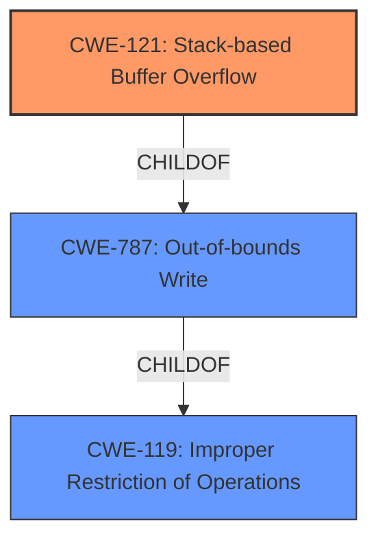

# Final Resolution for CVE-2021-45996

# Summary
| CWE ID | CWE Name | Confidence | CWE Abstraction Level | CWE Vulnerability Mapping Label | CWE-Vulnerability Mapping Notes |
|---|---|---|---|---|---|
| CWE-121 | Stack-based Buffer Overflow | 0.95 | Variant | Allowed | Primary CWE |

## Evidence and Confidence

*   **Confidence Score:** 0.95
*   **Evidence Strength:** HIGH

## Relationship Analysis
The primary relationship impacting the decision is the parent-child relationship between CWE-119 (**CWE-119: Improper Restriction of Operations within the Bounds of a Memory Buffer**) and CWE-121 (**CWE-121: Stack-based Buffer Overflow**). CWE-121 is a variant of CWE-119, making it more specific when the overflow occurs on the stack. The vulnerability description explicitly mentions a "stack overflow," justifying the selection of CWE-121 over its parent.

## Vulnerability Chain
The vulnerability chain begins with the lack of input validation on the `portMappingServer`, `portMappingProtocol`, `portMappingWan`, `porMappingtInternal`, and `portMappingExternal` parameters. This leads to an excessively large input being passed to the `formSetPortMapping` function. The `formSetPortMapping` function then attempts to write this data to a buffer on the stack without proper bounds checking, resulting in a **CWE-121: Stack-based Buffer Overflow**. The final impact is a Denial of Service (DoS).

## Summary of Analysis
The initial analysis and criticism are well-aligned. The vulnerability description provides direct evidence of a "**stack overflow**" in the `formSetPortMapping` function, triggered by specific parameters. This aligns perfectly with the definition of **CWE-121: Stack-based Buffer Overflow**.

The relationship analysis confirms that CWE-121 is the most specific and appropriate choice, given the available information. While other CWEs like **CWE-787: Out-of-bounds Write** and **CWE-119: Improper Restriction of Operations within the Bounds of a Memory Buffer** are related, they are less specific than **CWE-121**. The provided evidence is strong, justifying the high confidence score of 0.95.

The selected CWE is at the optimal level of specificity because the vulnerability description explicitly mentions that the overflow occurs on the stack, making CWE-121 a precise fit.