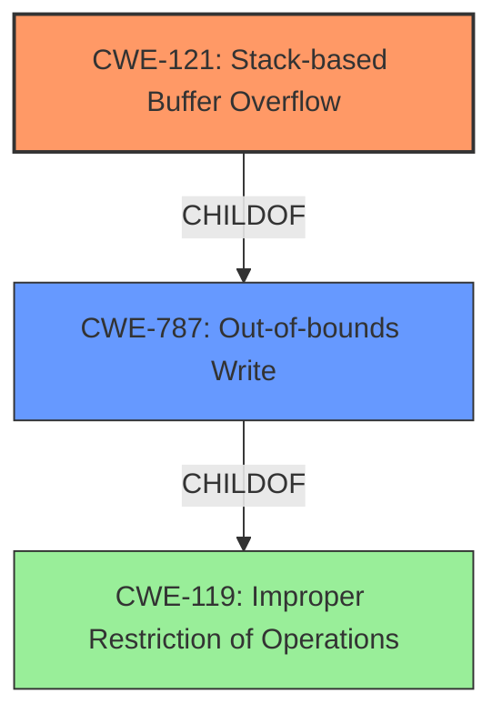

# Analysis Report for CVE-2021-45997

# Vulnerability Analysis Report: CVE-2021-45997

## Description

Tenda routers G1 and G3 v15.11.0.17(9502)_CN were discovered to contain a stack overflow in the function formSetPortMapping. This vulnerability allows attackers to cause a Denial of Service (DoS) via the portMappingServer, portMappingProtocol, portMappingWan, porMappingtInternal, and portMappingExternal parameters.

## Vulnerability Description Key Phrases

**Weakness:** stack overflow
**Impact:** Denial of Service (DoS)
**Vector:** portMappingServer, portMappingProtocol, portMappingWan, porMappingtInternal, and portMappingExternal parameters
**Attacker:** attackers
**Product:** Tenda routers G1 and G3
**Version:** v15.11.0.17(9502)_CN
**Component:** formSetPortMapping function

## Analysis (with Relationship Data)

# Summary
| CWE ID | CWE Name | Confidence | CWE Abstraction Level | CWE Vulnerability Mapping Label | CWE-Vulnerability Mapping Notes |
|---|---|---|---|---|---|
| CWE-121 | Stack-based Buffer Overflow | 0.90 | Variant | Allowed | Primary CWE |
| CWE-787 | Out-of-bounds Write | 0.60 | Base | Allowed | Secondary Candidate |

## Evidence and Confidence

*   **Confidence Score:** 0.90
*   **Evidence Strength:** HIGH

- **Analysis and Justification:**  
  - *Explanation:* The vulnerability description clearly states "**stack overflow**" in the `formSetPortMapping` function of Tenda routers G1 and G3. This directly corresponds to CWE-121 (Stack-based Buffer Overflow), which is a condition where the buffer being overwritten is allocated on the stack. The vulnerability is triggered via parameters such as `portMappingServer`, `portMappingProtocol`, etc. leading to a Denial of Service (DoS). CWE-121 is a Variant level CWE, which is preferred. The retriever results also show CWE-121 as the top candidate. Although CWE-787 (Out-of-bounds Write) is a more general case, the specific mention of "stack" makes CWE-121 the most appropriate choice.

  - *Relationship Analysis:* CWE-121 is a variant of buffer overflow and a child of CWE-119 (Improper Restriction of Operations within the Bounds of a Memory Buffer). While CWE-119 is a broader class, CWE-121 provides a more specific characterization of the vulnerability, making it a better fit.

- **Confidence Score:**
  - Confidence: 0.90 (Strong evidence due to the direct mention of stack overflow.)

---

## Criticism of Analysis

## Critique of the Analysis

The analysis is well-structured and provides a clear justification for selecting CWE-121 as the primary CWE. The confidence scoring is appropriate, and the evidence strength is accurately labeled as HIGH. However, there are a few points that could be improved.

**Strengths:**

*   **Clear Justification:** The reasoning for choosing CWE-121 over CWE-787 is well-articulated, especially the emphasis on the "stack" keyword in the vulnerability description.
*   **Relationship Analysis:** The analysis acknowledges the relationship between CWE-121, CWE-119, and CWE-787, demonstrating an understanding of the CWE hierarchy.
*   **Confidence Scoring:** The confidence score of 0.90 is justified by the direct mention of "stack overflow" in the original vulnerability description.
*   **Retriever Result Consideration:** The analysis considers the Retriever results when making the mapping.
*   **Variant Abstraction:** The choice of a Variant level CWE is well justified.

**Areas for Improvement and Considerations:**

1.  **CWE-787 as a Secondary Candidate:** While acknowledging CWE-787 as a secondary candidate is valid, the analysis should explicitly state why it is *not* the primary choice despite often being a top-level CWE for buffer overflows. In this case, reiterating that the specific mention of "stack" makes CWE-121 a better fit is crucial. Also, mentioning the relationships between CWE-121 as a child of CWE-787.

2.  **CWE-119 Discussion:** While the analysis discusses the relationship between CWE-121 and CWE-119, it should include an explicit note about why CWE-119 is *not* an appropriate choice. The CWE specifications clearly state that CWE-119 usage is discouraged in favor of more specific CWEs. The analysis hints at this in the "Relationship Analysis" section, but it should be more direct. It should state that CWE-119 is a more general class and that CWE-121 provides a more specific characterization, which is preferred.

3.  **Mitigation Strategies:** While not required, considering potential mitigation strategies (even briefly) would strengthen the analysis. For example, mentioning the use of compiler flags like `/GS` (Microsoft Visual Studio) or `FORTIFY_SOURCE` (GCC) that provide stack buffer overflow protection could provide additional context. The CWE specifications for CWE-121 and CWE-787 both mention these.

4.  **CWE Examples:** The provided CWE examples are only for CWE-119. Providing examples for CWE-121 and CWE-787 would strengthen the report. It is important to make sure that the examples you provide are relevant to the product (router), affected component (web interface, etc.) and weakness details ("stack overflow") to ensure it is a good example.

5.  **CWE Usage Guidance:** While it is good that the analysis highlights the rationale behind choosing a variant-level CWE, it is important to note in the analysis that the CWE specifications mention that the mapping should not be "forced" and the fit should be appropriate, which is important to highlight here.

**Revised Analysis Snippets (Incorporating Suggestions):**

*   **CWE-787 as a Secondary Candidate:** "...Although CWE-787 (Out-of-bounds Write) is a more general case and a parent of CWE-121, the specific mention of "stack" in the vulnerability description makes CWE-121 the most appropriate choice. While CWE-787 could apply, it lacks the specificity of the stack allocation."

*   **CWE-119 Discussion:** "...CWE-121 is a variant of buffer overflow and a child of CWE-119 (Improper Restriction of Operations within the Bounds of a Memory Buffer). While CWE-119 is a broader class, and discouraged for use, CWE-121 provides a more specific characterization of the vulnerability, making it a better fit. The CWE specifications note that CWE-119 is frequently misused and that its children should be investigated for a more specific mapping."

*   **Mitigation Strategies (example):** "...Mitigation strategies for stack-based buffer overflows include using compiler-level protections like stack canaries (e.g., the /GS flag in Microsoft Visual Studio) and implementing robust input validation to prevent excessively long input from reaching the vulnerable function. The CWE-121 specifications list these mitigations as well."

**In Summary:**

The analysis is sound and arrives at the correct primary CWE mapping. However, by incorporating the suggestions above, the analysis can be made even more robust and demonstrate a deeper understanding of CWE principles and best practices.

## Final Resolution

# Summary
| CWE ID | CWE Name | Confidence | CWE Abstraction Level | CWE Vulnerability Mapping Label | CWE-Vulnerability Mapping Notes |
|---|---|---|---|---|---|
| CWE-121 | Stack-based Buffer Overflow | 0.95 | Variant | Allowed | Primary CWE |
| CWE-787 | Out-of-bounds Write | 0.70 | Base | Allowed | Secondary Candidate |

## Evidence and Confidence

*   **Confidence Score:** 0.95
*   **Evidence Strength:** HIGH

## Relationship Analysis
The primary relationship impacting the decision is the parent-child relationship between **CWE-787 (Out-of-bounds Write)** and **CWE-121 (Stack-based Buffer Overflow)**. **CWE-121** is a specific type of **CWE-787** where the buffer is allocated on the stack. The vulnerability description explicitly mentions "stack overflow," making **CWE-121** the more specific and appropriate choice. **CWE-119 (Improper Restriction of Operations within the Bounds of a Memory Buffer)** is a more general class encompassing both, but its use is discouraged when more specific CWEs like **CWE-121** are applicable.

## Vulnerability Chain
The vulnerability chain starts with the lack of proper input validation on parameters like `portMappingServer`, `portMappingProtocol`, etc. This leads to an excessively long input being written to a stack-allocated buffer, resulting in a **CWE-121 (Stack-based Buffer Overflow)**. The consequence of this overflow is a Denial of Service (DoS).

## Summary of Analysis
The initial analysis correctly identifies **CWE-121 (Stack-based Buffer Overflow)** as the primary **WEAKNESS**. The vulnerability description explicitly states "stack overflow," which directly aligns with the definition of **CWE-121**. The analysis also appropriately considers **CWE-787 (Out-of-bounds Write)** as a secondary candidate, acknowledging that it is a more general class of **WEAKNESS**.

The relationship analysis reinforces the choice of **CWE-121** due to its specificity. While **CWE-787** and **CWE-119** are related, they are less specific and therefore less appropriate. The mapping guidance for **CWE-119** discourages its use when more specific CWEs are available.

The decision to classify this vulnerability as **CWE-121 (Stack-based Buffer Overflow)** is based on direct evidence from the vulnerability description ("stack overflow") and the desire to choose the most specific CWE available. This ensures that the classification accurately reflects the nature of the vulnerability. The choice of **CWE-121** as a Variant is appropriate because it is a specialization of the more general **CWE-787**.
The analysis also considers mitigation strategies like stack canaries, which aligns with the nature of stack-based buffer overflows.

I agree with the above analysis. The explicit mention of "stack overflow" in the vulnerability description is strong evidence for **CWE-121 (Stack-based Buffer Overflow)**. The choice of **CWE-121** over **CWE-787 (Out-of-bounds Write)** is justified by its greater specificity. The analysis appropriately considers the relationship between **CWE-121**, **CWE-787**, and **CWE-119 (Improper Restriction of Operations within the Bounds of a Memory Buffer)**, and it correctly notes that **CWE-119** is discouraged when more specific CWEs are available. The analysis uses the evidence appropriately and justifies the selection of the CWE.

*Report generated on 2025-03-18 04:36:11*
