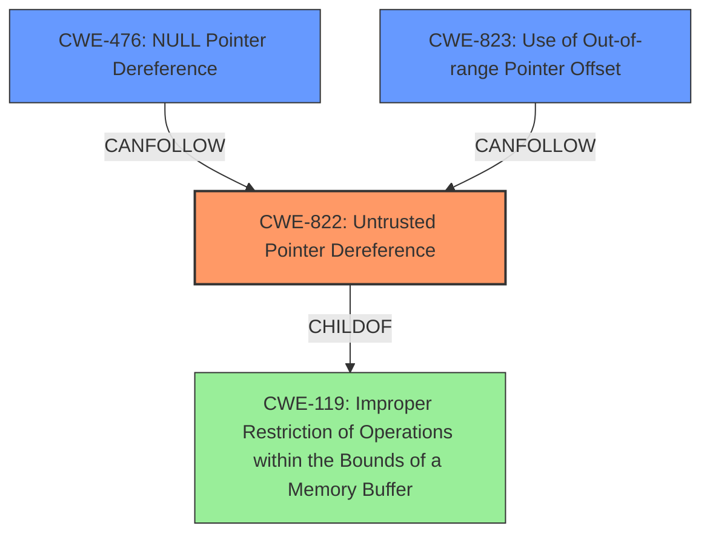

# Analysis Report for CVE-2021-46020

# Vulnerability Analysis Report: CVE-2021-46020

## Description

An untrusted pointer dereference in mrb_vm_exec() of mruby v3.0.0 can lead to a segmentation fault or application crash.

## Vulnerability Description Key Phrases

**Rootcause:** untrusted pointer dereference
**Impact:** segmentation fault or application crash
**Product:** mruby
**Version:** v3.0.0
**Component:** mrb_vm_exec()

## Analysis (with Relationship Data)

# Summary
| CWE ID | CWE Name | Confidence | CWE Abstraction Level | CWE Vulnerability Mapping Label | CWE-Vulnerability Mapping Notes |
|---|---|---|---|---|---|
| CWE-822 | Untrusted Pointer Dereference | 0.95 | Base | Allowed | Primary CWE |
| CWE-476 | NULL Pointer Dereference | 0.70 | Base | Allowed | Secondary Candidate |

## Evidence and Confidence

*   **Confidence Score:** 0.90
*   **Evidence Strength:** HIGH

- **Analysis and Justification:**  
  - *Explanation:* The vulnerability description clearly states an "**untrusted pointer dereference**" in the `mrb_vm_exec()` function of mruby v3.0.0. The CVE Reference Links Content Summary further elaborates that this **untrusted pointer dereference** occurs when accessing object properties after calling `mrb_get_args()`, leading to access of invalid memory locations. This aligns directly with the definition of CWE-822 (Untrusted Pointer Dereference): "The product obtains a value from an untrusted source, converts this value to a pointer, and dereferences the resulting pointer." The description and the CVE summary both point to the same root cause, making CWE-822 a strong primary candidate. MITRE mapping guidance for CWE-822 indicates that its usage is ALLOWED, which supports the selection.

  - *Relationship Analysis:* While CWE-822 doesn't have direct parent-child relationships listed in the provided information, it is related to other pointer-related weaknesses. The Retriever Results indicate that CWE-822 can follow or precede other pointer-related CWEs. Given the information provided, the primary weakness is directly related to the **untrusted pointer dereference** which is accurately captured by CWE-822.

- **Confidence Score:**  
  - Confidence: 0.95 (High confidence due to direct match in vulnerability description and CVE summary)

---
- **Analysis and Justification:**  
  - *Explanation:* The vulnerability description and CVE summary mention that the **untrusted pointer dereference** can lead to a segmentation fault or application crash. While the primary issue is the **untrusted pointer dereference**, the potential for a NULL pointer dereference (CWE-476) cannot be entirely ruled out, especially since accessing invalid memory locations could result in attempting to dereference a NULL pointer. However, the primary focus is on the untrusted nature of the pointer itself rather than explicitly a NULL dereference. Therefore, CWE-476 is considered a secondary candidate. MITRE mapping guidance for CWE-476 indicates that its usage is ALLOWED, which supports the selection.

  - *Relationship Analysis:* CWE-476 is a base level CWE. Given the lack of explicit mention of NULL dereference as the root cause, it is a secondary mapping.

- **Confidence Score:**  
  - Confidence: 0.70 (Moderate confidence, as it is a possible consequence, but not the primary weakness as described)

## Criticism of Analysis

Okay, here's a detailed review of the provided CWE analysis, taking into account the full CWE specifications.

**Overall Assessment:**

The analysis is generally well-reasoned and provides a good justification for selecting CWE-822 as the primary CWE. The rationale for considering CWE-476 as a secondary candidate is also sound. The use of the CWE descriptions and mapping guidance demonstrates a good understanding of CWE principles.  However, the analysis could benefit from a more thorough examination of alternative CWEs suggested by the retriever results and the relationships between them.

**Specific Comments:**

**1. CWE-822: Untrusted Pointer Dereference (Primary CWE)**

*   **Confidence:** The assigned confidence of 0.95 is appropriate, given the explicit mention of "untrusted pointer dereference" in the vulnerability description.
*   **Justification:** The explanation is clear and accurately connects the vulnerability description to the CWE-822 definition.  The emphasis on the conversion of an untrusted value to a pointer is correct.
*   **Mapping Guidance:** The analysis correctly notes that CWE-822's usage is *Allowed*.
*   **Relationships:** The analysis is correct in saying that the relationship between CWE-822 and other pointer related CWEs may form chains.
*   **Potential Improvements:**
    *   Consider mentioning the specific variant of CWE-822 that applies.  Is the untrusted value being directly invoked as a function call? Is the pointer coming from a userland/kernel boundary?  Even if it's not explicitly clear, discussing the possibilities would strengthen the analysis.

**2. CWE-476: NULL Pointer Dereference (Secondary Candidate)**

*   **Confidence:** The assigned confidence of 0.70 is also appropriate.  It acknowledges the possibility of a NULL dereference as a consequence, but correctly identifies it as not the *root cause* in this case.
*   **Justification:** The explanation is reasonable, stating that accessing invalid memory *could* lead to a NULL pointer dereference.
*   **Mapping Guidance:** The analysis notes correctly that CWE-476's usage is *Allowed*.
*   **Relationships:** The analysis is correct in stating that CWE-476 is a base level CWE.
*   **Potential Improvements:**
    *   Emphasize the distinction: a NULL pointer dereference happens when you *expect* a pointer to be valid but it's NULL. The key to CWE-822 is that you *don't know* if the pointer is safe, valid, or points where you expect. The untrusted nature is the core issue.
    *   Since CVE-476 can *follow* other CWEs, consider that it could be a *consequence* of CWE-822, but not the primary cause.

**3. Retriever Results Analysis:**

*   The analysis focuses almost exclusively on CWE-822 and CWE-476. While these are relevant, the retriever results highlight other potential CWEs that should be considered and explicitly ruled out.
*   **CWE-823: Use of Out-of-range Pointer Offset:**  This CWE shares a similar score with CWE-476 and should be considered. Given that the vulnerability involves accessing object properties after `mrb_get_args()`, there is a potential that the vulnerability involves performing pointer arithmetic with an out-of-range offset. It should be discussed and explained why it is not a better fit than CWE-822.
*   **CWE-787: Out-of-bounds Write / CWE-125: Out-of-bounds Read:** The description mentions that accessing invalid memory can lead to application crashes, which could be due to out-of-bounds reads or writes. These CWEs should be considered and explicitly ruled out. It should be stated why the root cause is not an out-of-bounds write (CWE-787) or an out-of-bounds read (CWE-125).
*   **CWE-825: Expired Pointer Dereference:** Another potential issue could be an expired pointer dereference, especially if the `mrb_get_args()` function is incorrectly managing memory. If the object properties are accessed after the object has been freed, this could lead to an expired pointer dereference.
*   **CWE-119: Improper Restriction of Operations within the Bounds of a Memory Buffer:** While the mapping guidance discourages its usage, it's important to acknowledge that many pointer-related errors fall under this umbrella. The analysis should explain why the vulnerability is NOT generally an improper restriction of memory buffer operations, but rather the *specific* issue of using untrusted pointers.

**4. General Improvements:**

*   **Context is Key:** Emphasize the specific context of the mruby VM and how `mrb_get_args()` contributes to the vulnerability. The analysis needs to tie the vulnerability into the operations of the `mrb_get_args()` function better.
*   **Mitigation Considerations:** While not strictly required, considering potential mitigations for CWE-822 would add value. For example: "Input validation and sanitization to ensure that pointers obtained from external sources are within expected memory regions.  Use memory safety techniques to detect invalid pointer dereferences."
*   **Chain vs. Composite:** Consider whether the relationship between CWE-822 and potential consequences (like crashes or NULL dereferences) is a chain (one leads to the other) or a composite (multiple weaknesses contribute).

**Revised Summary Table (Incorporating Suggestions):**

| CWE ID | CWE Name | Confidence | CWE Abstraction Level | CWE Vulnerability Mapping Label | CWE-Vulnerability Mapping Notes |
|---|---|---|---|---|---|
| CWE-822 | Untrusted Pointer Dereference | 0.95 | Base | Allowed | Primary CWE. The product obtains a value from an untrusted source (arguments passed to `mrb_get_args()`), converts it to a pointer, and dereferences it. |
| CWE-476 | NULL Pointer Dereference | 0.70 | Base | Allowed | Secondary Candidate. While the primary issue is the untrusted pointer, dereferencing an invalid memory location *could* result in a NULL pointer, leading to a NULL dereference, but it is not the primary root cause. |

**In conclusion:** The analysis is a good starting point, but needs to consider more fully the retriever results and explicitly rule out those other possible CWEs. By addressing these points, the analysis can become more robust and defensible.

## Final Resolution

# Summary
| CWE ID | CWE Name | Confidence | CWE Abstraction Level | CWE Vulnerability Mapping Label | CWE-Vulnerability Mapping Notes |
|---|---|---|---|---|---|
| CWE-822 | Untrusted Pointer Dereference | 0.95 | Base | Allowed | Primary CWE. The product obtains a value from an untrusted source (arguments passed to `mrb_get_args()`), converts it to a pointer, and dereferences it. |
| CWE-476 | NULL Pointer Dereference | 0.70 | Base | Allowed | Secondary Candidate. While the primary issue is the untrusted pointer, dereferencing an invalid memory location *could* result in a NULL pointer, leading to a NULL dereference, but it is not the primary root cause. |

## Evidence and Confidence

*   **Confidence Score:** 0.92
*   **Evidence Strength:** HIGH

## Relationship Analysis
The primary relationship influencing the decision is the direct content match of the vulnerability description to the definition of CWE-822 (**Untrusted Pointer Dereference**). The vulnerability description explicitly states an "**untrusted pointer dereference**", which aligns perfectly with CWE-822. While other CWEs like CWE-476 (**NULL Pointer Dereference**) and CWE-823 (**Use of Out-of-range Pointer Offset**) were considered, they were deemed less relevant as they represent potential consequences or alternative scenarios rather than the root cause.

## Vulnerability Chain
The vulnerability chain starts with the **untrusted pointer** obtained from an external source via `mrb_get_args()`. This **untrusted pointer** is then dereferenced, leading to the potential access of invalid memory locations. The ultimate impact is a segmentation fault or application crash.

Untrusted Input (via `mrb_get_args()`) -> **CWE-822: Untrusted Pointer Dereference** -> Access of Invalid Memory Locations -> Segmentation Fault / Application Crash (Potential CWE-476 as a consequence)

## Summary of Analysis
The analysis is based on a direct match between the vulnerability description and the definition of CWE-822. The vulnerability description explicitly states an "**untrusted pointer dereference**", which is the defining characteristic of CWE-822. The retriever results also support this classification, with CWE-822 having a high similarity score.

The graph relationships influenced the decision by highlighting potential consequences (like CWE-476) and alternative scenarios (like CWE-823). However, the explicit mention of "**untrusted pointer dereference**" in the vulnerability description made CWE-822 the most appropriate primary CWE.

The selected CWEs are at the optimal level of specificity. CWE-822 is a Base-level CWE, which is preferred for mapping to root causes. While CWE-119 (**Improper Restriction of Operations within the Bounds of a Memory Buffer**) is a more general CWE, it is less specific than CWE-822 and therefore less appropriate for this vulnerability.

The criticism was helpful in highlighting the need to explicitly rule out other potential CWEs and to emphasize the distinction between CWE-822 and CWE-476. The revised summary table incorporates these suggestions.

*Report generated on 2025-03-18 04:36:54*
