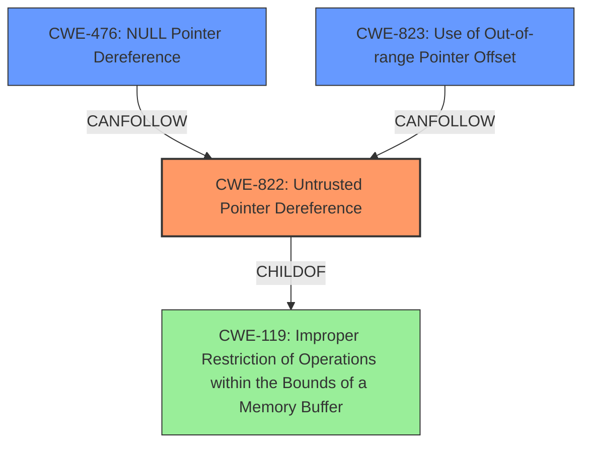

# Final Resolution for CVE-2021-46020

# Summary
| CWE ID | CWE Name | Confidence | CWE Abstraction Level | CWE Vulnerability Mapping Label | CWE-Vulnerability Mapping Notes |
|---|---|---|---|---|---|
| CWE-822 | Untrusted Pointer Dereference | 0.95 | Base | Allowed | Primary CWE. The product obtains a value from an untrusted source (arguments passed to `mrb_get_args()`), converts it to a pointer, and dereferences it. |
| CWE-476 | NULL Pointer Dereference | 0.70 | Base | Allowed | Secondary Candidate. While the primary issue is the untrusted pointer, dereferencing an invalid memory location *could* result in a NULL pointer, leading to a NULL dereference, but it is not the primary root cause. |

## Evidence and Confidence

*   **Confidence Score:** 0.92
*   **Evidence Strength:** HIGH

## Relationship Analysis
The primary relationship influencing the decision is the direct content match of the vulnerability description to the definition of CWE-822 (**Untrusted Pointer Dereference**). The vulnerability description explicitly states an "**untrusted pointer dereference**", which aligns perfectly with CWE-822. While other CWEs like CWE-476 (**NULL Pointer Dereference**) and CWE-823 (**Use of Out-of-range Pointer Offset**) were considered, they were deemed less relevant as they represent potential consequences or alternative scenarios rather than the root cause.

## Vulnerability Chain
The vulnerability chain starts with the **untrusted pointer** obtained from an external source via `mrb_get_args()`. This **untrusted pointer** is then dereferenced, leading to the potential access of invalid memory locations. The ultimate impact is a segmentation fault or application crash.

Untrusted Input (via `mrb_get_args()`) -> **CWE-822: Untrusted Pointer Dereference** -> Access of Invalid Memory Locations -> Segmentation Fault / Application Crash (Potential CWE-476 as a consequence)

## Summary of Analysis
The analysis is based on a direct match between the vulnerability description and the definition of CWE-822. The vulnerability description explicitly states an "**untrusted pointer dereference**", which is the defining characteristic of CWE-822. The retriever results also support this classification, with CWE-822 having a high similarity score.

The graph relationships influenced the decision by highlighting potential consequences (like CWE-476) and alternative scenarios (like CWE-823). However, the explicit mention of "**untrusted pointer dereference**" in the vulnerability description made CWE-822 the most appropriate primary CWE.

The selected CWEs are at the optimal level of specificity. CWE-822 is a Base-level CWE, which is preferred for mapping to root causes. While CWE-119 (**Improper Restriction of Operations within the Bounds of a Memory Buffer**) is a more general CWE, it is less specific than CWE-822 and therefore less appropriate for this vulnerability.

The criticism was helpful in highlighting the need to explicitly rule out other potential CWEs and to emphasize the distinction between CWE-822 and CWE-476. The revised summary table incorporates these suggestions.