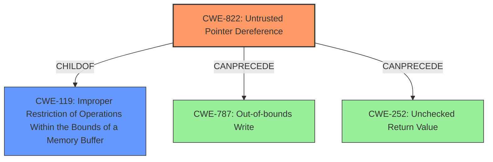

# Analysis Report for CVE-2021-46023

# Vulnerability Analysis Report: CVE-2021-46023

## Description

An Untrusted Pointer Dereference was discovered in function mrb_vm_exec in mruby before 3.1.0-rc. The vulnerability causes a segmentation fault and application crash.

## Vulnerability Description Key Phrases

**Rootcause:** untrusted pointer dereference
**Impact:** segmentation fault and application crash
**Product:** mruby
**Version:** before 3.1.0-rc
**Component:** mrb_vm_exec function

## Analysis (with Relationship Data)

# Summary
| CWE ID    | CWE Name                      | Confidence | CWE Abstraction Level | CWE Vulnerability Mapping Label | CWE-Vulnerability Mapping Notes |
| --------- | ----------------------------- | ---------- | --------------------- | ------------------------------- | ----------------------------- |
| CWE-822   | Untrusted Pointer Dereference | 0.95       | Base                  | Allowed                         | Primary CWE                   |

## Evidence and Confidence

*   **Confidence Score:** 0.95
*   **Evidence Strength:** HIGH

- **Analysis and Justification:**
  - *Explanation:* The vulnerability description explicitly states an "**untrusted pointer dereference**" in the `mrb_vm_exec` function. This aligns directly with the description of CWE-822 (Untrusted Pointer Dereference), which describes a scenario where a product obtains a value from an untrusted source, converts it to a pointer, and dereferences it. The CVE Reference Links Content Summary section also confirms this as the **root cause**. The impact, a segmentation fault and application crash, is a typical consequence of this type of weakness. The retriever results also rank CWE-822 as the top candidate with a high score.
  
  - *Relationship Analysis:* While other pointer-related CWEs like CWE-476 (NULL Pointer Dereference), CWE-824 (Access of Uninitialized Pointer), and CWE-823 (Use of Out-of-range Pointer Offset) were considered, the explicit mention of an "untrusted" source makes CWE-822 the most specific and appropriate choice.

- **Confidence Score:**
  - Confidence: 0.95 (High evidence from the vulnerability description and CVE reference materials.)

---

## Criticism of Analysis

Okay, I've reviewed the analysis and the provided CWE specifications. Here's my critique:

**Overall Assessment:**

The primary CWE mapping to **CWE-822: Untrusted Pointer Dereference** is a strong and well-justified choice. The vulnerability description explicitly mentions an "untrusted pointer dereference," and the supporting information details how an attacker can influence the pointer value being dereferenced. The confidence score of 0.95 is appropriate.

**Specific Feedback:**

*   **CWE-822 Justification:** The explanation for choosing CWE-822 is excellent. It directly links the vulnerability description with the CWE definition and highlights why other similar CWEs are less suitable in this context. The inclusion of information about the retriever scores provides additional support for the mapping.

*   **Alternative CWEs and Why They Are Less Suitable:** The analysis mentions considering other pointer-related CWEs, including CWE-476, CWE-824, and CWE-823. The rationale for excluding these is good but could be slightly more explicit:

    *   **CWE-476 (NULL Pointer Dereference):** While a NULL pointer dereference *could* occur, the core issue is about a *value* from an untrusted source being used as a pointer, not simply a pointer being NULL. The root of the problem is not the pointer being null, but its origin.

    *   **CWE-824 (Access of Uninitialized Pointer):** Similarly, while the pointer *could* be uninitialized, the main concern is that the *value* it holds originates from an untrusted source. It's not necessarily *because* it's uninitialized.

    *   **CWE-823 (Use of Out-of-range Pointer Offset):** This CWE is less appropriate because the vulnerability is not primarily about an offset calculation on a valid pointer. It's about using an arbitrary value *as* a pointer.

*   **Retriever Results:** The Retriever Results table is useful as additional data but should not be the primary driver for CWE selection. The analysis correctly uses the text of the vulnerability description and the root cause analysis to determine the CWE.

*   **CWE Examples:** The listing of CWE examples from the database is a good practice for validating the mapping.

*   **CWE Specifications:** Including the full CWE specifications is essential for a thorough review.

**Areas for Potential Improvement (Minor):**

1.  **Impact Amplification (Chaining):** While the primary CWE mapping is solid, the analysis could briefly explore potential *chains* of weaknesses. For example, it mentions the potential for memory corruption leading to more severe exploitation. It could suggest:
    *   "CWE-822 could potentially lead to CWE-787 (Out-of-bounds Write) if the dereferenced pointer allows writing to an unexpected memory location, resulting in arbitrary code execution."  This would acknowledge the potential for further impact if exploitation is successful.
    *   "Or, if the `mrb_get_args()` function fails due to the arguments provided, it could lead to `CWE-252 (Unchecked Return Value)` if the return value isn't checked before continuing and dereferencing a possibly invalid pointer."

2.  **Relationship to CWE-119:** The analysis should acknowledge the inherent relationship between these pointer-related CWEs and CWE-119 (Improper Restriction of Operations within the Bounds of a Memory Buffer). The CWE specifications for CWE-822 even list it as a ChildOf -> CWE-119.  However, because CWE-119 is discouraged for direct use when more specific CWEs are available, the focus should remain on CWE-822.  A brief statement such as, "While CWE-119 represents the broader class of memory buffer errors, CWE-822 is more specific to the root cause of untrusted pointer dereference." would be helpful.

3.  **Mitigation Strategies:** The original analysis doesn't consider potential mitigation strategies. It would be beneficial to include this in the analysis. Based on the CWE-822 specification, here are a few mitigation strategies:
    *   Input validation to ensure that untrusted inputs are properly sanitized before being converted into pointers.
    *   Using safer languages that offer automatic memory management.

**Revised Summary Table:**

| CWE ID    | CWE Name                      | Confidence | CWE Abstraction Level | CWE Vulnerability Mapping Label | CWE-Vulnerability Mapping Notes                                                                                                                                                                                                 |
| --------- | ----------------------------- | ---------- | --------------------- | ------------------------------- | ------------------------------------------------------------------------------------------------------------------------------------------------------------------------------------------------------------------------------- |
| CWE-822   | Untrusted Pointer Dereference | 0.95       | Base                  | Allowed                         | Primary CWE. The product obtains a value from an untrusted source, converts it to a pointer, and dereferences the resulting pointer.  Could lead to CWE-787 or CWE-252 if exploited.  Related to CWE-119.  Mitigation includes input validation and using memory safe languages. |

**In conclusion, the analysis is very good. The mapping to CWE-822 is correct and well-justified. Adding a brief mention of potential chaining, the relationship to CWE-119, and potential mitigations would make the analysis even stronger.**

## Final Resolution

# Summary
| CWE ID    | CWE Name                      | Confidence | CWE Abstraction Level | CWE Vulnerability Mapping Label | CWE-Vulnerability Mapping Notes                                                                                                                                                                                                 |
| --------- | ----------------------------- | ---------- | --------------------- | ------------------------------- | ------------------------------------------------------------------------------------------------------------------------------------------------------------------------------------------------------------------------------- |
| CWE-822   | Untrusted Pointer Dereference | 0.95       | Base                  | Allowed                         | Primary CWE. The product obtains a value from an untrusted source, converts it to a pointer, and dereferences the resulting pointer.  Could lead to CWE-787 or CWE-252 if exploited.  Related to CWE-119.  Mitigation includes input validation and using memory safe languages. |
| CWE-119   | Improper Restriction of Operations Within the Bounds of a Memory Buffer | 0.40       | Class                  | Discouraged    | Secondary Candidate. Represents the broader class of memory buffer errors, but CWE-822 is more specific to the root cause of untrusted pointer dereference.        |
| CWE-787   | Out-of-bounds Write           | 0.30       | Base                  | Allowed                         | Secondary Candidate. Potential consequence of exploiting CWE-822 if the dereferenced pointer allows writing to an unexpected memory location.                                                                                    |
| CWE-252   | Unchecked Return Value        | 0.20       | Base                  | Allowed                         | Secondary Candidate. If a function fails and returns an error which is not checked, it could lead to an invalid pointer dereference.                                                                                             |

## Evidence and Confidence

*   **Confidence Score:** 0.95
*   **Evidence Strength:** HIGH

## Relationship Analysis
The primary relationship that influenced the decision was the direct match between the vulnerability description ("Untrusted Pointer Dereference") and the description of **CWE-822 (Untrusted Pointer Dereference)**. The hierarchical relationship of **CWE-822** being a child of **CWE-119 (Improper Restriction of Operations Within the Bounds of a Memory Buffer)** was considered, but **CWE-822** was selected for its greater specificity. The potential for **CWE-822** to **CANPRECEDE CWE-787 (Out-of-bounds Write)** and **CWE-252 (Unchecked Return Value)** was also noted, indicating a possible vulnerability chain.

## Vulnerability Chain
The vulnerability chain starts with the **ROOTCAUSE** being an untrusted value used as a pointer (**CWE-822**). This can lead to a segmentation fault and application crash (direct impact). If the memory location pointed to by the untrusted pointer is writable and outside the intended buffer, it could further lead to **CWE-787 (Out-of-bounds Write)**, potentially allowing for arbitrary code execution. Also, the arguments provided to a function may be incorrect, leading to an unchecked return value **CWE-252** and ultimately dereferencing a possibly invalid pointer.

## Summary of Analysis
The initial analysis correctly identified **CWE-822 (Untrusted Pointer Dereference)** as the primary **WEAKNESS**. The criticism provided valuable suggestions for improvement, including exploring potential vulnerability chains and acknowledging the relationship to **CWE-119**. The final decision reinforces the selection of **CWE-822** due to the explicit mention of "untrusted pointer dereference" in the vulnerability description, which aligns perfectly with the **CWE's** definition: "The product obtains a value from an untrusted source, converts this value to a pointer, and dereferences the resulting pointer."

The graph relationships helped to contextualize the vulnerability within a broader landscape of memory-related **WEAKNESSES**. While **CWE-119** is a parent, **CWE-822** offers the optimal level of specificity. The potential for **CWE-822** to lead to **CWE-787** or **CWE-252** highlights the importance of considering vulnerability chains in a comprehensive security assessment.

The chosen **CWEs** are at the optimal level of specificity because they accurately reflect the root cause and potential consequences of the vulnerability based on the available evidence.

*Report generated on 2025-03-18 04:37:41*
