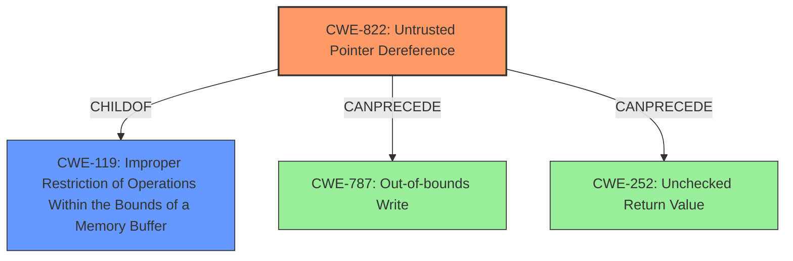

# Final Resolution for CVE-2021-46023

# Summary
| CWE ID    | CWE Name                      | Confidence | CWE Abstraction Level | CWE Vulnerability Mapping Label | CWE-Vulnerability Mapping Notes                                                                                                                                                                                                 |
| --------- | ----------------------------- | ---------- | --------------------- | ------------------------------- | ------------------------------------------------------------------------------------------------------------------------------------------------------------------------------------------------------------------------------- |
| CWE-822   | Untrusted Pointer Dereference | 0.95       | Base                  | Allowed                         | Primary CWE. The product obtains a value from an untrusted source, converts it to a pointer, and dereferences the resulting pointer.  Could lead to CWE-787 or CWE-252 if exploited.  Related to CWE-119.  Mitigation includes input validation and using memory safe languages. |
| CWE-119   | Improper Restriction of Operations Within the Bounds of a Memory Buffer | 0.40       | Class                  | Discouraged    | Secondary Candidate. Represents the broader class of memory buffer errors, but CWE-822 is more specific to the root cause of untrusted pointer dereference.        |
| CWE-787   | Out-of-bounds Write           | 0.30       | Base                  | Allowed                         | Secondary Candidate. Potential consequence of exploiting CWE-822 if the dereferenced pointer allows writing to an unexpected memory location.                                                                                    |
| CWE-252   | Unchecked Return Value        | 0.20       | Base                  | Allowed                         | Secondary Candidate. If a function fails and returns an error which is not checked, it could lead to an invalid pointer dereference.                                                                                             |

## Evidence and Confidence

*   **Confidence Score:** 0.95
*   **Evidence Strength:** HIGH

## Relationship Analysis
The primary relationship that influenced the decision was the direct match between the vulnerability description ("Untrusted Pointer Dereference") and the description of **CWE-822 (Untrusted Pointer Dereference)**. The hierarchical relationship of **CWE-822** being a child of **CWE-119 (Improper Restriction of Operations Within the Bounds of a Memory Buffer)** was considered, but **CWE-822** was selected for its greater specificity. The potential for **CWE-822** to **CANPRECEDE CWE-787 (Out-of-bounds Write)** and **CWE-252 (Unchecked Return Value)** was also noted, indicating a possible vulnerability chain.

## Vulnerability Chain
The vulnerability chain starts with the **ROOTCAUSE** being an untrusted value used as a pointer (**CWE-822**). This can lead to a segmentation fault and application crash (direct impact). If the memory location pointed to by the untrusted pointer is writable and outside the intended buffer, it could further lead to **CWE-787 (Out-of-bounds Write)**, potentially allowing for arbitrary code execution. Also, the arguments provided to a function may be incorrect, leading to an unchecked return value **CWE-252** and ultimately dereferencing a possibly invalid pointer.

## Summary of Analysis
The initial analysis correctly identified **CWE-822 (Untrusted Pointer Dereference)** as the primary **WEAKNESS**. The criticism provided valuable suggestions for improvement, including exploring potential vulnerability chains and acknowledging the relationship to **CWE-119**. The final decision reinforces the selection of **CWE-822** due to the explicit mention of "untrusted pointer dereference" in the vulnerability description, which aligns perfectly with the **CWE's** definition: "The product obtains a value from an untrusted source, converts this value to a pointer, and dereferences the resulting pointer."

The graph relationships helped to contextualize the vulnerability within a broader landscape of memory-related **WEAKNESSES**. While **CWE-119** is a parent, **CWE-822** offers the optimal level of specificity. The potential for **CWE-822** to lead to **CWE-787** or **CWE-252** highlights the importance of considering vulnerability chains in a comprehensive security assessment.

The chosen **CWEs** are at the optimal level of specificity because they accurately reflect the root cause and potential consequences of the vulnerability based on the available evidence.