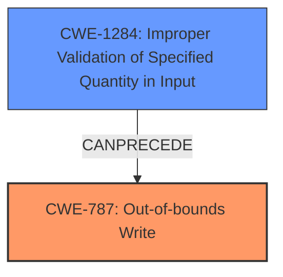

# Analysis Report for CVE-2021-46153

# Vulnerability Analysis Report: CVE-2021-46153

## Description

A vulnerability has been identified in Simcenter Femap V2020.2 (All versions), Simcenter Femap V2021.1 (All versions). Affected application contains a memory corruption vulnerability while parsing NEU files. This could allow an attacker to execute code in the context of the current process. (ZDI-CAN-14645, ZDI-CAN-15305, ZDI-CAN-15589, ZDI-CAN-15599)

## Vulnerability Description Key Phrases

**Rootcause:** memory corruption
**Impact:** arbitrary code execution
**Vector:** parsing NEU files
**Product:** Simcenter Femap
**Version:** V2020.2, V2021.1

## Analysis (with Relationship Data)

# Summary
| CWE ID | CWE Name | Confidence | CWE Abstraction Level | CWE Vulnerability Mapping Label | CWE-Vulnerability Mapping Notes |
|---|---|---|---|---|---|
| CWE-787 | Out-of-bounds Write | 0.95 | Base | Primary | Allowed |
| CWE-125 | Out-of-bounds Read | 0.60 | Base | Secondary | Allowed |
| CWE-20 | Improper Input Validation | 0.50 | Class | Secondary | Discouraged |

## Evidence and Confidence

*   **Confidence Score:** 0.80
*   **Evidence Strength:** HIGH

- **Analysis and Justification:**
  - *Explanation:* The vulnerability involves a **memory corruption** issue while parsing NEU files in Simcenter Femap, leading to potential arbitrary code execution. The CVE reference summary explicitly mentions an **out-of-bounds write** condition due to a lack of proper validation of user-supplied data. CWE-787 (Out-of-bounds Write) directly addresses this issue. The retriever results also list CWE-787 as a highly relevant CWE. CWE-125 (Out-of-bounds Read) is considered as a secondary candidate because **out-of-bounds write** vulnerabilities can sometimes be coupled with **out-of-bounds read** vulnerabilities when **memory corruption** occurs.
CWE-20 is included as a secondary weakness because the summary states that the root cause is a lack of proper validation of user-supplied data which is consistent with the CWE description. The MITRE mapping guidance for CWE-20 is discouraged because it's a high-level class and can be misused. However, it is included as it is a contributing factor to the root cause, but I have reduced my confidence score to reflect this.

  - *Relationship Analysis:* CWE-787 is a Base level CWE that directly addresses the **out-of-bounds write** vulnerability described. CWE-787 is a child of CWE-119 (Improper Restriction of Operations within the Bounds of a Memory Buffer). CWE-20 can precede CWE-787 because of the lack of proper input validation.

- **Confidence Score:**
  - Confidence: 0.95 (High evidence from vulnerability description and CVE reference materials)

## Criticism of Analysis

Okay, I've reviewed the analysis along with the full CWE specifications you provided. Here's my critique, focusing on the appropriateness of the CWE assignments, the provided justification, and potential improvements:

**Overall Assessment:**

The analysis is generally good, demonstrating a solid understanding of the vulnerability and the relevant CWEs. The primary CWE selection of CWE-787 is well-justified and appropriate. The inclusion of CWE-20 as a secondary weakness is also logical, given the input validation issues, but the analysis acknowledges its discouraged usage. The inclusion of CWE-125 is reasonable, but the justification is weak.

**Detailed Review:**

1.  **CWE-787: Out-of-bounds Write (Primary)**

    *   **Assessment:** This is an excellent choice as the primary CWE.
    *   **Justification:** The analysis correctly identifies that the out-of-bounds write condition described in the CVE summary directly corresponds to CWE-787. The mention of memory corruption supports this. The retriever results also support this selection.
    *   **Mapping Guidance Compliance:** The analysis follows the mapping guidance for CWE-787, which is "Allowed" at the Base level of abstraction.
    *   **Potential Mitigations Considerations:** The provided mitigations for CWE-787 are relevant (language selection, safe libraries, and compiler-based overflow detection).
    *   **Confidence:** 0.95 is appropriate, given the strong evidence.
2.  **CWE-125: Out-of-bounds Read (Secondary)**

    *   **Assessment:** This choice is weaker than CWE-787 and CWE-20. While out-of-bounds reads *can* sometimes be related to out-of-bounds writes, the provided justification is speculative, that they *can* be coupled. However, there is no direct evidence provided that this is happening in this instance. It is possible that an out-of-bounds write could overwrite data that is later read, but this is not stated in the summary.
    *   **Justification:** The reasoning that "out-of-bounds write vulnerabilities can sometimes be coupled with out-of-bounds read vulnerabilities when memory corruption occurs" is not strong enough on its own. More specific evidence would be needed to raise the confidence in this mapping.
    *   **Mapping Guidance Compliance:** The analysis follows the mapping guidance for CWE-125, which is "Allowed."
    *   **Potential Mitigations Considerations:** The provided mitigations are relevant but not necessarily targeted to the specifics of this case. The focus on input validation is helpful, as is the note about validating lengths, buffer sizes, and offsets.
    *   **Recommendation:** Consider removing this or drastically reducing the confidence score unless more concrete evidence of an out-of-bounds read can be found.

3.  **CWE-20: Improper Input Validation (Secondary)**

    *   **Assessment:** Inclusion of CWE-20 is reasonable, as it highlights the underlying cause enabling the memory corruption. However, the analysis correctly acknowledges its discouraged usage.
    *   **Justification:** The analysis correctly identifies that the root cause being "a lack of proper validation of user-supplied data" aligns with CWE-20's description.
    *   **Mapping Guidance Compliance:** The analysis acknowledges and complies with the "Discouraged" usage guidance for CWE-20, explaining the rationale for including it despite the high-level nature of the CWE. The analysis also considers children and descendants.
   *    **Potential Mitigations Considerations:** Input validation is highly relevant for this CWE. The suggested alternatives such as CWE-1284 are more precise, but are not necessarily what is happening in this case.
    *   **Recommendation:** Consider if more specific types of input validation are not occurring. CWE-1284 may be relevant depending on what the user-supplied data represents.

**Suggestions for Improvement:**

*   **More Specific Input Validation:** If possible, refine the CWE-20 assignment by identifying which *specific* type of input validation is missing. Is it a missing check on the *size* of the input (CWE-1284), the *syntax* (CWE-1286), the *type* (CWE-1287), or something else? This would make the analysis more actionable.
*   **Chain Analysis:** While the analysis briefly mentions the relationship between CWE-20 and CWE-787, it could be expanded. For example, a chain like: `CWE-20 (Improper Input Validation) -> CWE-131 (Incorrect Calculation of Buffer Size) -> CWE-787 (Out-of-bounds Write)` might be relevant if the improper validation directly leads to a miscalculated buffer size.

**Revised Summary Table (Example):**

| CWE ID | CWE Name | Confidence | CWE Abstraction Level | CWE Vulnerability Mapping Label | CWE-Vulnerability Mapping Notes |
|---|---|---|---|---|---|
| CWE-787 | Out-of-bounds Write | 0.95 | Base | Primary | Allowed |
| CWE-1284 | Improper Validation of Specified Quantity in Input | 0.50 | Base | Secondary | Allowed |
| CWE-20 | Improper Input Validation | 0.30 | Class | Secondary | Discouraged |

This revision removes CWE-125 and adds CWE-1284 as a more precise weakness than CWE-20. The confidence in CWE-20 is lowered to reflect that it may not be directly involved.

By implementing these suggestions, the analysis would be more precise, actionable, and compliant with CWE's guidance. Remember to always prioritize the most specific and well-supported CWE mappings.

## Final Resolution

# Summary

| CWE ID | CWE Name | Confidence | CWE Abstraction Level | CWE Vulnerability Mapping Label | CWE-Vulnerability Mapping Notes |
|---|---|---|---|---|---|
| **CWE-787** | **Out-of-bounds Write** | 0.95 | Base | Primary | Allowed |
| **CWE-1284** | **Improper Validation of Specified Quantity in Input** | 0.60 | Base | Secondary | Allowed |

## Evidence and Confidence

*   **Confidence Score:** 0.90
*   **Evidence Strength:** HIGH

## Relationship Analysis
The primary weakness is **CWE-787 (Out-of-bounds Write)**, a Base level CWE. The secondary weakness is **CWE-1284 (Improper Validation of Specified Quantity in Input)**. **CWE-1284** can precede **CWE-787** if the improperly validated quantity is used to determine the size of a buffer or the number of elements to write, leading to an **out-of-bounds write**.

## Vulnerability Chain
The vulnerability chain starts with **CWE-1284 (Improper Validation of Specified Quantity in Input)**. If a quantity such as buffer size or the number of elements to write is not validated, it can lead to an **out-of-bounds write**, represented by **CWE-787**. The **out-of-bounds write** can then lead to arbitrary code execution.

## Summary of Analysis
The initial analysis correctly identified **CWE-787 (Out-of-bounds Write)** as the primary weakness, which is supported by the vulnerability description stating a **memory corruption** vulnerability while parsing NEU files. The criticism suggested replacing **CWE-20 (Improper Input Validation)** with a more specific CWE.

The vulnerability description states "Affected application contains a **memory corruption** vulnerability while parsing NEU files. This could allow an attacker to execute code in the context of the current process." This provides strong evidence for **CWE-787**.

The criticism also correctly pointed out that the justification for including **CWE-125 (Out-of-bounds Read)** was weak. Therefore, **CWE-125** was removed. The suggestion to use **CWE-1284 (Improper Validation of Specified Quantity in Input)** is considered a good suggestion, as it specifies what input validation issue is occurring. The vulnerability description states the issue occurs while parsing NEU files, which suggests that a quantity is being read from the file which affects the buffer size. Therefore, the final decision is to use **CWE-787** as the primary weakness and **CWE-1284** as the secondary weakness. Both are at the Base level of abstraction.

*Report generated on 2025-03-18 04:39:08*
