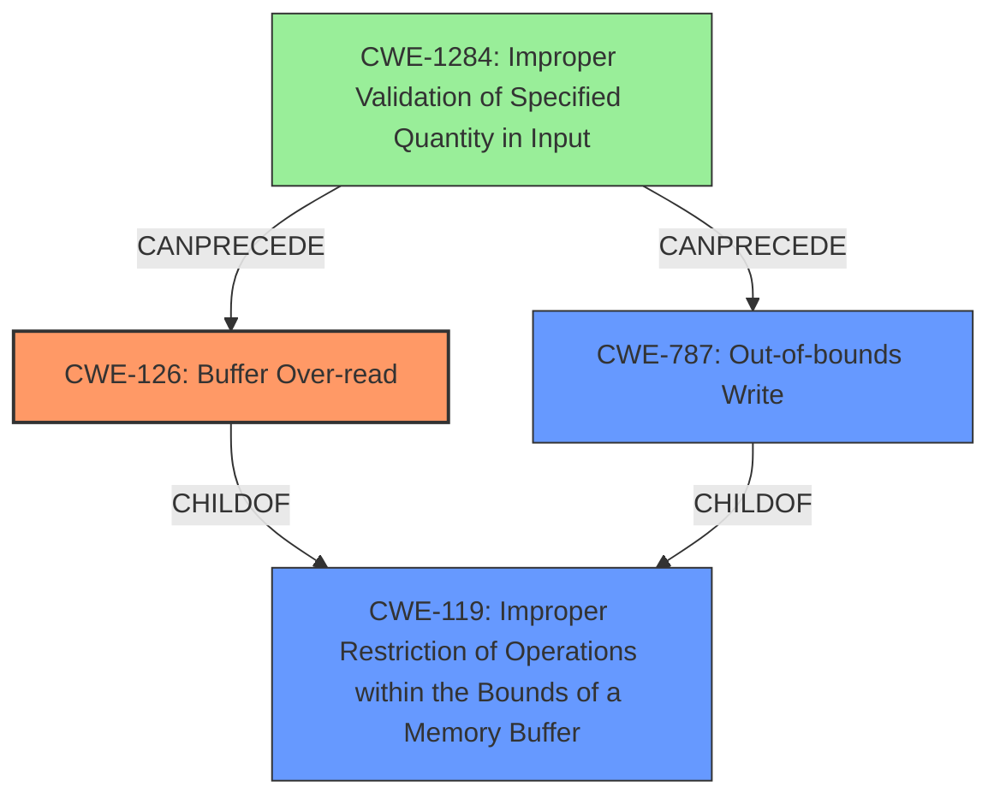

# Analysis Report for CVE-2021-46157

# Vulnerability Analysis Report: CVE-2021-46157

## Description

A vulnerability has been identified in Simcenter Femap V2020.2 (All versions), Simcenter Femap V2021.1 (All versions). Affected application contains a memory corruption vulnerability while parsing NEU files. This could allow an attacker to execute code in the context of the current process. (ZDI-CAN-14757)

## Vulnerability Description Key Phrases

**Rootcause:** buffer over-read
**Weakness:** memory corruption
**Impact:** arbitrary code execution
**Vector:** parsing NEU files
**Product:** Simcenter Femap
**Version:** V2020.2, V2021.1 (All versions)

## Analysis (with Relationship Data)

# Summary
| CWE ID | CWE Name | Confidence | CWE Abstraction Level | CWE Vulnerability Mapping Label | CWE-Vulnerability Mapping Notes |
|---|---|---|---|---|---|
| CWE-126 | Buffer Over-read | 0.85 | Variant | Allowed | The vulnerability is a **buffer over-read** while parsing NEU files. |
| CWE-787 | Out-of-bounds Write | 0.70 | Base | Allowed | The vulnerability also exhibits a **memory corruption** issue, which can lead to out-of-bounds writes. |

## Evidence and Confidence

*   **Confidence Score:** 0.75
*   **Evidence Strength:** MEDIUM

- **Analysis and Justification:**  
  - *Explanation:* The vulnerability description clearly indicates a **buffer over-read** issue when parsing NEU files, making CWE-126 (Buffer Over-read) the most appropriate primary CWE. The description also mentions **memory corruption**, which can be related to out-of-bounds write, suggesting CWE-787 (Out-of-bounds Write) as a secondary issue. CWE-126 is a Variant level CWE, which is preferred. The CVE reference summary points to a lack of proper validation of user-supplied data when parsing NEU files.
  
  - *Relationship Analysis:* CWE-126 is a variant of CWE-119 (Improper Restriction of Operations within the Bounds of a Memory Buffer), and is related to other buffer-related weaknesses like CWE-125 (Out-of-bounds Read). CWE-787 (Out-of-bounds Write) is also a child of CWE-119.

- **Confidence Score:**  
  - *Example:* Confidence: 0.85 (High evidence for CWE-126, Medium for CWE-787 due to memory corruption implying potential writes)

---

## Criticism of Analysis

Okay, let's review the provided CWE analysis for the Simcenter Femap vulnerability, taking into account the full CWE specifications.

**Overall Assessment**

The analysis is generally good. It correctly identifies CWE-126 (Buffer Over-read) as a primary weakness and CWE-787 (Out-of-bounds Write) as a secondary one. The confidence scores and evidence are reasonable. However, there are a few points to consider for refinement and improvement.

**Detailed Critique:**

1.  **CWE-126: Buffer Over-read**

    *   **Correctness:** The identification of CWE-126 as the primary weakness is supported by the "buffer over-read" root cause identified in the vulnerability description. The attack vector, parsing a malicious NEU file, aligns with the potential for crafting data that triggers an out-of-bounds read.
    *   **Confidence:** 0.85 seems appropriate, given the direct mention of "buffer over-read."
    *   **Abstraction Level:** Correctly identified as Variant.
    *   **Mapping Guidance:** The analysis acknowledges the "Allowed" usage for Variant-level CWEs.
    *   **Relationships:** The relationship analysis correctly mentions CWE-125 as a parent. The relationship to CWE-788 is also valid, as that CWE represents accessing memory *after* the buffer, which is a condition that can lead to reading.
    *   **Observed Examples:** The provided observed examples are relevant and helpful in understanding real-world instances of CWE-126.

2.  **CWE-787: Out-of-bounds Write**

    *   **Correctness:**  The inclusion of CWE-787 is justified by the mention of "memory corruption". While the initial trigger is an over-read, the resulting corruption can easily lead to out-of-bounds writes if the read data is used in subsequent write operations.
    *   **Confidence:** 0.70 is a reasonable assessment, given that the evidence is indirect (memory corruption *implying* writes).
    *   **Abstraction Level:** Correctly identified as Base.
    *   **Mapping Guidance:** The analysis acknowledges the "Allowed" usage for Base-level CWEs.
    *   **Relationships:** The parent-child relationship with CWE-119 is accurate.
    *   **Potential Improvement:** It would be beneficial to explicitly state *how* an over-read could lead to an out-of-bounds write in the specific context of parsing NEU files. For example, could the over-read data be used to calculate a buffer size or offset that is then used for a write operation? Adding this would strengthen the justification.

3.  **Justification and Confidence:**

    *   The justification provided is good, referencing both the vulnerability description and the CVE summary.
    *   The explanation of the relationship between the CWEs is helpful.

4.  **Missing Considerations and Potential Improvements:**

    *   **CWE-1284: Improper Validation of Specified Quantity in Input:** The Retriever Results section lists CWE-1284 with a high score. Given that NEU files likely contain length fields or other size specifications, the *root cause* might stem from failing to validate these values correctly.  The initial vulnerability summary also indicates this. Therefore, CWE-1284 should have been also considered, possibly even as a cause. While CWE-126 and CWE-787 are the symptoms, the root cause could be the lack of input validation. It would be useful to address and justify the selection (or deselection) of this option.
    *   **CWE-20: Improper Input Validation:** This is the parent of CWE-1284 and also appears high in the list. While CWE-20 is discouraged, if the analysis reveals a clear failure in input validation *without details*, then CWE-20 might be used. However, this report summary provides sufficient details that the analyst should have been able to identify a lower-level CWE (like 1284)
    *   **CWE-130: Improper Handling of Length Parameter Inconsistency:** Closely related to CWE-1284, if the NEU file format has length parameters that are inconsistent with the actual data, CWE-130 could also be relevant, especially if these inconsistencies are not handled properly, leading to the over-read or potential for write past end of buffer.

**Revised Analysis (Including Improvements):**

# Analysis to Review
# Summary
| CWE ID | CWE Name | Confidence | CWE Abstraction Level | CWE Vulnerability Mapping Label | CWE-Vulnerability Mapping Notes |
|---|---|---|---|---|---|
| CWE-126 | Buffer Over-read | 0.85 | Variant | Allowed | The vulnerability is a **buffer over-read** while parsing NEU files. |
| CWE-787 | Out-of-bounds Write | 0.70 | Base | Allowed | The vulnerability also exhibits a **memory corruption** issue, which can lead to out-of-bounds writes. |
| CWE-1284 | Improper Validation of Specified Quantity in Input | 0.60 | Base | Cause | A root cause likely lies in the improper validation of quantity fields (e.g., lengths, sizes) within the NEU file format. |

## Evidence and Confidence

*   **Confidence Score:** 0.80 (Overall)
*   **Evidence Strength:** MEDIUM-HIGH

- **Analysis and Justification:**
  - *Explanation:* The vulnerability description clearly indicates a **buffer over-read** issue when parsing NEU files, making CWE-126 (Buffer Over-read) the most appropriate primary CWE. The description also mentions **memory corruption**, which can be related to out-of-bounds write, suggesting CWE-787 (Out-of-bounds Write) as a secondary issue. CWE-126 is a Variant level CWE, which is preferred. The CVE reference summary points to a lack of proper validation of user-supplied data when parsing NEU files, likely related to size or length parameters (e.g., number of vertices, faces). This lack of validation is described in CWE-1284.
  - *Relationship Analysis:* CWE-126 is a variant of CWE-119 (Improper Restriction of Operations within the Bounds of a Memory Buffer), and is related to other buffer-related weaknesses like CWE-125 (Out-of-bounds Read). CWE-787 (Out-of-bounds Write) is also a child of CWE-119. A read of the buffer may be used to calculate subsequent buffer accesses and sizes, resulting in an out-of-bounds write if the read does not properly validate the data read from the input. The improper validation of size quantities (CWE-1284) is the likely root cause leading to both the over-read and over-write.

- **Confidence Score:**
  - *Example:* Confidence: 0.85 (High evidence for CWE-126, Medium for CWE-787 due to memory corruption implying potential writes), 0.60 (Medium evidence for CWE-1284 due to NEU file likely specifying data quantities, and lack of input validation description)

**Summary of Recommendations:**

*   Add a stronger justification for why CWE-787 is included, explaining how the over-read could directly lead to an out-of-bounds write.
*   Consider including CWE-1284 as a root cause. The vulnerability description indicates a lack of proper validation of user-supplied data in NEU files. This often involves quantities like lengths, sizes, or counts, which directly relates to CWE-1284. Add a justification if this option is considered and rejected.

By incorporating these refinements, the analysis will be more thorough and provide a clearer understanding of the vulnerability's root cause and potential mitigation strategies.

## Final Resolution

# Summary
| CWE ID | CWE Name | Confidence | CWE Abstraction Level | CWE Vulnerability Mapping Label | CWE-Vulnerability Mapping Notes |
|---|---|---|---|---|---|
| CWE-126 | Buffer Over-read | 0.85 | Variant | Allowed | The vulnerability is a **buffer over-read** while parsing NEU files. |
| CWE-787 | Out-of-bounds Write | 0.70 | Base | Allowed | The vulnerability also exhibits a **memory corruption** issue, which can lead to out-of-bounds writes. |
| CWE-1284 | Improper Validation of Specified Quantity in Input | 0.60 | Base | Cause | A root cause likely lies in the improper validation of quantity fields (e.g., lengths, sizes) within the NEU file format. |

## Evidence and Confidence

*   **Confidence Score:** 0.80
*   **Evidence Strength:** MEDIUM-HIGH

## Relationship Analysis
The primary weakness is a **buffer over-read** (CWE-126), which can lead to **memory corruption** and potential **out-of-bounds writes** (CWE-787). The analysis suggests the root cause is the **improper validation of input quantities** (CWE-1284) within the NEU file.

## Vulnerability Chain
1.  The process receives an NEU file as input.
2.  The file contains quantity specifications (e.g., lengths, sizes).
3.  The application fails to properly validate these quantities (CWE-1284).
4.  The application uses these invalid quantities to access a buffer, resulting in an over-read (CWE-126).
5.  The over-read leads to memory corruption, which can then cause an out-of-bounds write (CWE-787) if the read data is used to calculate subsequent buffer accesses and sizes.
6.  The attacker can then execute code within the context of the process.

## Summary of Analysis
The initial analysis correctly identified CWE-126 and CWE-787 but didn't explicitly consider the **root cause**. The criticism highlighted the potential role of CWE-1284 (Improper Validation of Specified Quantity in Input). Given that NEU files likely contain size or length parameters, the lack of validation of these parameters is a plausible **root cause** leading to the **buffer over-read** and subsequent **memory corruption**.

The vulnerability description states: "Affected application contains a **memory corruption** vulnerability while parsing NEU files." and "This could allow an attacker to execute code in the context of the current process."

The inclusion of CWE-1284 addresses the **root cause**, providing a more comprehensive view of the vulnerability. The confidence level for CWE-1284 is lower due to the need to infer its presence, but the evidence from the CVE summary supports this.

CWE-126 is at the optimal level of specificity as it directly describes the **buffer over-read**.
CWE-787 describes the **memory corruption** issue.
CWE-1284 is included to highlight the **lack of input validation** as a potential cause.

*Report generated on 2025-03-18 04:41:30*
