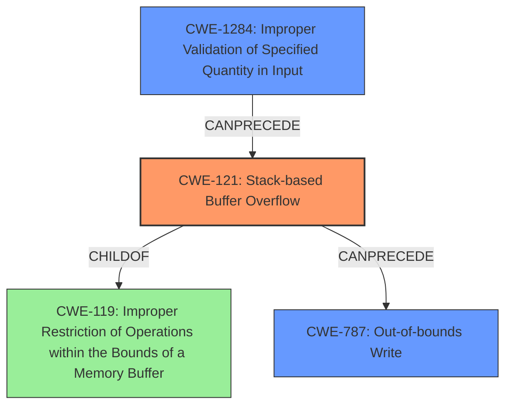

# Analysis Report for CVE-2021-46158

# Vulnerability Analysis Report: CVE-2021-46158

## Description

A vulnerability has been identified in Simcenter Femap V2020.2 (All versions), Simcenter Femap V2021.1 (All versions). Affected application contains a stack based buffer overflow vulnerability while parsing NEU files. This could allow an attacker to execute code in the context of the current process. (ZDI-CAN-15085, ZDI-CAN-15289, ZDI-CAN-15602)

## Vulnerability Description Key Phrases

**Weakness:** stack based buffer overflow
**Impact:** execute code in the context of the current process
**Vector:** parsing NEU files
**Attacker:** attacker
**Product:** Simcenter Femap
**Version:** V2020.2 (All versions), V2021.1 (All versions)

## Analysis (with Relationship Data)

# Summary
| CWE ID | CWE Name | Confidence | CWE Abstraction Level | CWE Vulnerability Mapping Label | CWE-Vulnerability Mapping Notes |
|---|---|---|---|---|---|
| CWE-121 | Stack-based Buffer Overflow | 0.95 | Variant | Primary | Allowed |
| CWE-787 | Out-of-bounds Write | 0.75 | Base | Secondary Candidate | Allowed |

## Evidence and Confidence

*   **Confidence Score:** 0.90
*   **Evidence Strength:** HIGH

- **Analysis and Justification:**  
  - *Explanation:* The vulnerability is explicitly described as a **stack based buffer overflow** vulnerability while parsing NEU files. This aligns directly with CWE-121 (Stack-based Buffer Overflow), which is a Variant-level CWE, making it more specific than the more general CWE-119 (Improper Restriction of Operations within the Bounds of a Memory Buffer). The CVE Reference Links Content Summary also confirms the stack-based nature of the overflow and the lack of proper validation of user-supplied data. CWE-787 (Out-of-bounds Write) is also a relevant CWE because a stack-based buffer overflow leads to writing data beyond the allocated buffer on the stack.
  
  - *Relationship Analysis:* CWE-121 is a variant of CWE-119 (Improper Restriction of Operations within the Bounds of a Memory Buffer). The vulnerability described directly involves a stack-based buffer, making CWE-121 a more precise classification than its parent CWE. CWE-787 (Out-of-bounds Write) is related as a consequence of the buffer overflow. It's a peer weakness that highlights the nature of the write operation causing the vulnerability.

- **Confidence Score:**  
  - *Example:* Confidence: 0.95 (High evidence from vulnerability description, CVE reference materials, and explicit mention of stack-based buffer overflow)

---

## Criticism of Analysis

Okay, let's review the provided CWE analysis and critique it against the full CWE specifications.

**Overall Assessment:**

The analysis correctly identifies CWE-121 (Stack-based Buffer Overflow) as the primary weakness. The justification is sound, given the explicit description of the vulnerability.  CWE-787 (Out-of-bounds Write) is also a reasonable secondary candidate as it represents the direct consequence of the overflow. The confidence scores are justifiable based on the available information.

**Detailed Critique:**

**1. CWE-121: Stack-based Buffer Overflow (Primary)**

*   **Correctness:** The selection of CWE-121 is accurate and well-justified. The vulnerability description explicitly mentions a "stack-based buffer overflow," making this the most specific and appropriate CWE.
*   **Abstraction Level:** CWE-121 is a Variant, which is a good level of abstraction for root cause analysis as recommended by CWE's mapping guidance.
*   **Mapping Guidance Check:** The analysis adheres to the mapping guidance for CWE-121, which suggests careful reading of the name and description to ensure a good fit.
*   **Relationship Analysis:** The explanation of the relationship between CWE-121 and CWE-119 (Improper Restriction of Operations within the Bounds of a Memory Buffer) is accurate. CWE-121 is a specific type of CWE-119 where the buffer is on the stack.
*   **Mitigations:** The potential mitigations listed in the CWE specification (compiler flags, abstraction libraries, input validation) are all relevant to addressing stack-based buffer overflows.
*   **Observed Examples:**  The example provided in the CWE specification (CVE-2021-35395) further validates the selection of CWE-121.

**2. CWE-787: Out-of-bounds Write (Secondary Candidate)**

*   **Correctness:** As a *consequence* of the Stack-based buffer overflow, an Out-of-bounds Write occurs.  Therefore, identifying it as a secondary candidate is reasonable.  The justification that a buffer overflow leads to writing data beyond the allocated buffer is accurate.
*   **Abstraction Level:** CWE-787 is a Base class, which is a suitable abstraction level, but less specific than a Variant.
*   **Mapping Guidance Check:** The analysis aligns with the mapping guidance for CWE-787, confirming it's an appropriate fit.
*   **Relationship Analysis:**  The analysis correctly states that CWE-787 is related as a consequence of the buffer overflow.
*   **Mitigations:** The potential mitigations listed in the CWE specification (language selection, libraries, compiler flags) are all relevant to preventing out-of-bounds writes.
*   **Observed Examples:** The examples provided in the CWE specifications (CVE-2023-1017, CVE-2021-21220, CVE-2021-28664) demonstrate the common occurence of out-of-bounds write in real world software.

**3. Analysis of Retriever Results**

The Retriever Results section contains a list of potential CWEs for the vulnerability. Let's review a few of these to see why they were not selected, and whether they could be applicable.

* **CWE-1284: Improper Validation of Specified Quantity in Input**  A quantity is the length of the input, which wasn't validated in parsing the .NEU file. This seems highly applicable. The "Extended Description" of CWE-1284 directly relates to buffer overflows.

* **CWE-170: Improper Null Termination**  The description doesn't mention anything specifically about strings or null termination. It's less likely, but possible if the overflow occurs in the context of string handling.

* **CWE-120: Buffer Copy without Checking Size of Input ('Classic Buffer Overflow')** The description doesn't explicitly mention using `memcpy` or a similar function without a size check.

* **CWE-20: Improper Input Validation** This is a *very general* CWE, and the notes mention it is discouraged from being used when lower-level CWEs are more descriptive. While there's clearly a lack of input validation, it is better to be more specific.

**Suggestions for Improvement:**

1.  **Include CWE-1284**: In addition to CWE-121 and CWE-787, include CWE-1284, "Improper Validation of Specified Quantity in Input" as a contributing factor. The lack of proper validation of the size of the input being parsed is a key element of the vulnerability, and makes code vulnerable to a stack overflow. The confidence level can be set to 0.70.
2.  **Strengthen the Relationship Analysis:** More explicitly state that CWE-787 is a direct *result* of CWE-121. The stack-based buffer overflow (CWE-121) allows an attacker to overwrite adjacent memory locations on the stack (CWE-787).
3.  **Mitigation Discussion:** Briefly mention which specific mitigations from the CWE specifications are most relevant to this particular scenario (e.g., using safe string handling functions, implementing bounds checking on input lengths before copying data).
4.  **CWE-120** While this is a very general CWE, it is helpful to mention that this is less descriptive because the use of `memcpy` is not explicitly mentioned in the text.
5.  **CWE-20** While the text says that there is an improper input validation, it would be more helpful to say that because there are more specific CWEs that describe this scenario, the use of it is not appropriate.
6.  **Avoid mentioning CWE-119**. It is too generic, and the CWE specifications say that it is discouraged.

**Revised Summary Table:**

| CWE ID | CWE Name | Confidence | CWE Abstraction Level | CWE Vulnerability Mapping Label | CWE-Vulnerability Mapping Notes |
|---|---|---|---|---|---|
| CWE-121 | Stack-based Buffer Overflow | 0.95 | Variant | Primary | Allowed |
| CWE-787 | Out-of-bounds Write | 0.75 | Base | Secondary Candidate | Allowed, Direct consequence of CWE-121 |
| CWE-1284 | Improper Validation of Specified Quantity in Input | 0.70 | Base | Contributing Factor | Allowed |

**Conclusion:**

The original analysis is generally good, especially in identifying the primary weakness. By incorporating the suggestions above, particularly the inclusion of CWE-1284 and strengthening the relationship analysis, the analysis can be even more accurate and informative. Remember to focus on specificity and the relationships between different CWEs.

## Final Resolution

# Summary
| CWE ID | CWE Name | Confidence | CWE Abstraction Level | CWE Vulnerability Mapping Label | CWE-Vulnerability Mapping Notes |
|---|---|---|---|---|---|
| CWE-121 | Stack-based Buffer Overflow | 0.95 | Variant | Primary | Allowed |
| CWE-787 | Out-of-bounds Write | 0.75 | Base | Secondary Candidate | Allowed, Direct consequence of CWE-121 |
| CWE-1284 | Improper Validation of Specified Quantity in Input | 0.70 | Base | Contributing Factor | Allowed |

## Evidence and Confidence

*   **Confidence Score:** 0.90
*   **Evidence Strength:** HIGH

## Relationship Analysis
The primary weakness is **CWE-121 (Stack-based Buffer Overflow)**, a variant of **CWE-119 (Improper Restriction of Operations within the Bounds of a Memory Buffer)**. **CWE-787 (Out-of-bounds Write)** is a direct consequence of **CWE-121**, as the overflow leads to writing beyond the allocated buffer. **CWE-1284 (Improper Validation of Specified Quantity in Input)** is a contributing factor because the vulnerability occurs due to the lack of proper validation of the size of the input being parsed.

## Vulnerability Chain
The vulnerability chain starts with **CWE-1284 (Improper Validation of Specified Quantity in Input)**, where the size of the input is not properly validated. This leads to **CWE-121 (Stack-based Buffer Overflow)**, allowing an attacker to write data beyond the allocated buffer on the stack. Finally, this results in **CWE-787 (Out-of-bounds Write)**, where adjacent memory locations on the stack are overwritten, potentially allowing the attacker to execute arbitrary code.

## Summary of Analysis
The initial analysis correctly identified **CWE-121 (Stack-based Buffer Overflow)** as the primary weakness, supported by the explicit mention of "stack-based buffer overflow" in the vulnerability description. The criticism highlighted the importance of including **CWE-1284 (Improper Validation of Specified Quantity in Input)** as a contributing factor, as the lack of input validation is a key element of the vulnerability. The addition of **CWE-1284** strengthens the analysis and provides a more complete picture of the vulnerability. I agree with the assessment that **CWE-787 (Out-of-bounds Write)** is a consequence of **CWE-121**.

The vulnerability description states, "Affected application contains a **stack based buffer overflow** vulnerability while parsing NEU files." This statement provides direct evidence for selecting **CWE-121**. The lack of proper validation of the size of the input being parsed supports the inclusion of **CWE-1284**.

The graph relationships influenced the final selection by highlighting the chain of weaknesses, starting with the lack of input validation (**CWE-1284**), leading to the stack-based buffer overflow (**CWE-121**), and ultimately resulting in an out-of-bounds write (**CWE-787**).

The selected CWEs are at the optimal level of specificity. **CWE-121** is a Variant that directly describes the stack-based nature of the buffer overflow. **CWE-787** is a Base CWE that accurately represents the consequence of writing beyond the allocated buffer. **CWE-1284** is a Base CWE that identifies the root cause of the vulnerability as improper validation of the input quantity.

*Report generated on 2025-03-18 04:42:17*
