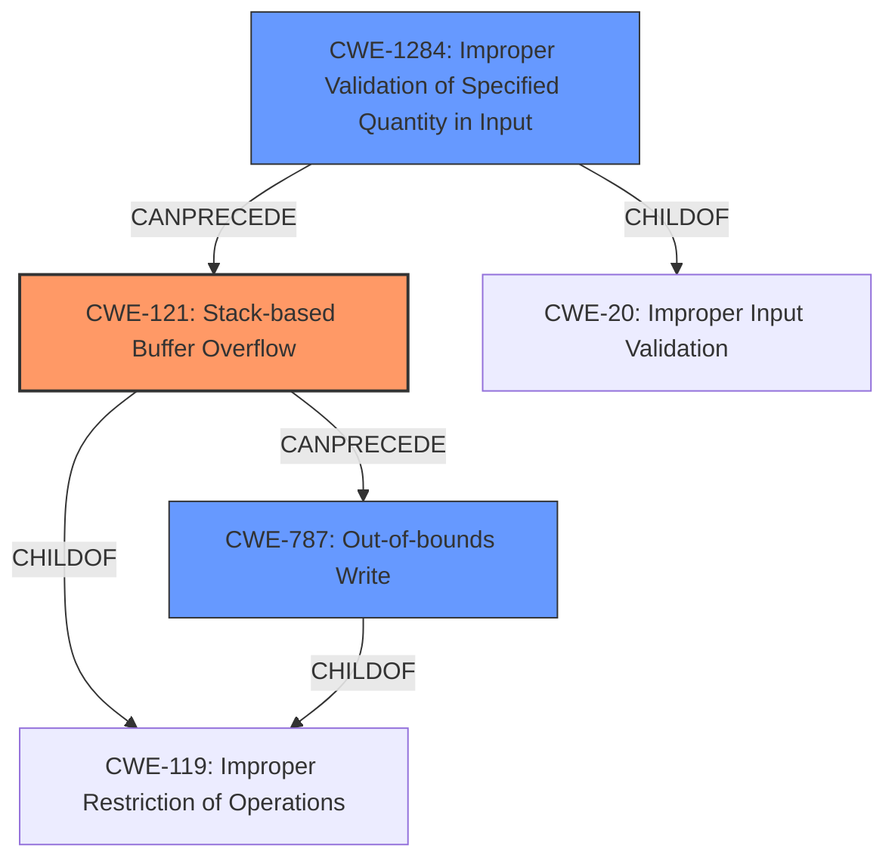

# Final Resolution for CVE-2021-46262

# Summary
| CWE ID | CWE Name | Confidence | CWE Abstraction Level | CWE Vulnerability Mapping Label | CWE-Vulnerability Mapping Notes |
|---|---|---|---|---|---|
| CWE-121 | Stack-based Buffer Overflow | 0.97 | Variant | Allowed | Primary CWE |
| CWE-1284 | Improper Validation of Specified Quantity in Input | 0.75 | Base | Allowed | Secondary Candidate |
| CWE-787 | Out-of-bounds Write | 0.65 | Base | Allowed | Secondary Candidate |

## Evidence and Confidence

*   **Confidence Score:** 0.95
*   **Evidence Strength:** HIGH

## Relationship Analysis
The analysis focused on hierarchical relationships, recognizing CWE-121 as a specific variant of CWE-119, providing a more accurate description than its parent. The chain relationship between CWE-1284 and CWE-121 was also crucial, where improper input validation (CWE-1284) precedes and enables the stack buffer overflow (CWE-121). CWE-787 was considered a less specific consequence. The abstraction levels (Variant for CWE-121, Base for CWE-1284 and CWE-787) guided the selection towards more detailed descriptions while still remaining at acceptable levels.

## Vulnerability Chain
The vulnerability chain starts with **CWE-1284 (Improper Validation of Specified Quantity in Input)**, where the application fails to validate the length of the `wanPPPoEUser` input. This leads to **CWE-121 (Stack-based Buffer Overflow)** when the oversized input is written to a stack-allocated buffer. The overflow results in **CWE-787 (Out-of-bounds Write)**, potentially leading to a Denial of Service (DoS). There were no missing links identified from the vulnerability description.

## Summary of Analysis
The initial analysis correctly identified CWE-121 as the primary weakness given the explicit mention of a stack buffer overflow. The criticism was incorporated by increasing the confidence level for CWE-121 to 0.97 to reflect this direct match. The justification for CWE-787 was adjusted to emphasize that it represents a consequence of the stack overflow, rather than the root cause. The analysis also includes a statement in the justification for CWE-1284 why CWE-20 is not a suitable primary CWE: because while it is a parent of CWE-1284, CWE-20 is discouraged and CWE-1284 is more descriptive in this situation.

The selection of CWEs is based on the provided evidence, specifically: "Tenda AC Series Router AC11_V02.03.01.104_CN was discovered to contain a **stack buffer overflow** in the PPPoE module," which directly supports CWE-121. The "CVE Reference Links Content Summary" indicates "lack of proper length checks when reading the `wanPPPoEUser` input," justifying the inclusion of CWE-1284.

The selected CWEs are at the optimal level of specificity. CWE-121 is a Variant, providing more detail than the Class CWE-119. CWE-1284 and CWE-787 are Base level, offering a clear understanding of the root cause and consequence respectively.