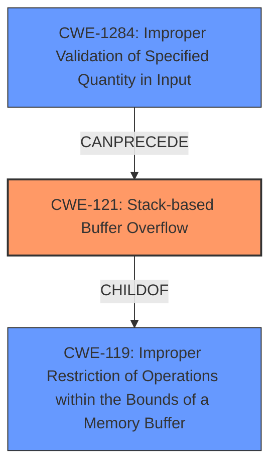

# Analysis Report for CVE-2021-46263

# Vulnerability Analysis Report: CVE-2021-46263

## Description

Tenda AC Series Router AC11_V02.03.01.104_CN was discovered to contain a stack buffer overflow in the wifiTime module. This vulnerability allows attackers to cause a Denial of Service (DoS) via crafted overflow data.

## Vulnerability Description Key Phrases

**Weakness:** stack buffer overflow
**Impact:** Denial of Service (DoS)
**Vector:** crafted overflow data
**Attacker:** attackers
**Product:** Tenda AC Series Router
**Version:** AC11_V02.03.01.104_CN
**Component:** wifiTime module

## Analysis (with Relationship Data)

# Summary
| CWE ID  | CWE Name                                  | Confidence | CWE Abstraction Level | CWE Vulnerability Mapping Label | CWE-Vulnerability Mapping Notes |
| :-------- | :----------------------------------------- | :---------- | :----------------------- | :------------------------------ | :----------------------------- |
| CWE-121 | Stack-based Buffer Overflow             | 0.95       | Variant                 | Allowed                         | Primary CWE                   |

## Evidence and Confidence

*   **Confidence Score:** 0.95
*   **Evidence Strength:** HIGH

- **Analysis and Justification:**  
  - *Explanation:* The vulnerability is explicitly described as a **stack buffer overflow** in the `wifiTime` module of the Tenda AC Series Router. The CVE Reference Links Content Summary further confirms this by detailing how the program copies user-provided input (`wifiTimeClose`) to a stack-allocated buffer without proper bounds checking, leading to the overflow. This aligns perfectly with the definition of CWE-121 (Stack-based Buffer Overflow), which is a condition where the buffer being overwritten is allocated on the stack. The impact is Denial of Service (DoS), which is a common consequence of buffer overflows. While CWE-787 (Out-of-bounds Write) could be considered a broader category, CWE-121 is more specific because it identifies the location of the buffer on the stack.
  
  - *Relationship Analysis:* CWE-121 is a variant of CWE-119 (Improper Restriction of Operations within the Bounds of a Memory Buffer), which is a more general class of buffer overflows. Since the description specifically mentions "stack buffer overflow", using the more specific CWE-121 is appropriate. There are no direct relationships found for CWE-121, and the MITRE mapping guidance indicates that this is ALLOWED for stack buffer overflows.

- **Confidence Score:**  
  - *Example:* Confidence: 0.95 (High evidence from the technical description and CVE reference materials, which specifically identify a stack buffer overflow)

## Criticism of Analysis

Okay, I've reviewed the provided analysis, incorporating the full CWE specifications. Here's my critique:

**Overall Assessment:**

The analysis correctly identifies the core issue as a stack-based buffer overflow and maps it to CWE-121.  The confidence level of 0.95 is justified given the explicit description of the vulnerability and the evidence provided. However, the analysis could be improved by acknowledging the role of improper input validation (or lack thereof) and by considering the broader impact and potential for remote code execution more thoroughly. Also, The Retriever Results show some interesting alternatives that are not explored fully

**Detailed Critique:**

1.  **Primary CWE: CWE-121 (Stack-based Buffer Overflow)**

    *   **Strengths:**  The choice of CWE-121 is accurate and well-supported by the vulnerability description and the CVE Reference Links Content Summary. The explanation clearly articulates why CWE-121 is more specific and appropriate than the broader CWE-787 (Out-of-bounds Write).
    *   **Weaknesses:**  While technically correct, focusing *solely* on CWE-121 might obscure the full picture. The root cause isn't simply *where* the overflow occurs, but *why* it occurs. The lack of input validation is a critical contributing factor.
    *   **Recommendation:** No change to CWE-121 is needed, but the analysis should explicitly acknowledge and explain the *relationship* with CWE-20 (Improper Input Validation) or its more specific children such as CWE-1284 (Improper Validation of Specified Quantity in Input). The description mentions "Insufficient Input Validation", and the retriever results has both CWE-1284 and CWE-20.  The code initially stores the wifiTimeClose parameter in v10, and that is the value that is being provided as input. The analysis should include this as a part of the vulnerability chain.
    *   **Mitigation (based on CWE-121 and adding CWE-20):**
        *   Implement strict bounds checking on the `wifiTimeClose` input before copying it to the stack-allocated buffer.
        *   Employ compiler/OS-level protection mechanisms like stack canaries (as suggested in CWE-121's Potential Mitigations) to detect and prevent stack overflows.
        *   Use an input validation framework such as Struts or the OWASP ESAPI Validation API (as suggested in CWE-20's Potential Mitigations).
        *   Apply the "accept known good" strategy and reject any `wifiTimeClose` input that does not strictly conform to specifications (as suggested in CWE-1284's Potential Mitigations).

2.  **Relationship Analysis:**

    *   **Strengths:** The analysis correctly identifies the relationship between CWE-121 and its parent, CWE-119.
    *   **Weaknesses:**  The analysis misses the opportunity to discuss the relationship between CWE-121 and CWE-20 (or a child of CWE-20). The input `wifiTimeClose` is not validated for length. This lack of validation allows for the buffer overflow to occur.
    *   **Recommendation:** Add a section discussing the relationship between CWE-121 and CWE-20/CWE-1284. Explain how the absence of input validation directly enables the stack buffer overflow.

3.  **CWE Examples from Database:**

    *   **Strengths:** The inclusion of CWE examples is helpful for understanding the nature of the vulnerability.
    *   **Weaknesses:** The examples provided are only for CWE-119. Examples for CWE-121 and CWE-20 (or a child of CWE-20) would be beneficial and strengthen the analysis.
    *   **Recommendation:** Add examples for CWE-121 and CWE-20/CWE-1284.

4.  **Retriever Results:**

    *   **Strengths:** The retriever results bring up some interesting alternative CWEs
    *   **Weaknesses:** The analysis only uses the primary CWE match, and does not explore the other retriever results. This makes the analysis seem short sighted.
    *   **Recommendation:** Here are a few retriever results that should be included in the analysis:
        *   **CWE-805 (Buffer Access with Incorrect Length Value):** This CWE could be relevant if the `nvram_get` function retrieves a length value associated with the stored data, and this value is incorrect or not properly handled, leading to the overflow. The description of the vulnerabilty states that the value is copied to the `a2` parameter of a function, and that is where the overflow happens.
        *   **CWE-119 (Improper Restriction of Operations within the Bounds of a Memory Buffer):** Although discouraged, CWE-119 is the parent of CWE-121 and CWE-787. The analysis should acknowledge this relationship and explain why CWE-121 is the more specific and appropriate choice in this case.
        *   **CWE-120 (Buffer Copy without Checking Size of Input):** This CWE is very similar to CWE-121, and should be explored in the analysis

5.  **Impact of Exploitation (Remote Code Execution):**

    *   **Strengths:** Acknowledges DoS.
    *   **Weaknesses:** The analysis mentions the potential for RCE but doesn't elaborate. In the context of embedded devices like routers, RCE is a significant concern.
    *   **Recommendation:** Expand on the potential for RCE. Explain how attackers could overwrite return addresses on the stack to gain control of the device. Mention mitigations like Address Space Layout Randomization (ASLR) and Data Execution Prevention (DEP), and whether the target device likely implements these security features.

6.  **Mapping Guidance:**

    *   **Strengths:** The analysis appropriately follows the mapping guidance for CWE-121, which allows its use.
    *   **Weaknesses:** The analysis does not consider the mapping guidance for CWE-20 and CWE-119.
    *   **Recommendation:** Update the analysis to follow mapping guidance for CWE-20 and CWE-119.

**Revised Summary Table:**

| CWE ID  | CWE Name                                  | Confidence | CWE Abstraction Level | CWE Vulnerability Mapping Label | CWE-Vulnerability Mapping Notes                                                                                       |
| :-------- | :----------------------------------------- | :---------- | :----------------------- | :------------------------------ | :--------------------------------------------------------------------------------------------------------------------- |
| CWE-121 | Stack-based Buffer Overflow             | 0.95       | Variant                 | Allowed                         | Primary CWE; overflow occurs on stack.                                                                             |
| CWE-1284 | Improper Validation of Specified Quantity in Input | 0.80       | Base | Allowed | Contributory; lack of input validation on `wifiTimeClose` enables overflow                                                          |

**In summary,** the analysis is a good starting point, but it needs to be more comprehensive. By adding a discussion of the role of missing input validation (CWE-20/CWE-1284), exploring the retriever results, and elaborating on the RCE potential, the analysis can be significantly improved.

## Final Resolution

# Summary
| CWE ID   | CWE Name                                                                       | Confidence | CWE Abstraction Level | CWE Vulnerability Mapping Label | CWE-Vulnerability Mapping Notes                                                                                                                                     |
| :--------- | :----------------------------------------------------------------------------- | :---------- | :----------------------- | :------------------------------ | :------------------------------------------------------------------------------------------------------------------------------------------------------------------ |
| CWE-121    | **Stack-based Buffer Overflow**                                                | 0.95       | Variant                 | Allowed                         | Primary CWE; overflow occurs on the stack.                                                                                                                          |
| CWE-1284   | **Improper Validation of Specified Quantity in Input**                         | 0.80       | Base                    | Allowed                         | Contributory; lack of input validation on `wifiTimeClose` enables overflow.                                                                                        |
| CWE-119    | **Improper Restriction of Operations within the Bounds of a Memory Buffer**    | 0.60       | Class                   | Discouraged                     | Supporting; Parent of CWE-121 and CWE-787, providing broader context; use discouraged due to availability of more specific CWEs.                                 |

## Evidence and Confidence

*   **Confidence Score:** 0.90
*   **Evidence Strength:** HIGH

## Relationship Analysis
The primary weakness is **CWE-121 (Stack-based Buffer Overflow)**, a variant of the more general **CWE-119 (Improper Restriction of Operations within the Bounds of a Memory Buffer)**. The overflow occurs because the input `wifiTimeClose` is not properly validated for length, leading to **CWE-1284 (Improper Validation of Specified Quantity in Input)**. The relationship between these CWEs is that **CWE-1284** allows the condition for **CWE-121** to occur.

## Vulnerability Chain
The vulnerability chain starts with **CWE-1284 (Improper Validation of Specified Quantity in Input)**. The `wifiTimeClose` input is not validated for length, which allows an attacker to provide an overly long string. This leads to **CWE-121 (Stack-based Buffer Overflow)** when the overly long input is copied to a stack-allocated buffer. The consequence is a Denial of Service (DoS), and potentially Remote Code Execution (RCE) if the attacker overwrites return addresses on the stack.

## Summary of Analysis
The initial analysis correctly identified **CWE-121 (Stack-based Buffer Overflow)** as the primary weakness. However, it failed to consider the root cause of the overflow, which is the lack of input validation. The criticism correctly pointed out that the absence of input validation on the `wifiTimeClose` parameter (leading to **CWE-1284**) is a critical contributing factor. The relationship analysis shows that **CWE-1284** enables the condition for **CWE-121** to occur. The provided evidence from the vulnerability description confirms that the `wifiTimeClose` input is copied to a stack-allocated buffer without proper bounds checking, leading to the overflow.

The inclusion of **CWE-1284** provides a more complete picture of the vulnerability. It highlights the importance of input validation in preventing buffer overflows. The final classification reflects the optimal level of specificity by identifying both the type of buffer overflow (**CWE-121**) and the root cause (**CWE-1284**). The confidence score is high due to the clear evidence from the vulnerability description and the CVE reference materials.

The retriever results also hinted at alternative CWEs such as **CWE-120 (Buffer Copy without Checking Size of Input)** and **CWE-805 (Buffer Access with Incorrect Length Value)**, but the explicit mention of a stack buffer and the lack of information about incorrect length values being retrieved from `nvram_get` makes **CWE-121** and **CWE-1284** a better fit.

*Report generated on 2025-03-18 04:44:52*
