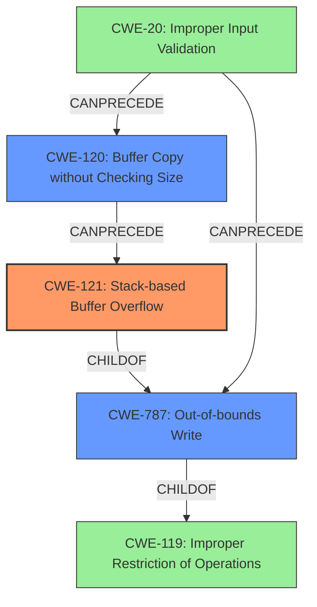

# Final Resolution for CVE-2021-46264

# Summary

| CWE ID  | CWE Name                                                                         | Confidence | CWE Abstraction Level | CWE Vulnerability Mapping Label | CWE-Vulnerability Mapping Notes |
| ------- | -------------------------------------------------------------------------------- | ---------- | --------------------- | ------------------------------- | ----------------------------- |
| CWE-121 | CWE-121: Stack-based Buffer Overflow                                              | 0.95       | Variant               | Allowed                         | Primary CWE                   |
| CWE-120 | CWE-120: Buffer Copy without Checking Size of Input ('Classic Buffer Overflow') | 0.80       | Base                  | Allowed-with-Review           | Secondary Candidate           |
| CWE-787 | CWE-787: Out-of-bounds Write                                                     | 0.75       | Base                  | Allowed                         | Secondary Candidate           |

## Evidence and Confidence

*   **Confidence Score:** 0.90
*   **Evidence Strength:** HIGH

## Relationship Analysis

The primary CWE is CWE-121, which is a variant of CWE-119, but more specific to stack-based overflows. CWE-787 is a more general form of out-of-bounds write, making it a parent. CWE-120 is closely related as it describes the buffer copy operation without size checking that leads to the overflow. The relationships influenced the decision to include CWE-120 as a secondary candidate due to its direct relevance to the vulnerability's mechanism.

## Vulnerability Chain

The vulnerability chain starts with **CWE-20 Improper Input Validation**, leading to **CWE-120 Buffer Copy without Checking Size**, which results in **CWE-121 Stack-based Buffer Overflow** and/or **CWE-787 Out-of-bounds Write**.

- Initial Flaw: Lack of input validation on the `onlineList` parameter.
- Weakness 1: `strncpy` is used without checking the size of the input.
- Weakness 2: Data is written beyond the boundaries of the stack buffer.
- Impact: Denial of Service (DoS) due to the overflow.

## Summary of Analysis

The initial analysis correctly identified CWE-121 as the primary weakness due to the explicit mention of a "stack buffer overflow." The criticism suggested adding CWE-120 and provided justification, which was adopted.

- "The vulnerability is described as a **stack buffer overflow** in the `onlineList` module of the Tenda AC Series Router." This quote highlights the direct evidence for selecting CWE-121.
- The graph relationships influenced the decision to include CWE-120 as it directly precedes CWE-121 in the vulnerability chain, explaining the mechanism of the overflow.
- CWE-121 is the most specific and appropriate choice as it identifies the location of the buffer (stack). CWE-120 explains how the overflow happens, and CWE-787 captures the out-of-bounds write.
- This decision is based on both the provided evidence and the relationships between CWEs, ensuring that the classification reflects the optimal level of specificity.
- The lack of input validation is also a key part of the vulnerability as without this, the overflow could not happen.