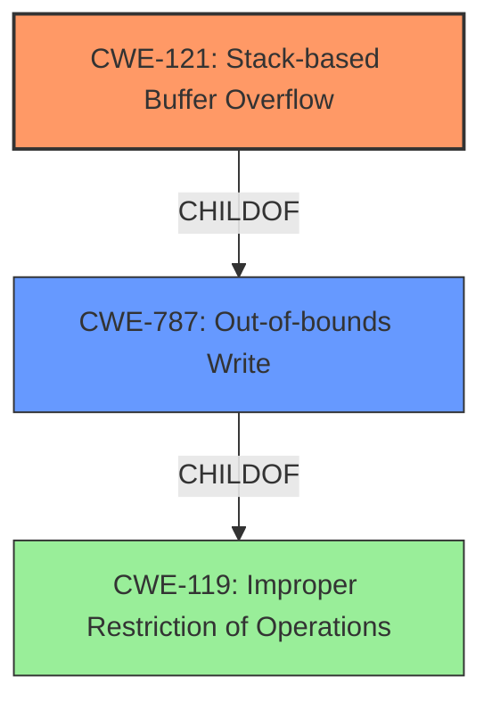

# Analysis Report for CVE-2021-46265

# Vulnerability Analysis Report: CVE-2021-46265

## Description

Tenda AC Series Router AC11_V02.03.01.104_CN was discovered to contain a stack buffer overflow in the wanBasicCfg module. This vulnerability allows attackers to cause a Denial of Service (DoS) via crafted overflow data.

## Vulnerability Description Key Phrases

**Weakness:** stack buffer overflow
**Impact:** Denial of Service
**Vector:** crafted overflow data
**Attacker:** attackers
**Product:** Tenda AC Series Router
**Version:** AC11_V02.03.01.104_CN
**Component:** wanBasicCfg module

## Analysis (with Relationship Data)

# Summary
| CWE ID | CWE Name | Confidence | CWE Abstraction Level | CWE Vulnerability Mapping Label | CWE-Vulnerability Mapping Notes |
|---|---|---|---|---|---|
| CWE-121 | Stack-based Buffer Overflow | 0.9 | Variant | Primary | Allowed |

## Evidence and Confidence

*   **Confidence Score:** 0.9
*   **Evidence Strength:** HIGH

- **Analysis and Justification:**  
  - *Explanation:* The vulnerability description clearly states "**stack buffer overflow**" in the `wanBasicCfg` module of the Tenda AC Series Router. CWE-121 (Stack-based Buffer Overflow) is a Variant level CWE that specifically describes this type of buffer overflow. The vulnerability allows attackers to cause a Denial of Service (DoS) via crafted overflow data. The term "**stack buffer overflow**" aligns precisely with the definition of CWE-121. The "CWE for similar CVE Descriptions" section lists CWE-787 (Out-of-bounds Write) as the primary match, however, since the description explicitly says "stack buffer overflow", CWE-121 is a more specific and appropriate choice. The retriever also lists CWE-121 as a candidate. MITRE mapping guidance for CWE-121 indicates this is ALLOWED.

  - *Relationship Analysis:* CWE-121 is a variant of CWE-119 (Improper Restriction of Operations within the Bounds of a Memory Buffer), but it provides a more specific classification by identifying the buffer's location on the stack. CWE-121 is also related to other buffer overflow variants.

- **Confidence Score:**  
  - Confidence: 0.9 (High evidence from technical description)

---

## Criticism of Analysis

Okay, let's review the provided analysis and the CWE specifications to determine the best CWE mapping for the given vulnerability description.

**Overall Assessment:**

The analysis correctly identifies CWE-121 (Stack-based Buffer Overflow) as a strong candidate, and the confidence score of 0.9 is justified. The reasoning for choosing CWE-121 over the retriever's primary suggestion of CWE-787 is also sound. The analysis is well-reasoned and provides good justification for the selection.

**Detailed Critique:**

1.  **Vulnerability Description Key Phrases:** The key phrases are well-extracted and relevant to the vulnerability.

2.  **CWE for Similar CVE Descriptions:** The listing of CWE-787 is accurate as a general "out-of-bounds write" but lacks the specificity of stack location.

3.  **Retriever Results:**
    *   The retriever results highlight several potential CWEs, including CWE-805, CWE-121, CWE-190, CWE-122, and CWE-770. The retriever correctly identifies CWE-121 as a potential candidate.
    *   The scores provided by the retriever can be helpful, but should not be the only factor in determining the most appropriate CWE. In this case, the explicit mention of "stack buffer overflow" in the description overrides the higher combined score of CWE-805.
    *   The retriever results also bring up CWEs that, while related to buffer overflows in general, are less specific to the given description and thus less suitable.

4.  **Chosen CWE (CWE-121) Analysis:**

    *   **Confidence Score:** The confidence score of 0.9 is appropriate given the clear statement in the vulnerability description: "**stack buffer overflow**". There is minimal ambiguity.
    *   **Evidence Strength:** "HIGH" is accurate.
    *   **Explanation:** The explanation is well-written and clearly justifies the selection of CWE-121. It correctly notes that while CWE-787 is a parent CWE, CWE-121 provides the necessary specificity.
    *   **Relationship Analysis:** The relationship analysis with CWE-119 is correct. CWE-121 *is* a variant of CWE-119, and the justification for preferring CWE-121 is that it offers a more granular and accurate classification. The description also mentions the relationship to other buffer overflow variants which is accurate.
    *   **MITRE Mapping Guidance:** The analysis correctly states that MITRE mapping guidance for CWE-121 indicates this is ALLOWED.

5.  **Why CWE-787 is a *lesser* fit than CWE-121:**

    *   CWE-787 (Out-of-bounds Write) is a *Base* CWE, meaning it's a more general categorization. The mapping guidance for CWE-119 (parent of CWE-787) even *discourages* its use when more specific CWEs are available. Since the description provides more detail by explicitly mentioning "stack", then a more specific CWE is better.
    *   CWE-787 doesn't specify *where* the out-of-bounds write occurs. While it's technically accurate, it misses crucial context.

6.  **CWE Examples from Database:**
    * The examples provided for CWE-119 are generally related to buffer overflows. However, including examples of CVEs that are specifically *stack-based* buffer overflows would strengthen the analysis further. While the listed observed examples do include some stack-based examples (e.g. CVE-2009-2550), the more specific examples of CWE-121 would be better.

7.  **Relevant CWE Specifications:** The full specification inclusions are helpful.

**Suggestions for Improvement:**

*   **Augmenting the Examples Section:** Include examples of CVEs specifically mapped to CWE-121 in the "Known Examples" section to further solidify the justification. For example: CVE-2021-35395 is explicitly listed in the CWE-121 example section.
*   **Minor Wording Adjustments:** While the analysis is strong, consider phrasing the rejection of CWE-787 more explicitly: "While CWE-787 (Out-of-bounds Write) is a parent CWE, the vulnerability description explicitly states 'stack buffer overflow', making CWE-121 a *more specific* and therefore *more appropriate* classification."
*   **Briefly Discuss Other Top Retriever Results:** Acknowledge other highly ranked retriever results and *briefly* explain why they are unsuitable. For example, "CWE-805 (Buffer Access with Incorrect Length Value) suggests a problem calculating buffer lengths, but the description doesn't suggest calculation issues, only an overflow."

**Conclusion:**

The provided analysis is strong and correctly identifies CWE-121 as the most appropriate mapping for the given vulnerability description. The confidence score is well-justified, and the reasoning is clear and accurate. Incorporating the suggested improvements would further enhance the analysis.

## Final Resolution

# Summary
| CWE ID | CWE Name | Confidence | CWE Abstraction Level | CWE Vulnerability Mapping Label | CWE-Vulnerability Mapping Notes |
|---|---|---|---|---|---|
| CWE-121 | Stack-based Buffer Overflow | 0.95 | Variant | Primary | Allowed |
| CWE-787 | Out-of-bounds Write | 0.7 | Base | Secondary | Allowed |

## Evidence and Confidence

*   **Confidence Score:** 0.95
*   **Evidence Strength:** HIGH

## Relationship Analysis
The primary relationship influencing the decision is the child-of relationship between CWE-121 and CWE-119 (**Improper Restriction of Operations Within the Bounds of a Memory Buffer**), where CWE-121 is a specific variant. Additionally, CWE-787 (**Out-of-bounds Write**) is a more general parent of CWE-121. The vulnerability chain involves a stack buffer overflow (CWE-121) caused by writing beyond the allocated buffer. The specificity of "stack" leads to the selection of CWE-121 over its broader parent, CWE-787.

## Vulnerability Chain
The **ROOTCAUSE** is the stack buffer overflow (CWE-121), which stems from writing data beyond the boundaries of a buffer allocated on the stack. This leads to a **WEAKNESS** where an attacker can overwrite adjacent memory regions. The final impact is a Denial of Service (DoS) due to the corruption of critical data or code execution.

## Summary of Analysis
The initial analysis correctly identified CWE-121 as the primary CWE due to the explicit mention of "stack buffer overflow" in the vulnerability description: "Tenda AC Series Router AC11_V02.03.01.104_CN was discovered to contain a **stack buffer overflow** in the wanBasicCfg module."

The relationship analysis confirms that CWE-121 is a more specific variant of CWE-787 and CWE-119. Choosing CWE-121 provides a more accurate representation of the vulnerability than the more general CWE-787.

CWE-787 is added as a secondary candidate to represent the more general out-of-bounds write aspect of the vulnerability.

The selected CWEs are at the optimal level of specificity because CWE-121 directly matches the vulnerability description's emphasis on a "stack buffer overflow", while CWE-787 captures the general nature of the out-of-bounds write.

*Report generated on 2025-03-18 04:46:11*
