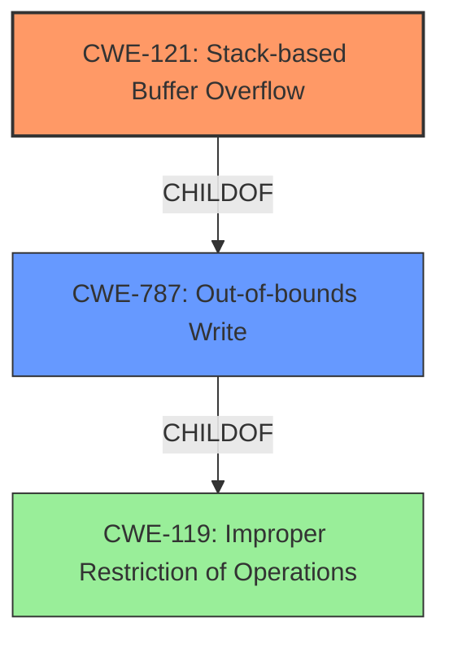

# Final Resolution for CVE-2021-46265

# Summary
| CWE ID | CWE Name | Confidence | CWE Abstraction Level | CWE Vulnerability Mapping Label | CWE-Vulnerability Mapping Notes |
|---|---|---|---|---|---|
| CWE-121 | Stack-based Buffer Overflow | 0.95 | Variant | Primary | Allowed |
| CWE-787 | Out-of-bounds Write | 0.7 | Base | Secondary | Allowed |

## Evidence and Confidence

*   **Confidence Score:** 0.95
*   **Evidence Strength:** HIGH

## Relationship Analysis
The primary relationship influencing the decision is the child-of relationship between CWE-121 and CWE-119 (**Improper Restriction of Operations Within the Bounds of a Memory Buffer**), where CWE-121 is a specific variant. Additionally, CWE-787 (**Out-of-bounds Write**) is a more general parent of CWE-121. The vulnerability chain involves a stack buffer overflow (CWE-121) caused by writing beyond the allocated buffer. The specificity of "stack" leads to the selection of CWE-121 over its broader parent, CWE-787.

## Vulnerability Chain
The **ROOTCAUSE** is the stack buffer overflow (CWE-121), which stems from writing data beyond the boundaries of a buffer allocated on the stack. This leads to a **WEAKNESS** where an attacker can overwrite adjacent memory regions. The final impact is a Denial of Service (DoS) due to the corruption of critical data or code execution.

## Summary of Analysis
The initial analysis correctly identified CWE-121 as the primary CWE due to the explicit mention of "stack buffer overflow" in the vulnerability description: "Tenda AC Series Router AC11_V02.03.01.104_CN was discovered to contain a **stack buffer overflow** in the wanBasicCfg module."

The relationship analysis confirms that CWE-121 is a more specific variant of CWE-787 and CWE-119. Choosing CWE-121 provides a more accurate representation of the vulnerability than the more general CWE-787.

CWE-787 is added as a secondary candidate to represent the more general out-of-bounds write aspect of the vulnerability.

The selected CWEs are at the optimal level of specificity because CWE-121 directly matches the vulnerability description's emphasis on a "stack buffer overflow", while CWE-787 captures the general nature of the out-of-bounds write.