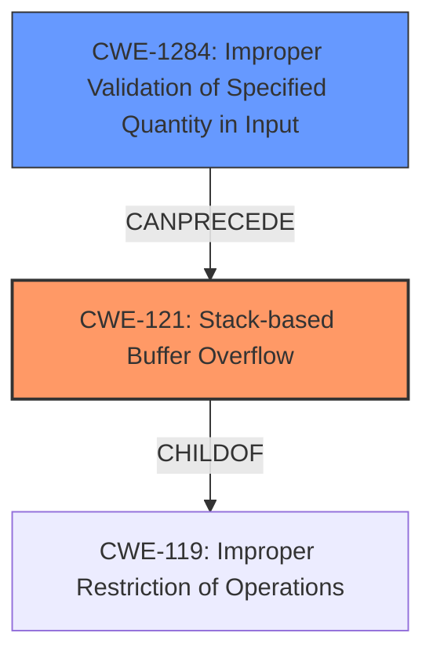

# Analysis Report for CVE-2021-46321

# Vulnerability Analysis Report: CVE-2021-46321

## Description

Tenda AC Series Router AC11_V02.03.01.104_CN was discovered to contain a stack buffer overflow in the wifiBasicCfg module. This vulnerability allows attackers to cause a Denial of Service (DoS) via crafted overflow data.

## Vulnerability Description Key Phrases

**Weakness:** stack buffer overflow
**Impact:** Denial of Service (DoS)
**Vector:** crafted overflow data
**Attacker:** attackers
**Product:** Tenda AC Series Router
**Version:** AC11_V02.03.01.104_CN
**Component:** wifiBasicCfg module

## Analysis (with Relationship Data)

# Summary
| CWE ID | CWE Name | Confidence | CWE Abstraction Level | CWE Vulnerability Mapping Label | CWE-Vulnerability Mapping Notes |
|---|---|---|---|---|---|
| CWE-121 | Stack-based Buffer Overflow | 0.95 | Variant | Primary | Allowed |
| CWE-1284 | Improper Validation of Specified Quantity in Input | 0.75 | Base | Secondary | Allowed |

## Evidence and Confidence

*   **Confidence Score:** 0.90
*   **Evidence Strength:** HIGH

- **Analysis and Justification:**  
  - *Explanation:* The vulnerability description clearly states a **stack buffer overflow** in the wifiBasicCfg module of the Tenda AC Series Router. The CVE Reference Links Content Summary confirms that the **root cause of the vulnerability** is a missing length check on the `wifiSSID` parameter received in a POST request. This unchecked input is then used in `sprintf` or `strcpy` functions, leading to a **buffer overflow** on the stack. CWE-121 (Stack-based Buffer Overflow) directly addresses this weakness, as it describes a buffer overflow where the buffer being overwritten is allocated on the stack. The use of `sprintf` or `strcpy` without proper bounds checking is a classic scenario for buffer overflows. CWE-121 is a Variant-level CWE, which is a preferred level of abstraction. The MITRE mapping guidance explicitly allows the use of CWE-121 for stack-based buffer overflows. The impact, Denial of Service (DoS), is a typical consequence of buffer overflows. CWE-787 (Out-of-bounds Write) and CWE-120 (Buffer Copy without Checking Size of Input ('Classic Buffer Overflow')) were considered, but CWE-121 is more specific because it identifies the stack as the location of the overflow, which is supported by the vulnerability description.

  - *Relationship Analysis:* CWE-121 is a variant of CWE-119 (Improper Restriction of Operations within the Bounds of a Memory Buffer), which is a more general class. However, since the vulnerability is specifically a **stack buffer overflow**, CWE-121 provides a more accurate and detailed description. CWE-121 can lead to CWE-787 (Out-of-bounds Write) as an impact.

- **Confidence Score:**  
  - Confidence: 0.95 (High confidence due to the explicit mention of "stack buffer overflow" and the details in the CVE reference confirming the root cause.)

---

- **Analysis and Justification:**  
  - *Explanation:* The CVE Reference Links Content Summary highlights that the `wifiSSID` parameter is not length-checked before being used in string manipulation functions. This lack of validation aligns with CWE-1284 (Improper Validation of Specified Quantity in Input). CWE-1284 describes the scenario where the product receives input that is expected to specify a quantity (in this case, the length of the `wifiSSID`), but it does not validate or incorrectly validates that the quantity has the required properties. The absence of length checking before using the `wifiSSID` parameter in `sprintf` or `strcpy` confirms this weakness. The usage is ALLOWED and the abstraction level is Base. This CWE is listed as a secondary CWE.

  - *Relationship Analysis:* CWE-1284 is a child of CWE-20 (Improper Input Validation). It CanPrecede CWE-789 (Uncontrolled Memory Allocation). In this case it precedes CWE-121 as the lack of input validation leads to the stack buffer overflow.

- **Confidence Score:**  
  - Confidence: 0.75 (High confidence as the lack of input validation is explicitly mentioned in the CVE reference summary.)

## Criticism of Analysis

Okay, I've reviewed the provided analysis and the full CWE specifications. Here's my critique:

**Overall Assessment:**

The analysis is generally good and provides a reasonable mapping of the vulnerability to CWEs. The confidence scores are appropriate, and the justifications are well-articulated. The choice of CWE-121 as the primary CWE is very strong, given the explicit mention of "stack buffer overflow" in the vulnerability description. The inclusion of CWE-1284 as a secondary CWE is also well-supported, as it directly addresses the root cause of the overflow: the lack of input validation.

Here's a more detailed breakdown, addressing each CWE individually, and noting areas where the analysis could be strengthened or where alternative CWEs might be considered (though I largely agree with the existing choices):

**CWE-121: Stack-based Buffer Overflow (Primary)**

*   **Strengths:**
    *   The justification is excellent. It directly connects the vulnerability description (stack buffer overflow) to the definition of CWE-121.
    *   The explanation of *sprintf* or *strcpy* without bounds checking is spot on.
    *   Correctly identifies CWE-121 as a Variant-level CWE, aligning with mapping best practices.
    *   Accurately notes DoS as a typical consequence.
    *   The consideration and rejection of CWE-787 and CWE-120 in favor of the more specific CWE-121 is well-reasoned.
*   **Areas for Improvement:**
    *   While not strictly necessary, mentioning mitigations could strengthen the analysis. Key mitigations, as per the CWE specification, include:
        *   **Language Selection:** Using languages with memory management or built-in overflow protection.
        *   **Environment Hardening:** Employing compiler options for buffer overflow detection (e.g., /GS flag in Visual Studio, FORTIFY_SOURCE in GCC).
        *   **Implementation:** Input bounds checking.
*   **Conclusion:** This is an excellent primary CWE mapping with very high confidence.

**CWE-1284: Improper Validation of Specified Quantity in Input (Secondary)**

*   **Strengths:**
    *   The justification accurately identifies the missing length check on the `wifiSSID` parameter as a violation of CWE-1284.
    *   The relationship analysis correctly positions CWE-1284 as a predecessor to CWE-121.
    *   Confidence level is justified.

*   **Areas for Improvement:**
    *   The description can be strengthened by explicitly mentioning the use of `sprintf` or `strcpy` and how the lack of length validation directly leads to their unsafe usage.
    *   Mention of specific input validation techniques that could have prevented this (e.g., explicit length checks before copying, using bounded string functions like `strncpy` or `snprintf`) would be helpful.

*   **Conclusion:** A strong secondary CWE mapping.

**Review of Alternative CWEs Suggested by Retriever Results:**

Let's briefly consider some of the top CWEs suggested by the retriever results and why they are less suitable than the chosen CWEs:

*   **CWE-805: Buffer Access with Incorrect Length Value:** While relevant, this is less precise than CWE-121. The root cause isn't necessarily about an "incorrect" length value that *is* specified, but rather the *absence* of a length check and resulting out-of-bounds write.

*   **CWE-120: Buffer Copy without Checking Size of Input ('Classic Buffer Overflow'):** This is a reasonable candidate, but it is more general than CWE-121 as it doesn't specify the location of the overflow, and the provided evidence clearly indicates the overflow happens on the stack. The mapping guidance on CWE-120 also suggests to consider children of CWE-20 like CWE-1284 for root cause analysis, which is what the analysis has already done.

*   **CWE-190: Integer Overflow or Wraparound:**  Not directly applicable. While an integer overflow *could* theoretically be involved in calculating the buffer size, the primary issue is the lack of any length check on the input string before copying it into a fixed-size buffer. This is not described in this case.

*   **CWE-122: Heap-based Buffer Overflow:** Clearly incorrect, as the vulnerability is a stack-based overflow.

*   **CWE-770: Allocation of Resources Without Limits or Throttling:** This CWE is about allocating too much memory, which could lead to DoS. Although DoS is the impact of the vulnerability, the root cause is not related to allocating memory without limits.

**General Recommendations:**

*   **Explicitly state the programming language:** Knowing the language (likely C or C++) would provide more context and enable a more precise understanding of the vulnerability.

*   **Consider Chain Relationships:** While not required, explicitly stating the chain of events as: `CWE-1284 (Improper Validation of Specified Quantity in Input) -> CWE-121 (Stack-based Buffer Overflow)` can further strengthen the analysis.

*   **Check CWE Maintenance Notes:** Before finalizing any CWE mapping, always review the "Maintenance" section of the CWE entry in the latest version of the CWE list. This section might contain important notes about usage, pending changes, or relationships with other CWEs.

In summary, this is a well-reasoned and accurate analysis. Incorporating the suggestions above would further enhance its quality and provide a more comprehensive understanding of the vulnerability.

## Final Resolution

# Summary
| CWE ID | CWE Name | Confidence | CWE Abstraction Level | CWE Vulnerability Mapping Label | CWE-Vulnerability Mapping Notes |
|---|---|---|---|---|---|
| CWE-121 | Stack-based Buffer Overflow | 0.95 | Variant | Primary | Allowed |
| CWE-1284 | Improper Validation of Specified Quantity in Input | 0.75 | Base | Secondary | Allowed |

## Evidence and Confidence

*   **Confidence Score:** 0.95
*   **Evidence Strength:** HIGH

## Relationship Analysis
The primary weakness is **CWE-121 (Stack-based Buffer Overflow)**, which is a variant of the more general **CWE-119 (Improper Restriction of Operations within the Bounds of a Memory Buffer)**. The analysis correctly identifies this hierarchical relationship. The secondary weakness, **CWE-1284 (Improper Validation of Specified Quantity in Input)**, is a root cause that **CanPrecede** **CWE-121**, as the lack of input validation directly leads to the buffer overflow. There are no significant peer relationships that suggest alternative classifications. The selection of CWEs at the Variant (CWE-121) and Base (CWE-1284) abstraction levels ensures appropriate specificity.

## Vulnerability Chain
The vulnerability chain starts with **CWE-1284 (Improper Validation of Specified Quantity in Input)**, where the `wifiSSID` parameter is not length-checked. This leads to **CWE-121 (Stack-based Buffer Overflow)** when the unchecked input is used in `sprintf` or `strcpy` functions, resulting in a Denial of Service (DoS). The root cause is the lack of input validation, and the impact is a buffer overflow on the stack, causing a DoS. There are no missing links in the chain based on the provided information.

## Summary of Analysis
The initial analysis and criticism both agree that the primary weakness is **CWE-121 (Stack-based Buffer Overflow)** and the secondary weakness is **CWE-1284 (Improper Validation of Specified Quantity in Input)**. The vulnerability description clearly states a stack buffer overflow, and the CVE reference confirms the missing length check. The graph relationships support this classification, with **CWE-1284** leading to **CWE-121**.

The selection of CWEs is based on the provided evidence, specifically the vulnerability description and the CVE reference summary. The abstraction levels are appropriate, with **CWE-121** at the Variant level and **CWE-1284** at the Base level.

The analysis is well-justified, considering both the content and relationships between CWEs. The final decision reflects the optimal level of specificity based on available evidence.

*Report generated on 2025-03-18 04:47:03*
