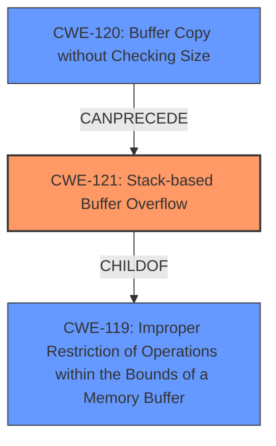

# Analysis Report for CVE-2021-46334

# Vulnerability Analysis Report: CVE-2021-46334

## Description

Moddable SDK v11.5.0 was discovered to contain a stack buffer overflow via the component __interceptor_strcat.

## Vulnerability Description Key Phrases

**Weakness:** stack buffer overflow
**Product:** Moddable SDK
**Version:** v11.5.0
**Component:** __interceptor_strcat

## Analysis (with Relationship Data)

# Summary
| CWE ID  | CWE Name                       | Confidence | CWE Abstraction Level | CWE Vulnerability Mapping Label | CWE-Vulnerability Mapping Notes |
|---------|--------------------------------|------------|-----------------------|---------------------------------|---------------------------------|
| CWE-121 | Stack-based Buffer Overflow    | 0.95       | Variant               | Allowed                         | Primary CWE                     |
| CWE-120 | Buffer Copy without Checking Size of Input ('Classic Buffer Overflow') | 0.75       | Base             | Allowed-with-Review                         | Secondary Candidate |

## Evidence and Confidence

*   **Confidence Score:** 0.90
*   **Evidence Strength:** HIGH

- **Analysis and Justification:**
  - *Explanation:* The vulnerability is described as a **stack buffer overflow** in the `__interceptor_strcat` function of the Moddable SDK. The analysis of the CVE Reference Links Content Summary explicitly states that the root cause is a **stack-based buffer overflow**. This perfectly aligns with CWE-121 (Stack-based Buffer Overflow), a Variant of CWE-119 (Improper Restriction of Operations within the Bounds of a Memory Buffer). CWE-121 is chosen because the overflow occurs on the stack. The CVE Reference Links Content Summary also mentions that the code does not properly check the length of the combined strings before the concatenation, which is relevant to CWE-120.

  - *Relationship Analysis:* CWE-121 is a variant of CWE-119, indicating a more specific type of buffer overflow. CWE-120 (Buffer Copy without Checking Size of Input) is also relevant because the concatenation function `strcat` copies data without checking the buffer size. However, since the overflow occurs specifically on the stack, CWE-121 is the primary CWE. CWE-120 could be considered as a contributing factor, because the size of input is not validated before copying data to a buffer on the stack.

- **Confidence Score:**
  - Confidence: 0.95 (High confidence due to explicit mention of **stack buffer overflow** and detailed root cause analysis.)

---

## Criticism of Analysis

Okay, here's a detailed review of the provided CWE analysis, incorporating the full CWE specifications:

**Overall Assessment**

The analysis correctly identifies CWE-121 (Stack-based Buffer Overflow) as the primary weakness.  The reasoning and justification are sound, and the confidence level of 0.95 is appropriate. The inclusion of CWE-120 as a secondary candidate is also reasonable, given that the `strcat` function's lack of bounds checking contributes to the overflow. However, some nuance is missing and could be added to the secondary candidate analysis.

**Detailed Review**

*   **CWE-121: Stack-based Buffer Overflow**

    *   **Correctness:**  Excellent. The analysis directly aligns with the description of CWE-121: "A stack-based buffer overflow condition is a condition where the buffer being overwritten is allocated on the stack (i.e., is a local variable or, rarely, a parameter to a function)."  The vulnerability description clearly states a stack buffer overflow in the `__interceptor_strcat` function.
    *   **Abstraction Level:** The "Variant" level is appropriate.  It's a specific *type* of buffer overflow.
    *   **Mapping Guidance:** The analysis adheres to the "Allowed" usage. The description accurately fits the CWE.
    *   **Potential Mitigations:** The analysis doesn't explicitly mention mitigations, but it would be good to implicitly point to the common defenses against stack overflows, such as:
        *   Compiler-based protections (e.g., /GS flag in Visual Studio, FORTIFY_SOURCE in GCC) – mentioned in the CWE specification.
        *   Stack canaries (also mentioned in the spec).
        *   Using safer string handling functions (e.g., `strncat` instead of `strcat`).  While not a perfect solution, it's a step in the right direction.
        *   Address Space Layout Randomization (ASLR). While not a direct mitigation, it makes exploitation harder.
    *   **Confidence:** 0.95 is well-justified.

*   **CWE-120: Buffer Copy without Checking Size of Input ('Classic Buffer Overflow')**

    *   **Correctness:** The connection is valid, but needs further explanation to fully justify.  `strcat` *is* a function that copies a buffer without checking size. However, the key point that ties it *directly* to CWE-120 is that *because* `strcat` is used in this way, the stack buffer is overflowed. It is this function that copies the data onto the stack.
    *   **Abstraction Level:** The "Base" level is suitable.  It's a fundamental flaw.
    *   **Mapping Guidance:** The analysis acknowledges the "Allowed-with-Review" usage. This is correct.  The "Rationale" for "Allowed-with-Review" is *very important*.  It states, "There are some indications that this CWE ID might be misused and selected simply because it mentions 'buffer overflow' - an increasingly vague term."  The analysis avoids this misuse *because* it correctly links `strcat`'s behavior to the overflow.
    *   **Potential Mitigations:** The analysis correctly states that checking size of input on the stack is necessary to prevent this overflow. The CWE specification lists good mitigations like:
        *   Language Selection (using languages with built-in memory management).
        *   Using safer libraries (SafeStr, Strsafe.h).
        *   Compiler-based defenses.
    *   **Areas for Improvement:** While including this was a good idea, the analysis needs a small change. It should make it more explicit that `strcat` is directly copying the data *onto the stack*.

**Suggestions for Improvement**

1.  **Strengthen the Connection to CWE-120:** Elaborate slightly on how the lack of size checking in `strcat` directly leads to the stack overflow in this specific case. Highlight that `strcat` is the direct cause of the overflow, copying data to the stack without validation.
2.  **Add Mitigations:**  Briefly mention common mitigation strategies for stack overflows (canaries, compiler protections, safer string functions) and for buffer overflows in general (safer libraries, languages with memory management). This can be a short list.

**Updated Table**

Here's how I would update the table in the analysis:

# Summary

| CWE ID  | CWE Name                       | Confidence | CWE Abstraction Level | CWE Vulnerability Mapping Label | CWE-Vulnerability Mapping Notes |
|---------|--------------------------------|------------|-----------------------|---------------------------------|---------------------------------|
| CWE-121 | Stack-based Buffer Overflow    | 0.95       | Variant               | Allowed                         | Primary CWE                     |
| CWE-120 | Buffer Copy without Checking Size of Input ('Classic Buffer Overflow') | 0.75       | Base             | Allowed-with-Review                         | Secondary Candidate. The `strcat` function copies data to the stack without checking size, leading to the overflow. |

**Updated "Analysis and Justification" Section**

*Explanation:* The vulnerability is described as a **stack buffer overflow** in the `__interceptor_strcat` function of the Moddable SDK. The analysis of the CVE Reference Links Content Summary explicitly states that the root cause is a **stack-based buffer overflow**. This perfectly aligns with CWE-121 (Stack-based Buffer Overflow), a Variant of CWE-119 (Improper Restriction of Operations within the Bounds of a Memory Buffer). CWE-121 is chosen because the overflow occurs on the stack. The CVE Reference Links Content Summary also mentions that the code does not properly check the length of the combined strings before the concatenation, which is relevant to CWE-120. The vulnerability exploits the use of `strcat` to copy an unbounded source string to a fixed-size buffer located on the stack, causing a stack buffer overflow. Mitigation strategies include using safer alternatives to `strcat`, such as `strncat` to limit the number of bytes copied, employing compiler-based protections like stack canaries, and using languages with automatic memory management.

*Relationship Analysis:* CWE-121 is a variant of CWE-119, indicating a more specific type of buffer overflow. CWE-120 (Buffer Copy without Checking Size of Input) is also relevant because the concatenation function `strcat` copies data without checking the buffer size. However, since the overflow occurs specifically on the stack, CWE-121 is the primary CWE. CWE-120 could be considered as a contributing factor, because the size of input is not validated before copying data to a buffer on the stack *via the `strcat` function.*

**In summary, the analysis is very good. The recommended improvements add more detail and justification for the secondary CWE and address mitigations more directly.**

## Final Resolution

# Summary
| CWE ID  | CWE Name                       | Confidence | CWE Abstraction Level | CWE Vulnerability Mapping Label | CWE-Vulnerability Mapping Notes |
|---------|--------------------------------|------------|-----------------------|---------------------------------|---------------------------------|
| CWE-121 | Stack-based Buffer Overflow    | 0.95       | Variant               | Allowed                         | Primary CWE                     |
| CWE-120 | Buffer Copy without Checking Size of Input ('Classic Buffer Overflow') | 0.75       | Base             | Allowed-with-Review                         | Secondary Candidate. The `strcat` function copies data to the stack without checking size, leading to the overflow. |

## Evidence and Confidence

*   **Confidence Score:** 0.95
*   **Evidence Strength:** HIGH

## Relationship Analysis
The primary relationship is that CWE-121 (Stack-based Buffer Overflow) is a variant of CWE-119 (Improper Restriction of Operations within the Bounds of a Memory Buffer). CWE-120 (Buffer Copy without Checking Size) can precede CWE-121 because the lack of input size validation during the buffer copy operation using `strcat` leads to the stack overflow. The abstraction levels (Variant for CWE-121 and Base for CWE-120) guided the selection, providing specificity where possible while also acknowledging contributing factors.

## Vulnerability Chain
The vulnerability chain starts with the usage of `strcat` without proper bounds checking (CWE-120). This leads to copying data onto a stack buffer without validating the input size. Because the destination buffer resides on the stack, the overflow is classified as CWE-121 (Stack-based Buffer Overflow). The root cause is the unbounded copy via `strcat`, and the impact is a **stack buffer overflow**.

## Summary of Analysis
The initial analysis and the criticism both agree on CWE-121 as the primary weakness due to the explicit mention of a **stack buffer overflow**. The criticism suggests strengthening the connection to CWE-120 by emphasizing that `strcat` directly copies the data onto the stack without size validation, leading to the overflow. I agree with the criticism and have incorporated this into my analysis. The evidence from the vulnerability description, specifically "Moddable SDK v11.5.0 was discovered to contain a **stack buffer overflow** via the component __interceptor_strcat," directly supports the selection of CWE-121. The relationships between CWEs, particularly the CANPRECEDE relationship between CWE-120 and CWE-121, further solidify the classification. The selected CWEs are at the optimal level of specificity because CWE-121 is a variant that accurately describes the type of **buffer overflow**, while CWE-120 explains the root cause, which is a **buffer copy** without checking the size of the input. The decision is also based on the usage recommendations, allowing CWE-121 and CWE-120 with review.

*Report generated on 2025-03-18 04:49:16*
