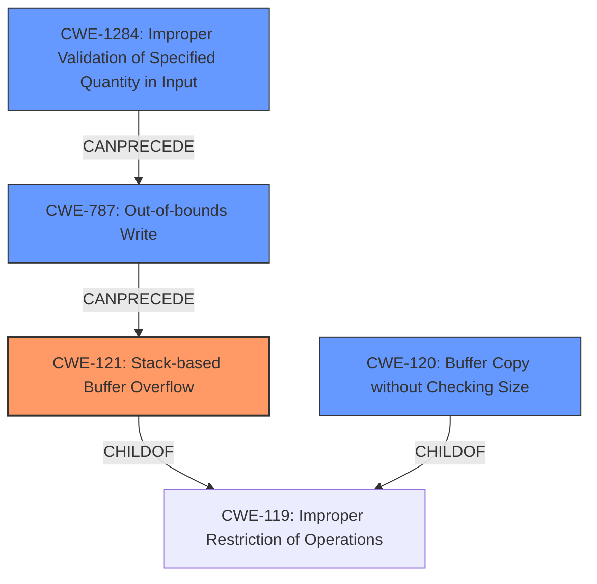

# Final Resolution for CVE-2021-46393

# Summary
| CWE ID | CWE Name | Confidence | CWE Abstraction Level | CWE Vulnerability Mapping Label | CWE-Vulnerability Mapping Notes |
|---|---|---|---|---|---|
| CWE-121 | Stack-based Buffer Overflow | 0.95 | Variant | Allowed | Primary CWE. The vulnerability involves a stack buffer overflow due to unchecked input to `sscanf`. |
| CWE-1284 | Improper Validation of Specified Quantity in Input | 0.7 | Base | Allowed | Secondary CWE. The `startIp` parameter is not validated for size before being used in `sscanf`. |
| CWE-787 | Out-of-bounds Write | 0.5 | Base | Allowed | Secondary CWE. Could be considered as a more general case of out-of-bounds write, but CWE-121 is more specific to the stack. |
| CWE-120 | Buffer Copy without Checking Size of Input ('Classic Buffer Overflow') | 0.4 | Base | Allowed-with-Review | Secondary CWE. Could apply if the sscanf function is viewed as a buffer copy without size checking, but this is less precise than CWE-121 and CWE-1284. |

## Evidence and Confidence

*   **Confidence Score:** 0.9
*   **Evidence Strength:** HIGH

## Relationship Analysis
The primary classification is CWE-121, which is a variant of CWE-119 (Improper Restriction of Operations within the Bounds of a Memory Buffer). CWE-1284 highlights the lack of input validation for the size of the input, which leads to the overflow. CWE-787 and CWE-120 are more general cases, but less precise. The vulnerability chain starts with CWE-1284 leading to CWE-787 and then CWE-121.

## Vulnerability Chain
The vulnerability chain starts with the **ROOTCAUSE** CWE-1284 (Improper Validation of Specified Quantity in Input), because the `startIp` parameter's size isn't validated. This leads to CWE-787 (Out-of-bounds Write) because `sscanf` writes beyond the allocated buffer. Finally, this results in CWE-121 (Stack-based Buffer Overflow) as the overflow occurs on the stack. The chain is: CWE-1284 -> CWE-787 -> CWE-121.

## Summary of Analysis
The initial analysis correctly identified CWE-121 as the primary **WEAKNESS**. The criticism correctly points out the relevance of CWE-1284 (Improper Validation of Specified Quantity in Input). The vulnerability description clearly states: "The v10 variable is directly retrieved from the http request parameter startIp. Then v10 will be splice to stack by function sscanf without any security check,which causes stack overflow."

The graph relationships highlight that CWE-121 is a specific type of buffer overflow (stack-based), making it more precise than CWE-787 or CWE-120. CWE-1284 represents the initial **ROOTCAUSE**, the lack of input validation.

The selected CWEs are at the optimal level of specificity because CWE-121 accurately describes the type of overflow (stack-based), while CWE-1284 identifies the missing input validation that enables the overflow.