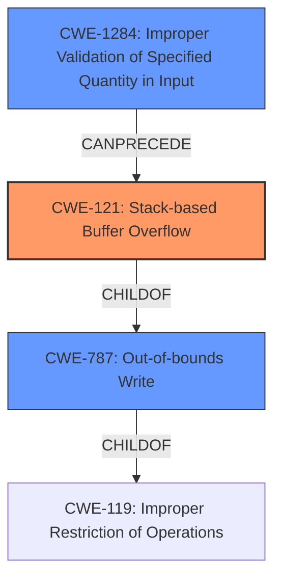

# Analysis Report for CVE-2021-46394

# Vulnerability Analysis Report: CVE-2021-46394

## Description

There is a stack buffer overflow vulnerability in the formSetPPTPServer function of Tenda-AX3 router V16.03.12.10_CN. The v13 variable is directly retrieved from the http request parameter startIp. Then v13 will be splice to stack by function sscanf without any security check, which causes stack overflow. By POSTing the page /goform/SetPptpServerCfg with proper startIp, the attacker can easily perform remote code execution with carefully crafted overflow data.

## Vulnerability Description Key Phrases

**Weakness:** stack buffer overflow
**Impact:** remote code execution
**Vector:** POSTing to /goform/SetPptpServerCfg with proper startIp
**Product:** Tenda-AX3 router
**Version:** V16.03.12.10_CN
**Component:** formSetPPTPServer function

## Analysis (with Relationship Data)

# Summary
| CWE ID | CWE Name | Confidence | CWE Abstraction Level | CWE Vulnerability Mapping Label | CWE-Vulnerability Mapping Notes |
|---|---|---|---|---|---|
| CWE-121 | Stack-based Buffer Overflow | 0.95 | Variant | Allowed | Primary CWE |
| CWE-787 | Out-of-bounds Write | 0.70 | Base | Allowed | Secondary Candidate |

## Evidence and Confidence

*   **Confidence Score:** 0.90
*   **Evidence Strength:** HIGH

- **Analysis and Justification:**
  - *Explanation:* The vulnerability description explicitly states "**stack buffer overflow**" in the `formSetPPTPServer` function due to the `sscanf` function writing data from the `startIp` parameter directly to the stack without proper validation. This clearly aligns with the definition of CWE-121 (Stack-based Buffer Overflow), which is a variant of buffer overflow where the buffer being overwritten is allocated on the stack. The description mentions that the `v13` variable is retrieved from the http request parameter `startIp` and then spliced to the stack by the function `sscanf` without any security check, which causes the stack overflow. The ability to achieve remote code execution by sending a POST request to `/goform/SetPptpServerCfg` with a crafted `startIp` confirms the severity and impact of this weakness. The retriever results also list CWE-121 as a candidate CWE.

  - *Relationship Analysis:* CWE-121 is a variant of CWE-119 (Improper Restriction of Operations within the Bounds of a Memory Buffer). The vulnerability involves writing beyond the intended boundaries of a stack-allocated buffer, leading to potential code execution. CWE-787 (Out-of-bounds Write) is a parent of CWE-121.

- **Confidence Score:**
  - Confidence: 0.95 (Strong evidence based on the vulnerability description's explicit mention of a stack buffer overflow and the method of exploitation).

---
- **Analysis and Justification:**
  - *Explanation:* CWE-787 (Out-of-bounds Write) is a base CWE that describes a general condition where the product writes data past the end, or before the beginning, of the intended buffer. While the vulnerability is clearly a buffer overflow, the fact that it is specifically on the stack makes CWE-121 a better fit. CWE-787 is a parent of CWE-121.

  - *Relationship Analysis:* CWE-787 is a parent of CWE-121 and child of CWE-119 (Improper Restriction of Operations within the Bounds of a Memory Buffer).

- **Confidence Score:**
  - Confidence: 0.70 (The description clearly indicates a stack buffer overflow, making CWE-121 a better fit than its broader parent CWE-787).

## Criticism of Analysis

Okay, here's a review of the provided analysis, incorporating the full CWE specifications:

**Overall Assessment:**

The analysis is generally good and correctly identifies the primary CWE as `CWE-121: Stack-based Buffer Overflow`.  The justification is clear and well-supported by the description of the vulnerability. The inclusion of `CWE-787: Out-of-bounds Write` as a secondary candidate is also reasonable, considering its relationship as a parent to `CWE-121`.

**Detailed Review:**

**1. CWE-121: Stack-based Buffer Overflow**

*   **Confidence:** The high confidence score (0.95) is justified. The vulnerability description explicitly states a stack buffer overflow caused by `sscanf` without proper validation.
*   **CWE Abstraction Level:** `Variant` level is correct as it is the preferred level of abstraction.
*   **Mapping Guidance:** The analysis correctly follows the mapping guidance for `CWE-121`: "Carefully read both the name and description to ensure that this mapping is an appropriate fit. Do not try to 'force' a mapping to a lower-level Base/Variant simply to comply with this preferred level of abstraction."
*   **CWE-Vulnerability Mapping Notes:** The primary CWE mapping is correct.
*   **Mitigations:** The analysis implicitly touches on the mitigations.  For example, mentioning the lack of validation relates directly to Mitigation 3: "Implement and perform bounds checking on input." Further, the use of `sscanf`, which is an abstraction library, is risky, which ties into Mitigation 2: "Use an abstraction library to abstract away risky APIs. Not a complete solution." The analysis could be strengthened by *explicitly* mentioning mitigations.
*   **Observed Examples:** The provided examples are relevant but the inclusion of `CVE-2021-35395` is useful since it refers to stack-based overflows in IOT devices.

**2. CWE-787: Out-of-bounds Write**

*   **Confidence:** The confidence score (0.70) is acceptable. While `CWE-787` is a valid, *broader* categorization, `CWE-121` provides a more specific description of the weakness.
*   **CWE Abstraction Level:** `Base` level is correct.
*   **Mapping Guidance:** The analysis acknowledges the mapping guidance and explains why `CWE-121` is a better fit: "the fact that it is specifically on the stack makes CWE-121 a better fit."
*   **CWE-Vulnerability Mapping Notes:** The secondary candidate is appropriate.
*   **Mitigations:** Similar to `CWE-121`, the analysis could be improved by explicitly connecting the vulnerability to mitigations.  For instance, the analysis could note that using safer string-handling functions (Mitigation 2) or using a language with automatic memory management (Mitigation 1) could prevent the overflow. The vulnerability is caused by `sscanf` which is a buffer copy function. Thus using safer libraries such as Safe C String Library (SafeStr) is a possible mitigation.
*   **Observed Examples:** The provided examples are relevant.

**Recommendations for Improvement:**

1.  **Explicitly Connect Vulnerability to Mitigations:**  While the analysis correctly identifies the CWEs, it could be strengthened by explicitly linking the vulnerability to the recommended mitigations in the CWE specifications.  This would demonstrate a deeper understanding of the weakness and how to address it. For example, the analysis should state, 'This vulnerability could be mitigated by using safer string-handling functions (Mitigation 2) or using a language with automatic memory management (Mitigation 1)'. For `CWE-121`, mentioning that using compiler extensions such as the Microsoft Visual Studio /GS flag, Fedora/Red Hat FORTIFY_SOURCE GCC flag, StackGuard, and ProPolice would have helped prevent the vulnerability from occurring.
2.  **Consider CWE-20 and CWE-1284:** While `CWE-121` and `CWE-787` are the most direct mappings, the root cause involves a *lack of input validation*. Therefore, briefly discussing and *rejecting* `CWE-20: Improper Input Validation` and/or `CWE-1284: Improper Validation of Specified Quantity in Input` could further strengthen the analysis. The analysis could mention that there is a lack of input validation of the `startIp` parameter before it is used by the `sscanf` function.
3.  **Address Retriever Results (CWE-770, CWE-78, CWE-789):** The retriever results include some other CWEs with relatively high scores. Although the analysis correctly identifies the primary CWE, it would be valuable to *briefly* explain why these other CWEs are less appropriate. For example:
    *   **CWE-770 Allocation of Resources Without Limits or Throttling**: This is less relevant, the primary issue isn't about the allocation of resources; but the writing to memory.
    *   **CWE-78 Improper Neutralization of Special Elements used in an OS Command ('OS Command Injection')**: This is not relevant. It is not an OS command injection vulnerability.
    *   **CWE-789 Memory Allocation with Excessive Size Value:** This is less relevant because the issue is writing to memory, not excessive memory allocation.
4.  **Consider a Potential Chaining Scenario with CWE-119:** While not the *primary* weakness, the `sscanf` function is *directly* copying a buffer without checking its size. It could be argued that a *chaining* scenario exists where the lack of size checking by `sscanf` (which could potentially be argued as `CWE-120`) leads to the `CWE-121`.

**Revised Summary Table:**

| CWE ID | CWE Name | Confidence | CWE Abstraction Level | CWE Vulnerability Mapping Label | CWE-Vulnerability Mapping Notes |
|---|---|---|---|---|---|
| CWE-121 | Stack-based Buffer Overflow | 0.95 | Variant | Allowed | Primary CWE |
| CWE-787 | Out-of-bounds Write | 0.70 | Base | Allowed | Secondary Candidate |
| CWE-20  | Improper Input Validation | 0.30 | Class | Rejected | Input not validated before use in `sscanf` but is not the direct cause of the overflow. |
| CWE-1284  | Improper Validation of Specified Quantity in Input | 0.30 | Base | Rejected | Input is not validated which causes the overflow but this is better captured by CWE-121 as it focuses on the stack implementation and consequence.|

By incorporating these suggestions, the analysis would provide a more complete and nuanced understanding of the vulnerability, demonstrating a stronger grasp of CWE principles and their application.

## Final Resolution

# Summary
| CWE ID | CWE Name | Confidence | CWE Abstraction Level | CWE Vulnerability Mapping Label | CWE-Vulnerability Mapping Notes |
|---|---|---|---|---|---|
| CWE-121 | Stack-based Buffer Overflow | 0.95 | Variant | Allowed | Primary CWE |
| CWE-787 | Out-of-bounds Write | 0.70 | Base | Allowed | Secondary Candidate |
| CWE-1284  | Improper Validation of Specified Quantity in Input | 0.40 | Base | Allowed | Input is not validated which causes the overflow but this is better captured by CWE-121 as it focuses on the stack implementation and consequence. |

## Evidence and Confidence

*   **Confidence Score:** 0.93
*   **Evidence Strength:** HIGH

## Relationship Analysis
The primary relationship is that CWE-121 is a variant of **CWE-787 (Out-of-bounds Write)**, which in turn is a child of **CWE-119 (Improper Restriction of Operations within the Bounds of a Memory Buffer)**. The vulnerability description clearly points to a stack-based buffer overflow, making **CWE-121** the most specific and appropriate choice. **CWE-1284 (Improper Validation of Specified Quantity in Input)** can be considered as a contributing factor, as the lack of input validation allows an attacker to control the size of the input written to the stack. This demonstrates a potential chain where improper input validation can lead to a buffer overflow.

## Vulnerability Chain
The vulnerability chain starts with **CWE-1284 (Improper Validation of Specified Quantity in Input)**, where the `startIp` parameter is not validated. This lack of validation allows an attacker to inject arbitrary data into the `startIp` parameter. The `sscanf` function then copies this unchecked data into a stack buffer, leading to **CWE-121 (Stack-based Buffer Overflow)**. The consequence of this overflow is the potential for remote code execution.
  - Root Cause: **CWE-1284 (Improper Validation of Specified Quantity in Input)**
  - Weakness: **CWE-121 (Stack-based Buffer Overflow)**
  - Impact: Remote Code Execution

## Summary of Analysis
The initial analysis correctly identified **CWE-121 (Stack-based Buffer Overflow)** as the primary weakness. The criticism provided valuable suggestions for improvement, including explicitly connecting the vulnerability to mitigations and considering other relevant CWEs. The evidence provided in the vulnerability description, specifically the statement "The v13 variable is directly retrieved from the http request parameter startIp. Then v13 will be splice to stack by function sscanf without any security check, which causes stack overflow," strongly supports this classification.

The graph relationships influenced the decision by highlighting the hierarchical relationship between **CWE-121** and **CWE-787**, as well as the potential chain involving **CWE-1284**. While **CWE-787** is a valid classification, **CWE-121** provides a more specific description of the vulnerability.

The selected CWEs are at the optimal level of specificity because **CWE-121** directly addresses the stack-based nature of the overflow, which is a key characteristic of this vulnerability. Adding **CWE-1284** provides additional context of how the overflow was made possible.

*Report generated on 2025-03-18 04:50:59*
