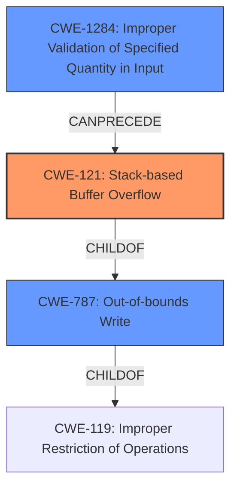

# Final Resolution for CVE-2021-46394

# Summary
| CWE ID | CWE Name | Confidence | CWE Abstraction Level | CWE Vulnerability Mapping Label | CWE-Vulnerability Mapping Notes |
|---|---|---|---|---|---|
| CWE-121 | Stack-based Buffer Overflow | 0.95 | Variant | Allowed | Primary CWE |
| CWE-787 | Out-of-bounds Write | 0.70 | Base | Allowed | Secondary Candidate |
| CWE-1284  | Improper Validation of Specified Quantity in Input | 0.40 | Base | Allowed | Input is not validated which causes the overflow but this is better captured by CWE-121 as it focuses on the stack implementation and consequence. |

## Evidence and Confidence

*   **Confidence Score:** 0.93
*   **Evidence Strength:** HIGH

## Relationship Analysis
The primary relationship is that CWE-121 is a variant of **CWE-787 (Out-of-bounds Write)**, which in turn is a child of **CWE-119 (Improper Restriction of Operations within the Bounds of a Memory Buffer)**. The vulnerability description clearly points to a stack-based buffer overflow, making **CWE-121** the most specific and appropriate choice. **CWE-1284 (Improper Validation of Specified Quantity in Input)** can be considered as a contributing factor, as the lack of input validation allows an attacker to control the size of the input written to the stack. This demonstrates a potential chain where improper input validation can lead to a buffer overflow.

## Vulnerability Chain
The vulnerability chain starts with **CWE-1284 (Improper Validation of Specified Quantity in Input)**, where the `startIp` parameter is not validated. This lack of validation allows an attacker to inject arbitrary data into the `startIp` parameter. The `sscanf` function then copies this unchecked data into a stack buffer, leading to **CWE-121 (Stack-based Buffer Overflow)**. The consequence of this overflow is the potential for remote code execution.
  - Root Cause: **CWE-1284 (Improper Validation of Specified Quantity in Input)**
  - Weakness: **CWE-121 (Stack-based Buffer Overflow)**
  - Impact: Remote Code Execution

## Summary of Analysis
The initial analysis correctly identified **CWE-121 (Stack-based Buffer Overflow)** as the primary weakness. The criticism provided valuable suggestions for improvement, including explicitly connecting the vulnerability to mitigations and considering other relevant CWEs. The evidence provided in the vulnerability description, specifically the statement "The v13 variable is directly retrieved from the http request parameter startIp. Then v13 will be splice to stack by function sscanf without any security check, which causes stack overflow," strongly supports this classification.

The graph relationships influenced the decision by highlighting the hierarchical relationship between **CWE-121** and **CWE-787**, as well as the potential chain involving **CWE-1284**. While **CWE-787** is a valid classification, **CWE-121** provides a more specific description of the vulnerability.

The selected CWEs are at the optimal level of specificity because **CWE-121** directly addresses the stack-based nature of the overflow, which is a key characteristic of this vulnerability. Adding **CWE-1284** provides additional context of how the overflow was made possible.