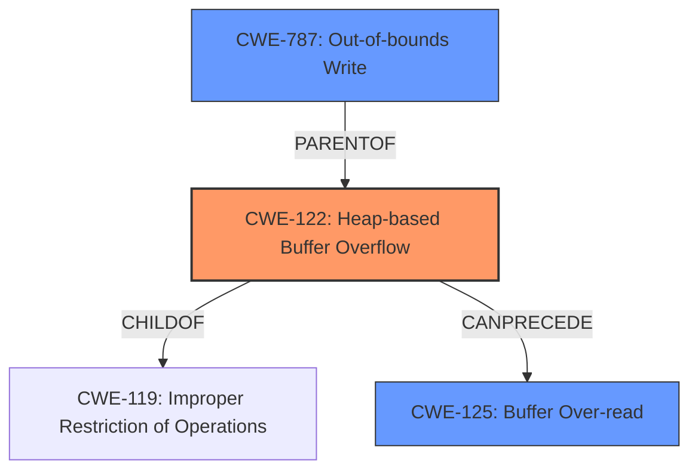

# Final Resolution for CVE-2021-46474

# Summary
| CWE ID | CWE Name | Confidence | CWE Abstraction Level | CWE Vulnerability Mapping Label | CWE-Vulnerability Mapping Notes |
|---|---|---|---|---|---|
| CWE-122 | Heap-based Buffer Overflow | 0.9 | Variant | Allowed | Primary CWE: The vulnerability is explicitly described as a **heap buffer overflow**. |
| CWE-787 | Out-of-bounds Write | 0.7 | Base | Allowed | Secondary Candidate: Writing data past the end of the intended buffer is a general characterization of buffer overflows. |
| CWE-125 | Buffer Over-read | 0.4 | Base | Allowed | Consequence of **heap overflow**; read past end of the buffer |

## Evidence and Confidence

*   **Confidence Score:** 0.9
*   **Evidence Strength:** HIGH

## Relationship Analysis
The primary CWE is CWE-122 (Heap-based Buffer Overflow), which is a variant of CWE-119 (Improper Restriction of Operations within the Bounds of a Memory Buffer). CWE-787 (Out-of-bounds Write) is a parent of CWE-122, representing a broader class of vulnerabilities. CWE-125 (Buffer Over-read) is included as a potential consequence of the **heap overflow**.

## Vulnerability Chain
The vulnerability chain begins with a **heap buffer overflow** (CWE-122). The **out-of-bounds write** (CWE-787) is the direct cause, leading to memory corruption. A potential consequence is a **buffer over-read** (CWE-125), where the program attempts to read data beyond the allocated buffer.

## Summary of Analysis
The initial analysis correctly identified CWE-122 as the primary weakness, which is a **heap-based buffer overflow**. The explicit description of the vulnerability as a "**heap buffer overflow**" in `jsiEvalCodeSub` provides strong evidence for this classification. CWE-787 is included as a related weakness, representing the general concept of **out-of-bounds write**. CWE-125 is retained as a potential consequence of the overflow. The confidence score remains high (0.9) due to the explicit description of the **heap overflow**. The retriever scores provided additional context.
The removal of CWE-416 was justified because the evidence did not indicate a use-after-free condition, only a **heap overflow**.

The selected CWEs are at the optimal level of specificity, with CWE-122 providing the most precise description of the vulnerability. CWE-787 and CWE-125 are included to capture related aspects of the overflow.