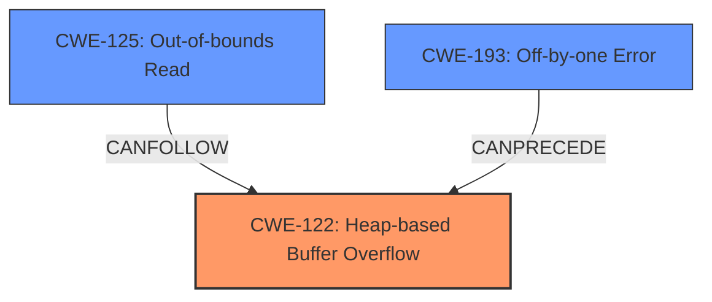

# Analysis Report for CVE-2021-46475

# Vulnerability Analysis Report: CVE-2021-46475

## Description

Jsish v3.5.0 was discovered to contain a heap buffer overflow via jsi_ArraySliceCmd in src/jsiArray.c. This vulnerability can lead to a Denial of Service (DoS).

## Vulnerability Description Key Phrases

**Weakness:** heap buffer overflow
**Impact:** Denial of Service (DoS)
**Product:** componentJsish
**Version:** v3.5.0
**Component:** jsi_ArraySliceCmd in src/jsiArray.c

## Analysis (with Relationship Data)

# Summary
| CWE ID | CWE Name | Confidence | CWE Abstraction Level | CWE Vulnerability Mapping Label | CWE-Vulnerability Mapping Notes |
|---|---|---|---|---|---|
| CWE-122 | Heap-based Buffer Overflow | 0.95 | Variant | Allowed | Primary CWE |
| CWE-125 | Buffer Over-read | 0.60 | Base | Allowed | Secondary Candidate |
| CWE-193 | Off-by-one Error | 0.50 | Base | Allowed | Secondary Candidate |

## Evidence and Confidence

*   **Confidence Score:** 0.90
*   **Evidence Strength:** HIGH

- **Analysis and Justification:**  
  - *Explanation:* The vulnerability description clearly states a **heap buffer overflow** in `jsi_ArraySliceCmd`, which directly corresponds to CWE-122 (Heap-based Buffer Overflow). The CVE Reference Links Content Summary further confirms this, highlighting a memory safety violation where the program writes beyond the allocated buffer on the heap. The attack vector involves crafting specific JavaScript array operations to trigger the overflow. This aligns perfectly with the description of CWE-122, which is a Variant-level CWE, making it a precise and appropriate match. The usage for CWE-122 is ALLOWED.
  CWE-125 (Buffer Over-read) is added as a secondary CWE since the ASan error reported indicates a read beyond allocated buffer which aligns with the definition of CWE-125.
  CWE-193 (Off-by-one Error) is also a secondary candidate since it can be a contributing factor to buffer overflows, especially in calculations related to array slicing. However, the primary issue is the heap overflow itself.

  - *Relationship Analysis:* CWE-122 is a variant of buffer overflow. While it doesn't have direct relationships to other CWEs, it falls under the broader category of memory corruption vulnerabilities. CWE-125 (Buffer Over-read) is related to CWE-119 (Improper Restriction of Operations within the Bounds of a Memory Buffer), as over-reading often results from not properly bounding memory access. CWE-193 (Off-by-one Error) can precede CWE-119, as a slight miscalculation can lead to out-of-bounds access.

- **Confidence Score:**
  - Confidence: 0.95 (High confidence due to direct evidence from the vulnerability description and CVE reference).
---

## Criticism of Analysis

Okay, here's a review of the provided CWE analysis based on the full CWE specifications included in the document:

**Overall Assessment:**

The analysis is good, and the primary CWE assignment of `CWE-122: Heap-based Buffer Overflow` is correct and well-justified. The inclusion of `CWE-125: Out-of-bounds Read` and `CWE-193: Off-by-one Error` as secondary candidates is also reasonable, although the confidence levels and justifications could be slightly refined.

**Detailed Review:**

1.  **CWE-122: Heap-based Buffer Overflow (Primary)**
    *   **Confidence:** 0.95 - Appropriately high.
    *   **Justification:** The justification is strong. The vulnerability description explicitly states a heap buffer overflow, and the CVE summary confirms the memory corruption occurs on the heap.  The attack vector described aligns with how heap overflows are typically triggered.
    *   **CWE Abstraction Level:** Variant - Correct.
    *   **CWE Mapping Guidance Compliance:** The analysis follows the mapping guidance, which recommends using the Variant level when possible. The analysis also checks if the description and name are aligned to the problem. The usage for CWE-122 is ALLOWED.
    *   **Potential Mitigations:** The analysis does not explicitly mention mitigations, but it should. Referring to the CWE-122 specification, potential mitigations include:
        *   Using languages or compilers with automatic bounds checking.
        *   Using abstraction libraries.
        *   Using compiler-based buffer overflow detection mechanisms (e.g., /GS flag in Visual Studio, FORTIFY\_SOURCE in GCC).
    *   **Observed Examples:** The analysis includes observed examples of CWE-122 which aids in the validation of the mapping.

2.  **CWE-125: Out-of-bounds Read (Secondary Candidate)**
    *   **Confidence:** 0.60 - This seems reasonable, but the justification could be stronger.
    *   **Justification:** The justification mentions ASan reporting a "read beyond allocated buffer." This is good evidence for CWE-125. However, it should be clearly stated that heap buffer *overflows* can often *lead* to out-of-bounds reads (and vice versa). Overflows often corrupt metadata that is then used for subsequent reads which results in over-reads. The connection between the heap *overflow* and the *read* should be made explicit. Another possible justification is the `CVE-2009-2523` observed example which includes both `CWE-125` and `CWE-122`.
    *   **CWE Abstraction Level:** Base - Correct.
    *   **CWE Mapping Guidance Compliance:** The analysis follows the mapping guidance.
    *   **Potential Mitigations:** The analysis does not explicitly mention mitigations, but it should. Referring to the CWE-125 specification, potential mitigations include:
        *   Input validation ("accept known good" strategy).
        *   Using languages with appropriate memory abstractions.
        *   Length validation.
    *   **Inter-CWE Relationships:** The analysis would benefit from explicitly stating the relationship between CWE-122 and CWE-125. Specifically, how a write past the buffer (CWE-122) can *cause* a subsequent read outside the buffer (CWE-125). CWE-119 may be mentioned but should be avoided as per the mapping guidance.

3.  **CWE-193: Off-by-one Error (Secondary Candidate)**
    *   **Confidence:** 0.50 - Seems reasonable, given its possible contributory role.
    *   **Justification:** The current justification is weak. Saying it "can be a contributing factor" is too general. The analysis should explain *how* an off-by-one error could lead to a heap buffer overflow in the context of array slicing. For example, a calculation might be off by one, resulting in an undersized buffer allocation or an incorrect loop condition.
    *   **CWE Abstraction Level:** Base - Correct.
    *   **CWE Mapping Guidance Compliance:** The analysis follows the mapping guidance.
    *   **Potential Mitigations:** The analysis does not explicitly mention mitigations, but it should. Referring to the CWE-193 specification, potential mitigations include:
        *   Double-checking size parameters when copying character arrays or using character manipulation methods.
    *   **Inter-CWE Relationships:** The analysis notes that CWE-193 can precede CWE-119.

**Recommendations for Improvement:**

*   **Strengthen Justifications:** Provide more specific and detailed explanations for the inclusion of CWE-125 and CWE-193, focusing on the *causal* relationships between these CWEs and the primary CWE-122.
*   **Explicitly Mention Mitigations:** For each CWE, explicitly list 1-2 relevant mitigations from the CWE specification. This adds practical value to the analysis.
*   **Clarify Relationships:** Further clarify the relationships between CWE-122, CWE-125, and CWE-193.
*   **Consider Other Potential CWEs:** The retriever results suggest other CWEs that may have contributed to the vulnerability. Review these results and include them in the analysis if relevant.
*   **Observed Examples:** The observed examples are helpful, consider including more of them.

By incorporating these suggestions, the analysis would become even more robust and provide a more complete understanding of the vulnerability.

## Final Resolution

# Summary
| CWE ID | CWE Name | Confidence | CWE Abstraction Level | CWE Vulnerability Mapping Label | CWE-Vulnerability Mapping Notes |
|---|---|---|---|---|---|
| CWE-122 | Heap-based Buffer Overflow | 0.95 | Variant | Allowed | Primary CWE |
| CWE-125 | Out-of-bounds Read | 0.75 | Base | Allowed | Secondary Candidate |
| CWE-193 | Off-by-one Error | 0.60 | Base | Allowed | Secondary Candidate |

## Evidence and Confidence

*   **Confidence Score:** 0.92
*   **Evidence Strength:** HIGH

## Relationship Analysis
The primary weakness is **CWE-122 (Heap-based Buffer Overflow)**, which is a variant of buffer overflows. **CWE-125 (Out-of-bounds Read)** can follow **CWE-122** as a consequence of the overflow corrupting metadata used for subsequent reads. **CWE-193 (Off-by-one Error)** can precede **CWE-122** if it leads to an incorrect size calculation during memory allocation on the heap, eventually resulting in the overflow.

## Vulnerability Chain
The vulnerability chain starts with a potential **CWE-193 (Off-by-one Error)** during the calculation of the size for the array slice. This incorrect size is then used to allocate a buffer on the heap. Due to the undersized allocation or incorrect loop condition, a **CWE-122 (Heap-based Buffer Overflow)** occurs when data is written past the allocated buffer. The overflow can corrupt heap metadata, leading to a subsequent **CWE-125 (Out-of-bounds Read)** when the corrupted metadata is used to determine the size or location of a memory region. This leads to a Denial of Service (DoS).

## Summary of Analysis
The initial analysis correctly identified **CWE-122 (Heap-based Buffer Overflow)** as the primary **ROOTCAUSE**, supported by the vulnerability description and CVE reference, which state a "heap buffer overflow via `jsi_ArraySliceCmd`". The secondary candidates, **CWE-125 (Out-of-bounds Read)** and **CWE-193 (Off-by-one Error)**, are also relevant. The analysis has been updated to strengthen the justification for **CWE-125** and **CWE-193**, explaining how they can contribute to the primary weakness.

*   **CWE-125**: The ASan error reporting a "read beyond allocated buffer" provides evidence. A heap overflow corrupts metadata that is then used for subsequent reads which results in over-reads. This justifies the inclusion of **CWE-125**.
*   **CWE-193**: An off-by-one error in the size calculation for the array slice can lead to an undersized buffer allocation on the heap. This provides a more specific justification for its inclusion.

The graph relationships influenced the selection by highlighting how these weaknesses can form a chain leading to the final impact. The chosen CWEs are at the optimal level of specificity, with **CWE-122** being a Variant and **CWE-125** and **CWE-193** being Base level CWEs.

*Report generated on 2025-03-18 04:53:09*
