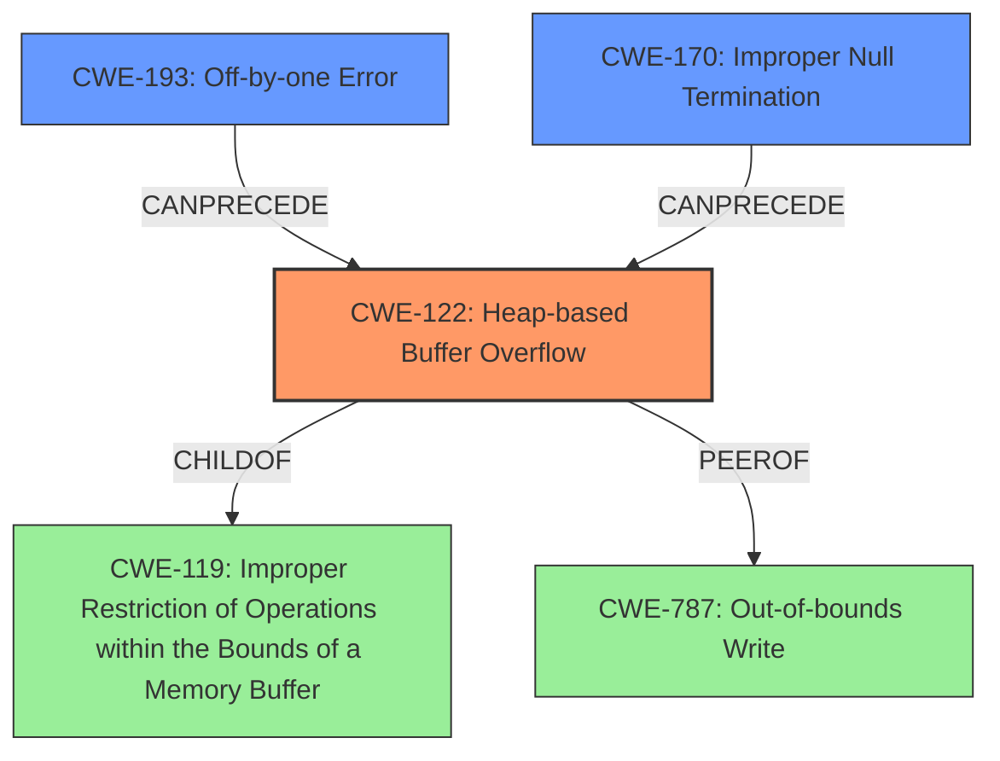

# Analysis Report for CVE-2021-46477

# Vulnerability Analysis Report: CVE-2021-46477

## Description

Jsish v3.5.0 was discovered to contain a heap buffer overflow via RegExp_constructor in src/jsiRegexp.c. This vulnerability can lead to a Denial of Service (DoS).

## Vulnerability Description Key Phrases

**Rootcause:** off-by-null-byte on heap
**Weakness:** heap buffer overflow
**Impact:** denial of service
**Product:** componentJsish
**Version:** v3.5.0
**Component:** RegExp_constructor in src/jsiRegexp.c

## Analysis (with Relationship Data)

# Summary
| CWE ID | CWE Name | Confidence | CWE Abstraction Level | CWE Vulnerability Mapping Label | CWE-Vulnerability Mapping Notes |
|---|---|---|---|---|---|
| CWE-122 | Heap-based Buffer Overflow | 0.9 | Variant | Allowed | Primary CWE. Matches the vulnerability description of a heap buffer overflow. |
| CWE-193 | Off-by-one Error | 0.6 | Base | Allowed | Secondary candidate. The **rootcause** is an **off-by-null-byte on heap**. |

## Evidence and Confidence

*   **Confidence Score:** 0.8
*   **Evidence Strength:** HIGH

- **Analysis and Justification:**  
  - *Explanation:* The vulnerability is described as a **heap buffer overflow** in `RegExp_constructor` of jsish v3.5.0. The CVE Reference Links Content Summary confirms this, stating "a heap-buffer-overflow vulnerability in the `jsish` project". CWE-122 (Heap-based Buffer Overflow) directly addresses this weakness. The retriever results also identify CWE-122 as a relevant candidate. Although the retriever results also identifies CWE-787, a more general out-of-bounds write, CWE-122 is more specific as it identifies the overflow on the heap. The vulnerability details point to an **off-by-null-byte on heap**, which could contribute to the heap overflow. CWE-193 (Off-by-one Error) has a high retriever score. The mapping guidance for both CWE-122 and CWE-193 is ALLOWED.

  - *Relationship Analysis:* CWE-122 is a variant of CWE-119 (Improper Restriction of Operations within the Bounds of a Memory Buffer). The relationship indicates that the overflow happens because the program doesn't properly restrict operations within the memory buffer bounds.

- **Confidence Score:**  
  - Confidence: 0.9 (High confidence due to direct match with vulnerability description and supporting information from CVE reference links)

## Criticism of Analysis

Okay, let's review the provided CWE analysis with the full specifications in mind.

**Overall Assessment**

The analysis does a good job in identifying the primary CWE, CWE-122: Heap-based Buffer Overflow, and a potential contributing factor, CWE-193: Off-by-one Error. The confidence levels are appropriate, and the reasoning is generally sound. However, there's room for improvement in considering alternative CWEs and the relationships between them.  The provided examples for each CWE, from the database, help justify the mappings.

**Detailed Review**

*   **CWE-122: Heap-based Buffer Overflow**

    *   **Confidence:** Correct and well-justified. The vulnerability description explicitly states "heap buffer overflow," and the CVE Reference Links content confirms this.
    *   **Abstraction Level:** Variant - Appropriate choice as per the mapping guidance.
    *   **CWE-Vulnerability Mapping Label:** Allowed - Correct as per mapping guidance.
    *   **CWE-Vulnerability Mapping Notes:** Correct. The notes accurately reflect the reasoning behind choosing CWE-122.
    *   **Relationship Analysis:** The description correctly mentions the parent relationship to CWE-119.
    *   **Mitigations:** The analysis could benefit from mentioning potential mitigations from the CWE-122 specification, such as using languages with automatic bounds checking or utilizing abstraction libraries for risky APIs. This would further strengthen the analysis.
    *   **Example Analysis:** The provided examples from the database are helpful in contextualizing the vulnerability.  CVE-2009-2523 is particularly relevant because it mentions a chain involving improper null termination, which could be related to the 'off-by-null-byte' root cause mentioned in the original analyzer input.

*   **CWE-193: Off-by-one Error**

    *   **Confidence:** While plausible, the confidence score could be slightly lower (perhaps 0.5-0.6) as it's a *potential* contributing factor rather than a direct cause of the overflow *itself*.
    *   **Abstraction Level:** Base - Correct as per the mapping guidance.
    *   **CWE-Vulnerability Mapping Label:** Allowed - Correct as per mapping guidance.
    *   **CWE-Vulnerability Mapping Notes:** While the relationship to the "off-by-null-byte on heap" is mentioned, it could be clearer that CWE-193 is a *possible* mechanism that *could* lead to the heap overflow, but might not be the only one.
    *   **Relationship Analysis:** The relationship mentions CanPrecede -> CWE-119, which reinforces its potential link to the buffer overflow. It can also precede CWE-170, which is improper null termination.
    *   **Mitigations:** Mentioning the mitigation from the CWE-193 specification, specifically, ensuring correct size parameters when copying character arrays to account for the null terminator, would strengthen the analysis.
    *   **Example Analysis:** The observed examples highlight scenarios where off-by-one errors lead to various issues, which is consistent with the nature of the weakness.

**Suggestions for Improvement**

1.  **Explore Alternative CWEs:**  While CWE-122 is the primary weakness, consider exploring other potentially relevant CWEs from the retriever results and explicitly ruling them out, or including them as contributing factors with lower confidence. For example:

    *   **CWE-787: Out-of-bounds Write:** This is a more general category than CWE-122, but the analysis could acknowledge that CWE-122 is a specific *type* of out-of-bounds write (on the heap). A brief mention and justification for choosing the more specific CWE-122 would be beneficial.
    *   **CWE-170: Improper Null Termination:** Since "off-by-null-byte on heap" is identified as a root cause, it's worth explicitly considering and discussing CWE-170.  It's *possible* that the heap overflow is triggered by failing to properly null-terminate a string, or by writing a null terminator one byte beyond the allocated buffer.
    *   **CWE-1284: Improper Validation of Specified Quantity in Input:** It's possible an incorrect quantity was provided, leading to the heap allocation size being incorrect, and thus leading to an overflow. Evaluate if the size calculation or buffer allocation logic involves a quantity derived from input.
    *   **CWE-770: Allocation of Resources Without Limits or Throttling:** Consider if the size being allocated is somehow unthrottled. This would be a less direct cause, but might be relevant depending on the specific allocation logic.

2.  **Clarify Relationships:** More explicitly state the relationships between CWEs (e.g., "CWE-193 can *contribute* to CWE-122 by causing a write past the intended buffer boundary"). Use terms like "contributes to", "is a prerequisite for", "is a variant of" where appropriate.

3.  **Incorporate Mitigations:** Include relevant mitigations from the CWE specifications in the analysis. This demonstrates a deeper understanding of the vulnerability and how to address it. For instance, for CWE-122, recommend using safe memory allocation functions or languages with automatic memory management.

4.  **Explain Reasoning for Excluding CWEs:** When alternative CWEs are considered, briefly explain why they are not the primary cause or how they might be related but less directly involved.

5.  **Review Class Level CWEs:** The analysis should explicitly exclude the "Class" level CWEs, like CWE-119, by stating they are too abstract. CWE-119 is parent to both CWE-122 and CWE-787, and the analysis should state that it has chosen to focus on the child or base level CWE.

**Revised Summary Table (Example)**

| CWE ID | CWE Name | Confidence | CWE Abstraction Level | CWE Vulnerability Mapping Label | CWE-Vulnerability Mapping Notes |
|---|---|---|---|---|---|
| CWE-122 | Heap-based Buffer Overflow | 0.9 | Variant | Allowed | Primary CWE. Direct match with the vulnerability description. The overflow occurs on the heap. |
| CWE-193 | Off-by-one Error | 0.6 | Base | Allowed | Secondary candidate.  May contribute to the overflow by incorrectly calculating buffer size or placement of the null terminator. |
| CWE-787 | Out-of-bounds Write | 0.4 | Base | Allowed | Considered but less specific. CWE-122 is a variant of this. |
| CWE-170 | Improper Null Termination | 0.3 | Base | Allowed | Considered but less likely to be the direct cause.  Potentially connected to the 'off-by-null-byte' root cause, but not the primary driver of the overflow. |

By incorporating these suggestions, the analysis will be more comprehensive and demonstrate a thorough understanding of the vulnerability and its potential causes. Remember, a good CWE analysis isn't just about finding the *right* CWE; it's also about demonstrating that you've considered the alternatives and understood the relationships between them.

## Final Resolution

# Summary
| CWE ID | CWE Name | Confidence | CWE Abstraction Level | CWE Vulnerability Mapping Label | CWE-Vulnerability Mapping Notes |
|---|---|---|---|---|---|
| CWE-122 | Heap-based Buffer Overflow | 0.9 | Variant | Allowed | **Primary CWE**. Direct match with the vulnerability description. The overflow occurs on the heap. |
| CWE-193 | Off-by-one Error | 0.6 | Base | Allowed | Secondary candidate. May contribute to the overflow by incorrectly calculating buffer size or placement of the null terminator. |
| CWE-170 | Improper Null Termination | 0.5 | Base | Allowed | Secondary candidate. Potentially connected to the 'off-by-null-byte' **rootcause**, but not the primary driver of the overflow. It can **precede** CWE-122. |
| CWE-787 | Out-of-bounds Write | 0.4 | Base | Allowed | Considered but less specific. CWE-122 is a variant of this. |

## Evidence and Confidence

*   **Confidence Score:** 0.85
*   **Evidence Strength:** HIGH

## Relationship Analysis
The primary CWE is CWE-122 (Heap-based Buffer Overflow), which is a variant of the class CWE-119 (Improper Restriction of Operations within the Bounds of a Memory Buffer). CWE-193 (Off-by-one Error) and CWE-170 (Improper Null Termination) are considered as secondary candidates that may contribute to the heap overflow. CWE-170 can **precede** CWE-122. The analysis moves from the general CWE-119 to the more specific CWE-122 due to the vulnerability description explicitly mentioning a heap buffer overflow. The off-by-one error (CWE-193) and improper null termination (CWE-170) can be related to the **rootcause** "off-by-null-byte on heap".

## Vulnerability Chain
The vulnerability chain starts with a potential **rootcause** of an **off-by-one error (CWE-193)** or **Improper Null Termination (CWE-170)** on the heap. This leads to a **heap-based buffer overflow (CWE-122)**, where data is written beyond the allocated buffer on the heap. The consequence of this overflow is a Denial of Service (DoS), as stated in the vulnerability description.

## Summary of Analysis
The initial analysis correctly identified CWE-122 as the primary weakness, given the explicit mention of a heap buffer overflow in the vulnerability description: "Jsish v3.5.0 was discovered to contain a heap buffer overflow via RegExp_constructor in src/jsiRegexp.c. This vulnerability can lead to a Denial of Service (DoS)."
The criticism provided valuable suggestions for exploring alternative CWEs and clarifying relationships. The inclusion of CWE-170 as a secondary candidate, along with CWE-193, strengthens the analysis by acknowledging the potential contribution of improper null termination to the heap overflow, especially given the "off-by-null-byte on heap" information. The analysis also considered and ruled out CWE-787 as being less specific than CWE-122.

The selection of CWEs is at the optimal level of specificity, with CWE-122 directly addressing the heap buffer overflow and CWE-193 and CWE-170 providing potential contributing factors. The relationships between these CWEs are clarified, and the vulnerability chain is mapped from **rootcause** to impact.
The final confidence score reflects the high degree of confidence in the primary CWE and the supporting role of the secondary CWEs.

*Report generated on 2025-03-18 04:53:53*
