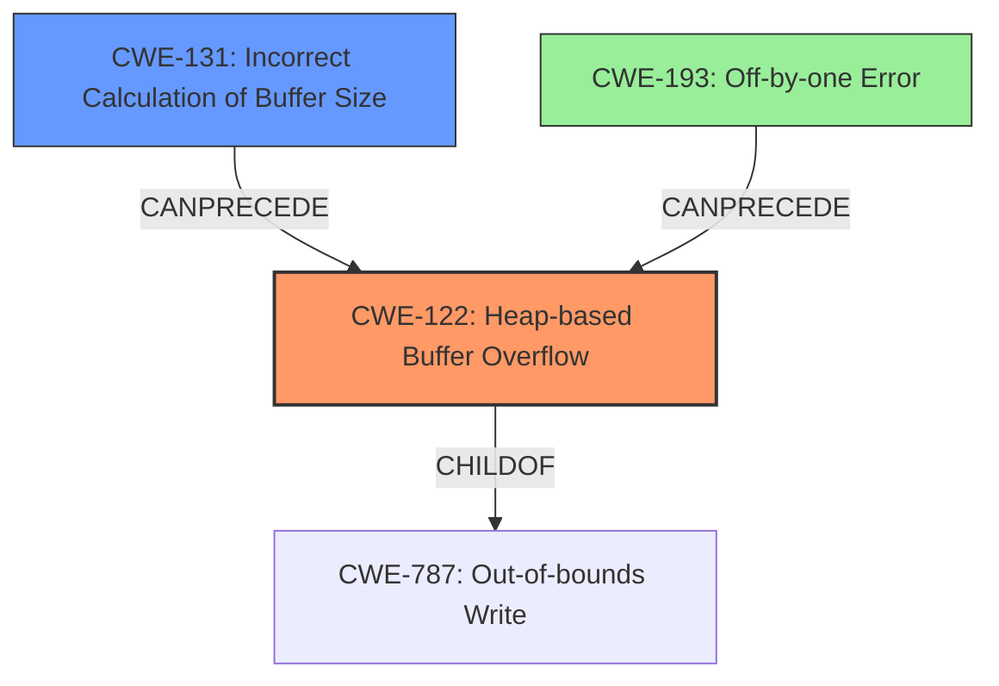

# Final Resolution for CVE-2021-46482

# Summary
| CWE ID | CWE Name | Confidence | CWE Abstraction Level | CWE Vulnerability Mapping Label | CWE-Vulnerability Mapping Notes |
|---|---|---|---|---|---|
| CWE-122 | Heap-based Buffer Overflow | 0.95 | Variant | Allowed | Primary CWE |
| CWE-131 | Incorrect Calculation of Buffer Size | 0.7 | Base | Allowed | Secondary Candidate |
| CWE-193 | Off-by-one Error | 0.4 | Base | Allowed | Tertiary Candidate |

## Evidence and Confidence

*   **Confidence Score:** 0.9
*   **Evidence Strength:** HIGH

## Relationship Analysis
The primary relationship that impacted the decision was the parent-child relationship between CWE-787 (**Out-of-bounds Write**) and CWE-122 (**Heap-based Buffer Overflow**). CWE-122 is a specific type of CWE-787. The decision to select CWE-122 was based on the vulnerability description specifying that the overflow occurred on the heap.

Additionally, the relationship between CWE-131 (**Incorrect Calculation of Buffer Size**) and CWE-122 was considered. CWE-131 can precede CWE-122, as an incorrect calculation of buffer size can lead to a heap-based buffer overflow.

Finally, CWE-193 (**Off-by-one Error**) was considered as a tertiary candidate, as this error can lead to a heap buffer overflow if it causes the allocation to be smaller than required.

## Vulnerability Chain
The vulnerability chain starts with a **ROOTCAUSE** such as CWE-131 (**Incorrect Calculation of Buffer Size**) or CWE-193 (**Off-by-one Error**). If the buffer size is incorrectly calculated (CWE-131) or there's an off-by-one error (CWE-193), it can lead to a **WEAKNESS**: CWE-122 (**Heap-based Buffer Overflow**). This occurs when data is written beyond the allocated buffer on the heap. The resulting consequence is a potential crash, arbitrary code execution, or other security impacts.

## Summary of Analysis
The initial analysis correctly identified CWE-122 as the primary weakness given the vulnerability description explicitly mentioning "heap buffer overflow". The criticism provided valuable points on alternative causes and relationships between CWEs. Specifically, the suggestion to consider CWE-120 (**Buffer Copy without Checking Size of Input**), CWE-787 (**Out-of-bounds Write**), CWE-193 (**Off-by-one Error**), CWE-190/191 (**Integer Overflow/Underflow**), CWE-126 (**Buffer Over-read**), and CWE-170 (**Improper Null Termination**) was helpful.

While CWE-120 is a possible direct cause, the context of `NumberConstructor` suggests a size calculation issue is more likely than a simple buffer copy without checking size. CWE-787 is a parent of CWE-122, but CWE-122 is more specific because the overflow occurs on the heap.

CWE-131 remains a strong secondary candidate as it is a common underlying cause for heap overflows. The suggestion to consider integer overflows or truncations as specific causes within CWE-131 is valid and increases the confidence in its selection to 0.7.

CWE-193 is added as a tertiary candidate with a confidence of 0.4. If the size calculation is correct, an off-by-one error on indexing could lead to the out-of-bounds write.

The analysis is based on the provided evidence, including the vulnerability description stating a "**heap buffer overflow**" and the CVE Reference Links Content Summary confirming the "**heap-buffer-overflow**" as the root cause. The graph relationships influenced the final selection by ensuring the most specific CWE was chosen (CWE-122) while also considering potential contributing factors (CWE-131, CWE-193). The selected CWEs are at the optimal level of specificity as CWE-122 directly reflects the vulnerability, and CWE-131 and CWE-193 represent potential underlying causes.