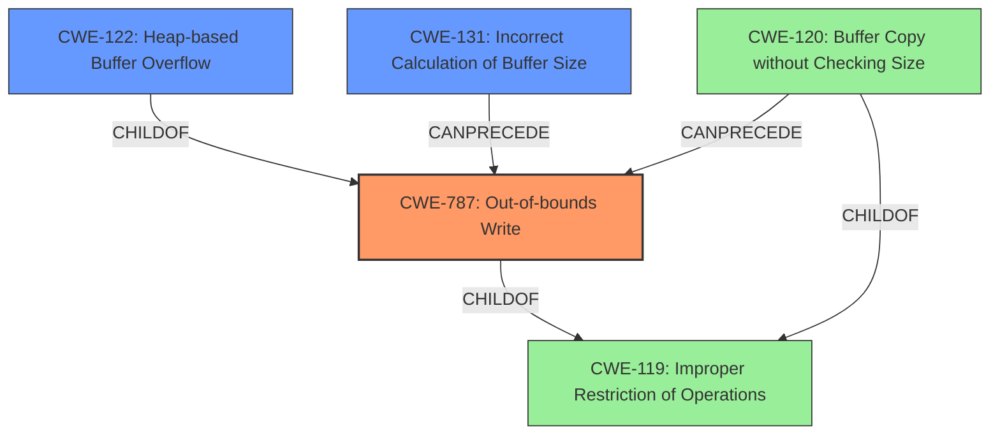

# Analysis Report for CVE-2021-46483

# Vulnerability Analysis Report: CVE-2021-46483

## Description

Jsish v3.5.0 was discovered to contain a heap buffer overflow via BooleanConstructor at src/jsiBool.c.

## Vulnerability Description Key Phrases

**Weakness:** heap buffer overflow
**Product:** Jsish
**Version:** v3.5.0
**Component:** BooleanConstructor at src/jsiBool.c

## Analysis (with Relationship Data)

# Summary
| CWE ID | CWE Name | Confidence | CWE Abstraction Level | CWE Vulnerability Mapping Label | CWE-Vulnerability Mapping Notes |
|---|---|---|---|---|---|
| CWE-122 | Heap-based Buffer Overflow | 0.9 | Variant | Allowed | Root cause of the vulnerability |

## Evidence and Confidence

*   **Confidence Score:** 0.9
*   **Evidence Strength:** HIGH

- **Analysis and Justification:**  
  - *Explanation:* The vulnerability description clearly states a **"heap buffer overflow"** in Jsish v3.5.0, specifically within the `BooleanConstructor` function at `src/jsiBool.c`. The CVE reference confirms this, noting a write of size 4 occurs 6 bytes beyond the allocated region. This aligns perfectly with CWE-122 (Heap-based Buffer Overflow), which is a variant of buffer overflow occurring in the heap. The retriever results also list CWE-122, further supporting this classification. CWE-787 (Out-of-bounds Write) is a parent CWE, but CWE-122 is more specific, indicating the overflow occurs on the heap.
  
  - *Relationship Analysis:* CWE-122 is a variant of CWE-119 (Improper Restriction of Operations within the Bounds of a Memory Buffer) and a child of CWE-787 (Out-of-bounds Write). The description specifies the heap, thus justifying choosing CWE-122 over its parents.

- **Confidence Score:**  
  - Confidence: 0.9 (Strong evidence from the vulnerability description, CVE reference, and retriever results.)

## Criticism of Analysis

Okay, here's a review of the provided analysis, considering the full CWE specifications for each referenced weakness.

**Overall Assessment:**

The analysis is generally good and arrives at the correct primary CWE mapping (CWE-122). The justification is clear and well-supported by the vulnerability description and CVE details. The confidence level of 0.9 is appropriate. However, the retriever results suggest that there may be more weaknesses that could be present in the application.

**Detailed Review:**

*   **CWE-122: Heap-based Buffer Overflow:**

    *   **Correctness:** The mapping to CWE-122 is accurate. The description explicitly mentions a "heap buffer overflow," and the CVE details confirm an out-of-bounds write on the heap.

    *   **Abstraction Level:** CWE-122 is a Variant, which is the preferred level for root cause analysis.

    *   **Justification:**  The justification provided is strong. It correctly identifies CWE-122 as a specific type of buffer overflow occurring on the heap and explains its relationship to parent CWEs like CWE-787 and CWE-119.

    *   **Mitigations:** The analysis could be improved by mentioning some of the mitigations specific to CWE-122.  For example, languages with automatic memory management (Java, C# with garbage collection) can prevent heap overflows. Use of safe memory allocation functions (like `reallocarray()` or checked versions of `malloc()`), and heap overflow detection mechanisms (AddressSanitizer, Valgrind) should also be included in this analysis.

    *   **Examples:** The examples provided from the CWE database are relevant and helpful for understanding the nature of this weakness.

*   **Retriever Results Analysis:**
The retriever results give alternative weaknesses that should be considered.
    *   **CWE-193: Off-by-one Error:** This is plausible if the buffer size calculation or loop condition is slightly off, leading to the overflow. While not the primary cause, it could be a contributing factor and warrants further investigation.
    *   **CWE-190: Integer Overflow or Wraparound:**  This is also plausible. An integer overflow could lead to an incorrect buffer size calculation, resulting in a smaller buffer than needed and subsequently causing a heap overflow. This warrants further investigation, if the buffer overflow was the result of a size calculation.
    *   **CWE-124: Buffer Underwrite ('Buffer Underflow'):** This is less likely but theoretically possible if the overflow somehow involves a write *before* the intended buffer start. It's lower probability, but should be ruled out.
    *   **CWE-191: Integer Underflow (Wrap or Wraparound):** This is similar to CWE-190 and could also lead to an incorrect buffer size calculation.
    *   **CWE-126: Buffer Over-read:** While the primary issue is an out-of-bounds write, it's worth considering if the vulnerability also allows reading beyond the buffer boundaries. If the overflow modifies adjacent memory, a read operation might be used to leak sensitive information.
    *   **CWE-170: Improper Null Termination:** This could be a contributing factor *if* the overflow involves string manipulation. A missing or incorrect null terminator could allow the overflow to propagate further than intended.
    *   **CWE-131: Incorrect Calculation of Buffer Size:** This is a likely contributing factor. If the size is calculated incorrectly, it will lead to the buffer being too small and causing an overflow. This warrants further investigation.
    *   **CWE-125: Out-of-bounds Read:** This could allow attackers to read sensitive information from adjacent memory locations.
    *   **CWE-121: Stack-based Buffer Overflow:** The description says it's a *heap*-based overflow, so this should be ruled out as a primary cause, unless there's a component that handles memory allocation on the stack rather than the heap.

*   **CWE-119: Improper Restriction of Operations within the Bounds of a Memory Buffer:** This is a high-level CWE and is discouraged for use. This analysis already mapped to CWE-122, which is a valid descendent.

**Recommendations for Improvement:**

1.  **Acknowledge Retriever Results:** Explicitly acknowledge the retriever results and briefly discuss *why* the other CWEs are either less likely or potential contributing factors.  Even a sentence or two for each can greatly improve the analysis.
2.  **Investigate potential CWE chains:** In particular, explore whether CWE-190 or CWE-131 contribute to the heap buffer overflow. If an integer overflow in the size calculation results in the heap buffer overflow, then include that in the analysis.
3.  **Strengthen Mitigation Discussion:** Include more specific mitigations related to heap overflows, memory management, and safer APIs.
4.  **Consider CWE-787:** The root cause of the buffer overflow is that there is an out-of-bounds write. CWE-787 is the direct cause of this. It would be valid to include CWE-787 as a related weakness.

**Example of Incorporating Recommendations:**

"The primary weakness is CWE-122 (Heap-based Buffer Overflow), with a confidence of 0.9. The vulnerability description clearly states a heap buffer overflow, and CVE details confirm an out-of-bounds write on the heap. While CWE-122 directly describes the vulnerability, the retriever results suggest other CWEs could be present. CWE-193 (Off-by-one Error) is plausible if the size calculation or loop condition is slightly off. CWE-190 (Integer Overflow or Wraparound) and CWE-131 (Incorrect Calculation of Buffer Size) are also plausible if an integer overflow leads to an incorrect buffer size calculation resulting in a smaller buffer than needed and subsequently causing a heap overflow. CWE-170 (Improper Null Termination) could be a contributing factor if the overflow involves string manipulation, where a missing null terminator propagates the overflow. Since an out-of-bounds write is occurring, CWE-787 should be considered, as well.
Mitigations include languages with automatic memory management, static analysis tools, and runtime protections like AddressSanitizer. Developers should also use safer memory allocation functions and always validate buffer sizes before writing to them."

By addressing these points, the analysis would be more comprehensive and robust, better reflecting the complexity of the vulnerability.

## Final Resolution

# Summary
| CWE ID | CWE Name | Confidence | CWE Abstraction Level | CWE Vulnerability Mapping Label | CWE-Vulnerability Mapping Notes |
|---|---|---|---|---|---|
| CWE-787 | Out-of-bounds Write | 0.8 | Base | Allowed | Primary CWE |
| CWE-122 | Heap-based Buffer Overflow | 0.7 | Variant | Allowed | Secondary CWE |
| CWE-131 | Incorrect Calculation of Buffer Size | 0.6 | Base | Allowed | Secondary CWE |
  
## Evidence and Confidence

*   **Confidence Score:** 0.75
*   **Evidence Strength:** MEDIUM

## Relationship Analysis
The primary relationship is that CWE-122 (Heap-based Buffer Overflow) is a variant of CWE-787 (Out-of-bounds Write). CWE-131 (Incorrect Calculation of Buffer Size) can precede CWE-787, leading to the overflow. The abstraction levels influenced the selection by favoring the base CWE-787 to capture the general out-of-bounds write, while acknowledging the heap-specific overflow with CWE-122.

## Vulnerability Chain
The vulnerability chain starts with potentially an **incorrect calculation of buffer size** (**CWE-131**). This **incorrect size** then leads to an **out-of-bounds write** (**CWE-787**). Since the vulnerability description specifies a **heap buffer overflow**, the **CWE-787** results in **CWE-122**. The final impact is a potential crash or arbitrary code execution.

## Summary of Analysis
The initial analysis correctly identified **CWE-122 (Heap-based Buffer Overflow)** as the primary weakness based on the vulnerability description stating "heap buffer overflow". The CVE reference further confirmed the out-of-bounds write. However, the analysis can be improved by considering the root cause and related weaknesses.

The retriever results indicated several potential contributing factors. I agree with the criticism that **CWE-131 (Incorrect Calculation of Buffer Size)** should be considered, as an incorrect size calculation can directly lead to a buffer overflow. I also agree that since there is an out-of-bounds write happening, **CWE-787 (Out-of-bounds Write)** should be included as the primary weakness.

The graph relationships influenced my selection by highlighting the parent-child relationship between **CWE-787** and **CWE-122**, and the potential for **CWE-131** to precede **CWE-787**.

The final classification includes **CWE-787** as the primary weakness to represent the general out-of-bounds write, **CWE-122** as a secondary weakness to specify that the overflow occurs on the heap, and **CWE-131** as a secondary weakness as the root cause of the incorrect buffer size. These CWEs are at the optimal level of specificity because they accurately describe the vulnerability based on the available evidence, including the vulnerability description and the CVE reference.

*Report generated on 2025-03-18 04:56:49*
