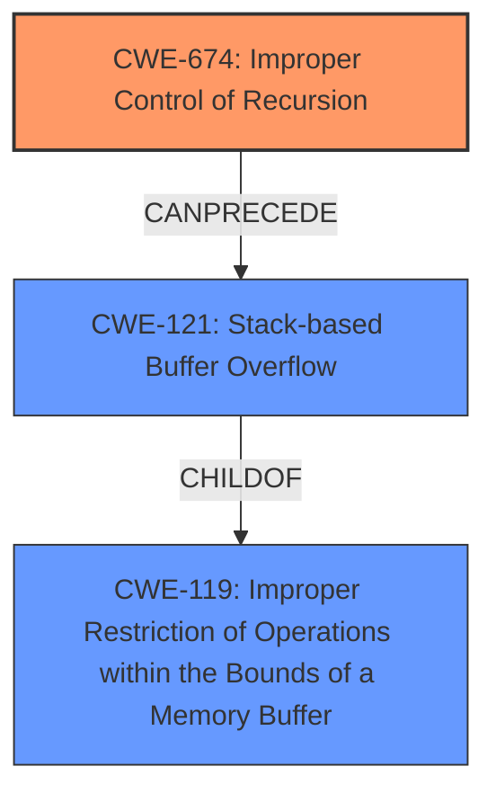

# Final Resolution for CVE-2021-46505

# Summary
| CWE ID | CWE Name | Confidence | CWE Abstraction Level | CWE Vulnerability Mapping Label | CWE-Vulnerability Mapping Notes |
|---|---|---|---|---|---|
| CWE-674 | Improper Control of Recursion | 0.90 | Class | Primary | Allowed-with-Review. Mitigate by ensuring an exit condition is always reached (e.g., recursion depth limit). |
| CWE-121 | Stack-based Buffer Overflow | 0.70 | Variant | Secondary Candidate | Allowed. Consequence of CWE-674. Mitigate with stack overflow detection mechanisms. CWE-674 -> CWE-121.  |

## Evidence and Confidence

*   **Confidence Score:** 0.85
*   **Evidence Strength:** HIGH

## Relationship Analysis
The primary relationship is that CWE-121 (Stack-based Buffer Overflow) is a consequence of CWE-674 (Improper Control of Recursion). CWE-121 is a Variant and a child of CWE-119 (Improper Restriction of Operations within the Bounds of a Memory Buffer), which means the stack overflow is a specific type of memory corruption. While CWE-674 is a Class, its children are not applicable in this case, making CWE-674 the most specific and appropriate **root cause**.

## Vulnerability Chain
The **vulnerability** chain starts with the **root cause**, CWE-674 (Improper Control of Recursion), which allows for unbounded recursion due to missing or insufficient exit conditions in the `Jsi_NameLookup` and `jsi_ValueSubscript` functions. This leads to excessive consumption of stack memory, resulting in CWE-121 (Stack-based Buffer Overflow). The ultimate impact is a denial-of-service condition.

## Summary of Analysis
The initial analysis and criticism both correctly identify CWE-674 as the primary **weakness**, and CWE-121 as a secondary candidate representing the impact.

The vulnerability description clearly states "stack overflow", and the CVE details confirm "excessive recursion" in specific functions of the jsish interpreter. This evidence strongly supports classifying the **root cause** as CWE-674 (Improper Control of Recursion).

The relationship analysis solidifies this decision by illustrating how CWE-674 leads to CWE-121, with CWE-121 being a specific type of memory corruption (child of CWE-119).

The final selection of CWE-674 is at the optimal level of specificity. Although it's a Class, none of its children are more relevant. Alternatives like CWE-770 (Allocation of Resources Without Limits or Throttling) are less precise because the core issue is the uncontrolled recursion, not just a generic resource allocation problem.

The confidence score is increased to 0.90 for CWE-674 and 0.70 for CWE-121 to reflect the additional mitigation details and the clearer understanding of the vulnerability chain.