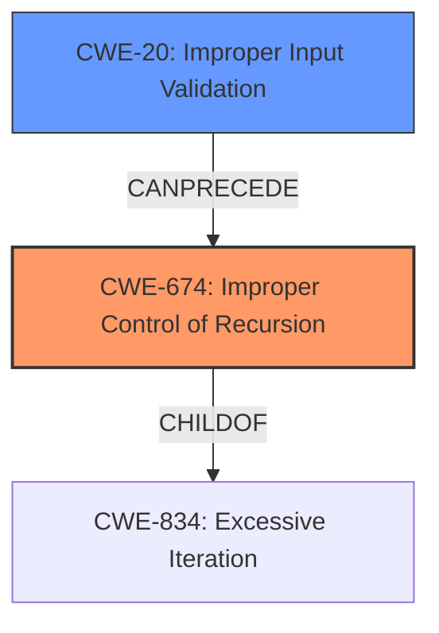

# Final Resolution for CVE-2021-46507

# Summary
| CWE ID | CWE Name | Confidence | CWE Abstraction Level | CWE Vulnerability Mapping Label | CWE-Vulnerability Mapping Notes |
|---|---|---|---|---|---|
| CWE-674 | Improper Control of Recursion | 0.9 | Class | Primary | Allowed-with-Review |
| CWE-20 | Improper Input Validation | 0.6 | Base | Secondary | Contributes to vulnerability by allowing malicious input to reach the vulnerable function. |

## Evidence and Confidence

*   **Confidence Score:** 0.9
*   **Evidence Strength:** HIGH

## Relationship Analysis
The primary weakness, **CWE-674 (Improper Control of Recursion)**, is a Class-level CWE. While it doesn't have direct relationships listed in the provided data, it is conceptually related to resource management issues. The **stack overflow** is a direct consequence of the uncontrolled recursion. A potential parent is **CWE-834 (Excessive Iteration)**, representing a broader category of resource consumption issues. The secondary weakness, **CWE-20 (Improper Input Validation)**, highlights that the vulnerability is triggered by crafted input. The relationship between these CWEs is that the **lack of input validation** allows malicious input to reach the vulnerable function, triggering the uncontrolled recursion and leading to a **stack overflow**.

## Vulnerability Chain
The vulnerability chain starts with **CWE-20 (Improper Input Validation)**, allowing crafted JavaScript input to reach the `Jsi_LogMsg` function. This triggers **CWE-674 (Improper Control of Recursion)** within the `Jsi_ValueToString` and `Jsi_LogMsg` functions, leading to unbounded recursion. The consequence of this recursion is a **stack overflow**, which causes the application to crash.

## Summary of Analysis
The initial analysis correctly identified **CWE-674 (Improper Control of Recursion)** as the primary weakness, given the **stack overflow** caused by uncontrolled recursion within the `Jsi_LogMsg` function. The vulnerability description clearly states a "**stack overflow** via Jsi_LogMsg at src/jsiUtils.c" which is reinforced by CVE Reference Links Content Summary, highlighting "Stack overflow due to unbounded recursion" and "Improper handling of specific input data, causing infinite recursion".

The criticism suggested adding **CWE-20 (Improper Input Validation)** as a secondary weakness, which is appropriate because the crafted JavaScript input is the trigger for the vulnerability. The **lack of input validation** allows malicious input to reach the vulnerable function, triggering the uncontrolled recursion.

The graph relationships support this decision by illustrating how **CWE-20** can precede **CWE-674**.

The selected CWEs are at the optimal level of specificity. **CWE-674** directly addresses the uncontrolled recursion, while **CWE-20** highlights the role of user-provided input.