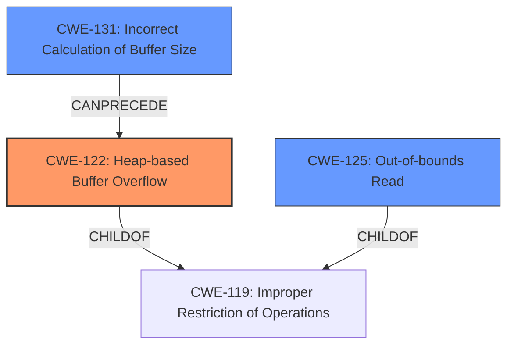

# Analysis Report for CVE-2021-46519

# Vulnerability Analysis Report: CVE-2021-46519

## Description

Cesanta MJS v2.20.0 was discovered to contain a heap buffer overflow via mjs_array_length at src/mjs_array.c.

## Vulnerability Description Key Phrases

**Weakness:** heap buffer overflow
**Product:** Cesanta MJS
**Version:** v2.20.0
**Component:** mjs_array_length at src/mjs_array.c

## Analysis (with Relationship Data)

# Summary
| CWE ID | CWE Name | Confidence | CWE Abstraction Level | CWE Vulnerability Mapping Label | CWE-Vulnerability Mapping Notes |
|---|---|---|---|---|---|
| CWE-122 | Heap-based Buffer Overflow | 0.95 | Variant | Allowed | Primary CWE: The vulnerability is explicitly described as a **heap buffer overflow**. |
| CWE-125 | Out-of-bounds Read | 0.65 | Base | Allowed | Secondary Candidate: The vulnerability involves reading memory beyond the allocated buffer. |
| CWE-131 | Incorrect Calculation of Buffer Size | 0.55 | Base | Allowed | Secondary Candidate: The buffer overflow could be caused by an incorrect calculation of buffer size. |

## Evidence and Confidence

*   **Confidence Score:** 0.90
*   **Evidence Strength:** HIGH

- **Analysis and Justification:**  
  - *Explanation:* The vulnerability is described as a **heap buffer overflow** in the `mjs_array_length` function. This directly corresponds to CWE-122 (Heap-based Buffer Overflow). The CVE Reference Links Content Summary confirms this by stating that a **heap-buffer-overflow** occurs when the program attempts to read memory beyond the allocated buffer for the array. This aligns perfectly with the definition and characteristics of CWE-122. The retriever results also list CWE-122 as a candidate.
  - *Relationship Analysis:* CWE-122 is a variant of CWE-119 (Improper Restriction of Operations within the Bounds of a Memory Buffer). It is also related to other buffer overflow variants like CWE-121 (Stack-based Buffer Overflow).

- **Confidence Score:**  
  - Confidence: 0.95 (The evidence is strong and directly supports the classification of CWE-122)

---
- **Analysis and Justification:**  
  - *Explanation:* The vulnerability also involves reading memory beyond the allocated buffer, which is a characteristic of CWE-125 (Out-of-bounds Read). While the primary issue is the overflow itself (CWE-122), the out-of-bounds read is a consequence of that overflow, indicating a potential for information disclosure or other unexpected behavior. The retriever results also list CWE-125 as a candidate.
  - *Relationship Analysis:* CWE-125 is a base-level CWE, and is a parent of CWE-126 (Buffer Over-read).

- **Confidence Score:**  
  - Confidence: 0.65 (Supporting evidence points to out-of-bounds read as a consequence of the heap overflow)

---
- **Analysis and Justification:**  
  - *Explanation:* The **heap buffer overflow** could be the result of an incorrect calculation of the size to be used when allocating a buffer. Therefore, CWE-131 (Incorrect Calculation of Buffer Size) is a reasonable secondary candidate.
  - *Relationship Analysis:* CWE-131 is a base-level CWE, which can lead to buffer overflows.

- **Confidence Score:**  
  - Confidence: 0.55 (The evidence suggest this is a possible rootcause, but there is no direct evidence to support this.)

## Criticism of Analysis

Okay, here's a review of the provided CWE analysis, incorporating the full CWE specifications:

**Overall Assessment**

The analysis does a decent job of identifying the primary CWE (CWE-122) and potential secondary CWEs. The confidence levels are generally reasonable, though some could be refined. The justifications are mostly sound, but can be improved by explicitly linking cause and effect. It appropriately discourages using CWE-119 directly, in favour of its children.

**Detailed Review**

**1. CWE-122: Heap-based Buffer Overflow**

*   **Confidence:** 0.95 (Good)
*   **Rationale:** Excellent. The analysis directly and clearly links the vulnerability description (heap buffer overflow) to the CWE definition. The CVE summary confirms the root cause. The reference to the `mjs_array_length` function pinpoints the location. It should also be pointed out that a buffer-overflow allows an attacker to write outside the buffer, potentially overwriting other memory.
*   **Improvements:** Consider highlighting that CWE-122 is a *write* operation. Because heap overflows can overwrite memory with attacker controlled data, this could lead to more serious outcomes than just a denial of service, such as arbitrary code execution. The provided mitigations like using languages with automatic bounds checking or using libraries that abstract away risky APIs are good points to highlight in this case.

**2. CWE-125: Out-of-bounds Read**

*   **Confidence:** 0.65 (Reasonable)
*   **Rationale:** Sound, but could be stronger. The analysis correctly identifies that an out-of-bounds *read* can be a *consequence* of the heap overflow.  When the `mjs_array_length` function attempts to access the `array` beyond the allocated bounds, it performs a read operation on an invalid memory address.
*   **Improvements:** Mention the information disclosure aspect of this vulnerability. Since it is a read operation, the vulnerability has the *potential* to leak sensitive information stored adjacent to the buffer in memory.

**3. CWE-131: Incorrect Calculation of Buffer Size**

*   **Confidence:** 0.55 (Acceptable, but weakest link)
*   **Rationale:** It correctly identifies a possible root cause.  The *potential* for an incorrect buffer size calculation to be a contributing factor is logical. *However*, there's no *direct* evidence to support this from the vulnerability description or CVE summary. This is more of a hypothesis.
*   **Improvements:** Reduce the confidence score to something closer to 0.45. Also, more explicitly state that there's *no direct evidence* to support this, and that it's based on the understanding of how such errors *could* be introduced.

**General Improvements**

*   **Chains of Weaknesses:** The analysis could benefit from explicitly discussing potential *chains* of weaknesses. For example, a common chain leading to CWE-122 is:
    *   CWE-20: Improper Input Validation ->
    *   CWE-131: Incorrect Calculation of Buffer Size ->
    *   CWE-122: Heap-based Buffer Overflow
    While CWE-131 has a low confidence, the possibility is there.

*   **Mitigation Discussion:** Briefly mentioning *relevant* mitigations for each CWE would improve the analysis. Refer to the "Potential Mitigations" sections in the CWE specifications. This adds practical value.

*   **Relationship to CWE-119:** All of these issues are descendants of CWE-119 "Improper Restriction of Operations within the Bounds of a Memory Buffer," but as it should be, the report doesn't recommend using CWE-119 directly. Good.

*   **Retriever Results:** The original retriever results suggest other interesting candidates, such as CWE-193 (Off-by-one error) and CWE-190 (Integer Overflow or Wraparound) and CWE-130 (Improper Handling of Length Parameter Inconsistency). While these are not selected, the report could include discussion of *why* these candidates were rejected. For example, were integer overflows considered but deemed unlikely based on the code?

**Revised Analysis Summary Table (with suggested changes)**

| CWE ID | CWE Name | Confidence | CWE Abstraction Level | CWE Vulnerability Mapping Label | CWE-Vulnerability Mapping Notes |
|---|---|---|---|---|---|
| CWE-122 | Heap-based Buffer Overflow | 0.95 | Variant | Allowed | Primary CWE: The vulnerability is explicitly described as a **heap buffer overflow**. Allows attacker to write outside the buffer, potentially leading to arbitrary code execution. Mitigation: Use languages with automatic bounds checking or libraries to abstract away risky APIs.|
| CWE-125 | Out-of-bounds Read | 0.65 | Base | Allowed | Secondary Candidate: The vulnerability involves reading memory beyond the allocated buffer (a consequence of the overflow), potentially leaking sensitive information. Mitigation: Implement strict input validation. |
| CWE-131 | Incorrect Calculation of Buffer Size | 0.45 | Base | Allowed | Secondary Candidate: Possible root cause.  The buffer overflow *could* be caused by an incorrect calculation of buffer size, however, no direct evidence from the description.  Mitigation: Implement thorough checks to ensure the accuracy of all buffer size calculations.|

**In Summary**

The analysis is a solid starting point. By incorporating more specific evidence, discussing potential chains, and adding mitigation considerations, the analysis becomes more comprehensive and valuable.

## Final Resolution

# Summary
| CWE ID | CWE Name | Confidence | CWE Abstraction Level | CWE Vulnerability Mapping Label | CWE-Vulnerability Mapping Notes |
|---|---|---|---|---|---|
| CWE-122 | Heap-based Buffer Overflow | 0.95 | Variant | Allowed | **Primary CWE**: The vulnerability is explicitly described as a **heap buffer overflow**. Allows attacker to write outside the buffer, potentially leading to arbitrary code execution. Mitigation: Use languages with automatic bounds checking or libraries to abstract away risky APIs.|
| CWE-125 | Out-of-bounds Read | 0.65 | Base | Allowed | Secondary Candidate: The vulnerability involves reading memory beyond the allocated buffer (a consequence of the overflow), potentially leaking sensitive information. Mitigation: Implement strict input validation. |
| CWE-131 | Incorrect Calculation of Buffer Size | 0.45 | Base | Allowed | Secondary Candidate: Possible root cause. The buffer overflow *could* be caused by an incorrect calculation of buffer size, however, no direct evidence from the description. Mitigation: Implement thorough checks to ensure the accuracy of all buffer size calculations.|

## Evidence and Confidence

*   **Confidence Score:** 0.90
*   **Evidence Strength:** HIGH

## Relationship Analysis
The primary relationship that influenced the decision was the parent-child relationship between CWE-119 (Improper Restriction of Operations within the Bounds of a Memory Buffer) and its variants, CWE-122 (Heap-based Buffer Overflow) and CWE-125 (Out-of-bounds Read). The analysis appropriately selected the more specific CWE-122 over the more general CWE-119. The potential chain relationship starting from CWE-131 (Incorrect Calculation of Buffer Size) and leading to CWE-122 was also considered.

## Vulnerability Chain
The vulnerability chain can be visualized as follows:

1.  Possible **ROOTCAUSE**: CWE-131 (Incorrect Calculation of Buffer Size).
2.  **WEAKNESS**: CWE-122 (Heap-based Buffer Overflow) occurs due to the undersized buffer.
3.  **CONSEQUENCE**: CWE-125 (Out-of-bounds Read) may occur as a result of the overflow, potentially leading to information disclosure or arbitrary code execution if attacker controlled data overwrites memory.

## Summary of Analysis
The initial analysis, along with the criticism, provided a strong foundation for classifying this vulnerability. The primary CWE, CWE-122 (Heap-based Buffer Overflow), is well-supported by the vulnerability description, which explicitly states that a **heap buffer overflow** occurred. This is further confirmed by the CVE summary and the mention of the `mjs_array_length` function.

The selection of CWE-122 is at the optimal level of specificity because it directly reflects the nature of the vulnerability. While CWE-119 (Improper Restriction of Operations within the Bounds of a Memory Buffer) is a parent of CWE-122, choosing CWE-122 provides more precise information about the vulnerability.

The decision to include CWE-125 (Out-of-bounds Read) as a secondary CWE is also justified, as reading memory beyond the allocated buffer is a direct consequence of the overflow. This can lead to information disclosure or other unexpected behaviors.

The confidence score for CWE-131 (Incorrect Calculation of Buffer Size) was reduced to 0.45, as suggested in the criticism, to reflect the lack of direct evidence supporting this as a contributing factor. It remains a possible root cause but is based more on the understanding of how such errors *could* be introduced rather than direct evidence.

The graph relationships influenced the final selection by emphasizing the importance of choosing the most specific CWE available. The child-parent relationship between CWE-119 and its variants guided the selection of CWE-122.

Overall, the final classification is well-justified and reflects the optimal level of specificity based on the available evidence and relationship analysis.

*Report generated on 2025-03-18 05:00:19*
