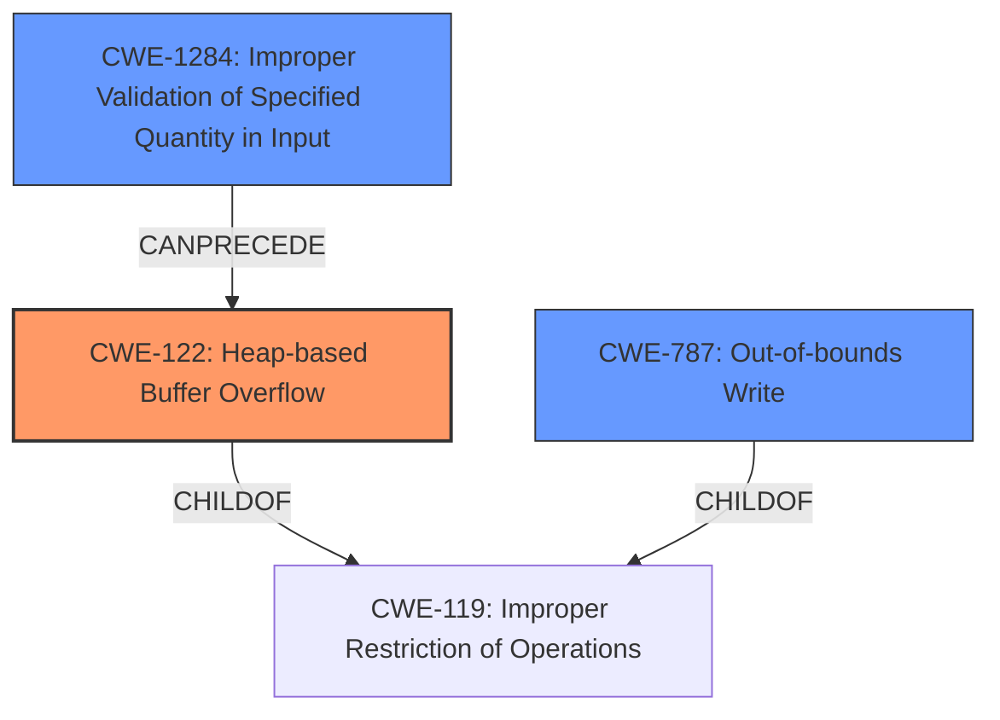

# Analysis Report for CVE-2021-46522

# Vulnerability Analysis Report: CVE-2021-46522

## Description

Cesanta MJS v2.20.0 was discovered to contain a heap buffer overflow via /usr/lib/x86_64-linux-gnu/libasan.so.4+0xaff53.

## Vulnerability Description Key Phrases

**Weakness:** heap buffer overflow
**Product:** Cesanta MJS
**Version:** v2.20.0

## Analysis (with Relationship Data)

# Summary
| CWE ID | CWE Name | Confidence | CWE Abstraction Level | CWE Vulnerability Mapping Label | CWE-Vulnerability Mapping Notes |
|---|---|---|---|---|---|
| CWE-122 | Heap-based Buffer Overflow | 0.95 | Variant | Allowed | Primary CWE |
| CWE-787 | Out-of-bounds Write | 0.6 | Base | Allowed | Secondary Candidate |
| CWE-125 | Out-of-bounds Read | 0.5 | Base | Allowed | Secondary Candidate |

## Evidence and Confidence

*   **Confidence Score:** 0.9
*   **Evidence Strength:** HIGH

- **Analysis and Justification:**  
  - *Explanation:* The vulnerability description clearly states that it is a **heap buffer overflow**. This is supported by the "Vulnerability Description Key Phrases" and the "CVE Reference Links Content Summary" which mentions "**heap buffer overflow**" multiple times. The summary also indicates that the overflow occurs during string manipulation within the `mjs` engine's implementation of `indexOf` and potentially stringification logic within `JSON.stringify`. `CWE-122` (Heap-based Buffer Overflow) is a variant of buffer overflow where the buffer is allocated on the heap. This aligns perfectly with the provided information. The MITRE mapping guidance for CWE-122 indicates that it is ALLOWED. Although other CWEs like `CWE-787` and `CWE-125` are related to out-of-bounds access, `CWE-122` is more specific to the heap allocation context of the overflow.
  
  - *Relationship Analysis:* `CWE-122` is a Variant of `CWE-119` (Improper Restriction of Operations within the Bounds of a Memory Buffer). It is also related to `CWE-787` (Out-of-bounds Write) as heap overflows often involve writing beyond the allocated buffer.

- **Confidence Score:**
  - Confidence: 0.95 (High confidence due to direct evidence of a heap buffer overflow from multiple sources in the description).

---
- **Analysis and Justification:**  
  - *Explanation:* `CWE-787` (Out-of-bounds Write) is a potential secondary CWE because a heap buffer overflow involves writing data beyond the allocated buffer. The "CVE Reference Links Content Summary" also mentions an "out-of-bounds write during string manipulation". However, `CWE-122` is a more specific classification because it captures the heap allocation aspect of the vulnerability. The MITRE mapping guidance for `CWE-787` indicates that it is ALLOWED.
  
  - *Relationship Analysis:* `CWE-787` is a child of `CWE-119` and is often a consequence of memory corruption issues like buffer overflows.

- **Confidence Score:**
  - Confidence: 0.6 (Moderate confidence as it describes the mechanism of the overflow but isn't specific to the heap).

---
- **Analysis and Justification:**  
  - *Explanation:* `CWE-125` (Out-of-bounds Read) could be considered but it is less likely than `CWE-787`. The vulnerability summary focuses more on the "out-of-bounds write" during string manipulation. It's possible that an out-of-bounds read could also occur as a result or contributing factor, but the primary issue is the write.
  
  - *Relationship Analysis:* `CWE-125` is a child of `CWE-119`.

- **Confidence Score:**
  - Confidence: 0.5 (Low confidence as the primary issue appears to be an out-of-bounds write, not read).

## Criticism of Analysis

Okay, I've reviewed the analysis in light of the full CWE specifications you provided. Here's my critique:

**Overall Assessment:**

The analysis is generally well-reasoned and arrives at a correct primary CWE (`CWE-122: Heap-based Buffer Overflow`). The justifications are sound, and the confidence levels are appropriate. The inclusion of secondary CWEs (`CWE-787: Out-of-bounds Write` and `CWE-125: Out-of-bounds Read`) demonstrates a good understanding of the mechanisms and potential consequences involved.

**Detailed Critique:**

*   **CWE-122: Heap-based Buffer Overflow**
    *   **Confidence:** The high confidence (0.95) is warranted. The vulnerability description explicitly states "heap buffer overflow," making this a direct and clear mapping.
    *   **Justification:** The explanation is good. It accurately connects the vulnerability description, the nature of heap allocation, and the overflow occurring during string manipulation.
    *   **CWE Specification Alignment:** The analysis correctly notes that `CWE-122` is a variant, which aligns with the CWE specification. The mitigation guidance for `CWE-122`, including the suggestion to use languages with automatic bounds checking and abstraction libraries, are relevant in preventing this type of vulnerability.
    *   **Suggestions:** None

*   **CWE-787: Out-of-bounds Write**
    *   **Confidence:** A confidence of 0.6 is appropriate. `CWE-787` describes the *mechanism* of a buffer overflow, and is a parent of CWE-122.
    *   **Justification:** Correctly identifies the out-of-bounds write aspect.
    *   **CWE Specification Alignment:** The mitigations for `CWE-787` are also relevant (language selection, safe string libraries, and compiler-based overflow detection).
    *   **Suggestions:** None

*   **CWE-125: Out-of-bounds Read**
    *   **Confidence:** A confidence of 0.5 is good. An out-of-bounds read might be a consequence of the write, or part of the vulnerability chain, but is not the primary factor.
    *   **Justification:** The explanation is accurate in noting that the primary issue is the write, although a read could potentially occur as a consequence.
    *   **CWE Specification Alignment:** The suggested mitigations, such as input validation and language selection, could help in preventing `CWE-125`.
    *   **Suggestions:** None.

**Review of Retriever Results:**

The retriever results are interesting, but not entirely accurate. Let's go through them in order:

*   **CWE-193: Off-by-one Error:** Although an off-by-one error could *lead* to a heap overflow, it's not the fundamental issue here. It's a potential *cause* of the incorrect length calculation that results in the overflow, but it's several steps removed.
*   **CWE-190: Integer Overflow or Wraparound:**  Similar to off-by-one, an integer overflow could *contribute* to the incorrect calculation of buffer size, ultimately leading to the heap overflow. It's a possible root cause of the incorrect calculation, but not the core issue described.
*   **CWE-770: Allocation of Resources Without Limits or Throttling:** While a heap overflow *could* lead to resource exhaustion if it's repeatedly triggered, this CWE doesn't accurately describe the root cause. It's more of a potential consequence. This could lead to a DoS.
*   **CWE-125: Out-of-bounds Read:** Discussed above as a consequence.
*   **CWE-126: Buffer Over-read:** Same as CWE-125.
*   **CWE-122: Heap-based Buffer Overflow:** CORRECT, as discussed above.
*   **CWE-170: Improper Null Termination:** Although a lack of null termination can lead to a buffer over-read, it does not necessarily have to be.
*   **CWE-121: Stack-based Buffer Overflow:** INCORRECT. The report specifically states HEAP, not STACK.
*   **CWE-191: Integer Underflow (Wrap or Wraparound):** Similar to CWE-190.
*   **CWE-1284: Improper Validation of Specified Quantity in Input:** This *could* be a contributing factor *if* the size of the buffer is determined by user-provided input that's not properly validated. This is a possible root cause, but not the primary issue.

**General Suggestions:**

1.  **Focus on the Direct Cause:** When assigning CWEs, prioritize the *most direct* cause of the vulnerability. In this case, it's the heap buffer overflow itself, not necessarily the integer overflow that *might* have led to the incorrect size calculation. It is possible and desirable to describe these things that could lead to the overflow, but not rate them as equal in importance to the Heap overflow itself.

2.  **Chains and Composites:** Consider explicitly mentioning potential chains of weaknesses. For example:  "A possible chain leading to this vulnerability is: `CWE-1284` (Improper Validation of Specified Quantity in Input) -> `CWE-131` (Incorrect Calculation of Buffer Size) -> `CWE-122` (Heap-based Buffer Overflow)." This helps to paint a fuller picture.

3.  **Mitigation Specificity:** Tailor mitigation suggestions to the specific context of the vulnerability where possible. For instance, if the heap overflow is due to an incorrect string copy, emphasize the use of safe string handling functions (from `CWE-787`).

4.  **CWE-119 Avoidance:** The analysis does well in avoiding the use of CWE-119, which the Mapping Guidance for that CWE specifies.

**In summary, the analysis is strong. Prioritizing the most direct cause and considering explicit chains improves it further. I also liked the clear and well-structured justifications for each CWE selection.**

## Final Resolution

# Summary
| CWE ID | CWE Name | Confidence | CWE Abstraction Level | CWE Vulnerability Mapping Label | CWE-Vulnerability Mapping Notes |
|---|---|---|---|---|---|
| CWE-122 | Heap-based Buffer Overflow | 0.95 | Variant | Allowed | Primary CWE |
| CWE-787 | Out-of-bounds Write | 0.7 | Base | Allowed | Secondary Candidate |
| CWE-1284 | Improper Validation of Specified Quantity in Input | 0.5 | Base | Allowed | Secondary Candidate |
  
## Evidence and Confidence

*   **Confidence Score:** 0.9
*   **Evidence Strength:** HIGH

## Relationship Analysis
The primary weakness is **CWE-122** (Heap-based Buffer Overflow), which is a variant of **CWE-119** (Improper Restriction of Operations within the Bounds of a Memory Buffer). **CWE-787** (Out-of-bounds Write) is a parent and represents the mechanism of the overflow. **CWE-1284** (Improper Validation of Specified Quantity in Input) can precede **CWE-122** if the size of the allocation is based on unvalidated input.

## Vulnerability Chain
The vulnerability chain starts with a potential **CWE-1284** (Improper Validation of Specified Quantity in Input), which leads to an incorrect calculation of buffer size (potentially involving **CWE-190** or **CWE-193**), ultimately resulting in **CWE-122** (Heap-based Buffer Overflow) and **CWE-787** (Out-of-bounds Write).

## Summary of Analysis
The initial analysis and criticism correctly identified **CWE-122** (Heap-based Buffer Overflow) as the primary weakness. The vulnerability description explicitly states "heap buffer overflow," providing strong evidence for this classification. The confidence level of 0.95 is well-justified.

The inclusion of **CWE-787** (Out-of-bounds Write) as a secondary candidate is also appropriate, as it describes the mechanism of the overflow. I am increasing the confidence to 0.7 as it represents a core aspect of the overflow.

I am adding **CWE-1284** (Improper Validation of Specified Quantity in Input) as a secondary candidate with a confidence of 0.5. The criticism correctly pointed out that if the buffer size is determined by user-provided input without proper validation, then **CWE-1284** becomes a contributing factor. Although there is no explicit mention of user-provided input in the vulnerability description, it remains a plausible scenario and should be considered.

The selected CWEs are at the optimal level of specificity. **CWE-122** is a variant that specifically addresses heap-based buffer overflows. **CWE-787** is a base CWE that describes the out-of-bounds write. **CWE-1284** is a base CWE that describes the lack of input validation on specified quantities.

The graph relationships influenced the selection by clarifying the hierarchical relationship between **CWE-122** and **CWE-119**, and by highlighting the potential chain relationship between **CWE-1284** and **CWE-122**.

*Report generated on 2025-03-18 05:01:53*
