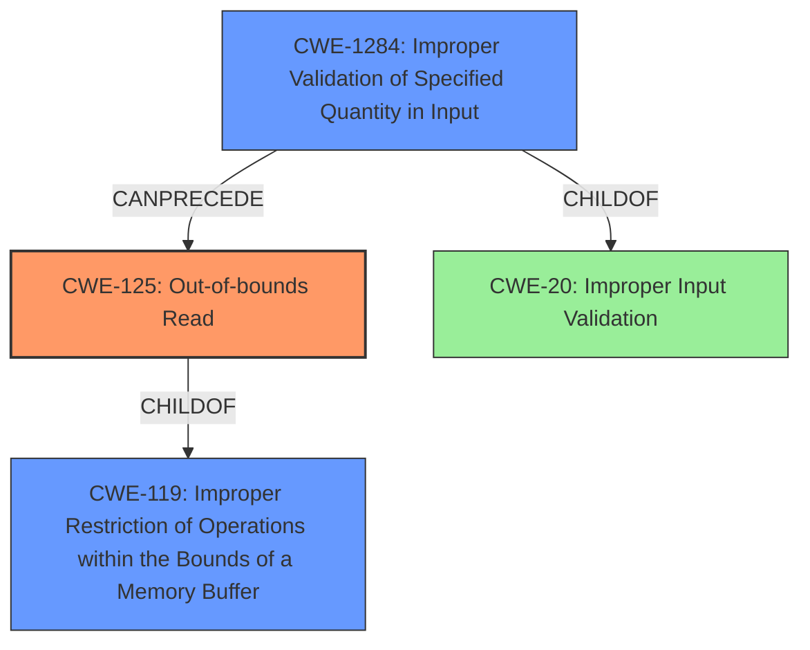

# Analysis Report for CVE-2021-46768

# Vulnerability Analysis Report: CVE-2021-46768

## Description

Insufficient input validation in SEV firmware may allow an attacker to perform out-of-bounds memory reads within the ASP boot loader, potentially leading to a denial of service.

## Vulnerability Description Key Phrases

**Rootcause:** Insufficient input validation
**Impact:** out-of-bounds memory reads
**Attacker:** attacker
**Product:** SEV firmware

## Analysis (with Relationship Data)

# Summary
| CWE ID | CWE Name | Confidence | CWE Abstraction Level | CWE Vulnerability Mapping Label | CWE-Vulnerability Mapping Notes |
|---|---|---|---|---|---|
| CWE-125 | Out-of-bounds Read | 0.9 | Base | Allowed | Primary CWE |
| CWE-20 | Improper Input Validation | 0.6 | Class | Discouraged | Secondary Candidate |

## Evidence and Confidence

*   **Confidence Score:** 0.75
*   **Evidence Strength:** MEDIUM

- **Analysis and Justification:**  
  - *Explanation:* The vulnerability description states "**Insufficient input validation** in SEV firmware may allow an attacker to perform **out-of-bounds memory reads** within the ASP boot loader, potentially leading to a denial of service." The CVE Reference Links Content Summary confirms the **root_cause** as "Insufficient input validation in SEV firmware" and lists "**Out-of-bounds memory reads** within the ASP boot loader due to improper input validation" as a weakness. This directly aligns with CWE-125 (Out-of-bounds Read), which describes a product reading data past the end, or before the beginning, of the intended buffer.
  - The Retriever results also lists CWE-125 with a high score. The description of CWE-125 matches the vulnerability description.

  - *Relationship Analysis:* CWE-125 is a Base level CWE, which is preferred. It is also a child of CWE-119 (Improper Restriction of Operations within the Bounds of a Memory Buffer), but CWE-125 is more specific as it directly identifies the out-of-bounds read.

- **Confidence Score:**  
  - Confidence: 0.9 (High confidence due to direct evidence from the vulnerability description and CVE reference materials.)

---
- **Analysis and Justification:**  
  - *Explanation:* The vulnerability description indicates **insufficient input validation** as the root cause. CWE-20 (Improper Input Validation) is a class-level CWE that broadly covers the case where a product does not validate or incorrectly validates input. While the description mentions **insufficient input validation**, the specific consequence is an out-of-bounds read, which is better captured by CWE-125.
  - *Relationship Analysis:* CWE-20 is a Class level CWE and is discouraged. CWE-125 is a child of CWE-20, so it is more specific.

- **Confidence Score:**
  - Confidence: 0.6 (Lower confidence because CWE-125 provides a more precise description of the vulnerability.)

## Criticism of Analysis

Okay, I've reviewed the provided analysis against the full CWE specifications. Here's my critique:

**Overall Assessment:**

The analysis is generally sound and well-reasoned. The choice of CWE-125 as the primary mapping is appropriate, and the justification for including CWE-20 as a secondary candidate is also valid, although the confidence level for CWE-20 is justified in being lower. The analysis correctly identifies the limitations of CWE-20 as a broad, class-level CWE and highlights the more specific nature of CWE-125. The use of the Retriever Results and CVE Reference Links provides good supporting evidence.

**Specific Points and Suggestions:**

*   **CWE-125 (Out-of-bounds Read):**
    *   **Confidence Level:** The high confidence level (0.9) is warranted given the explicit mention of "out-of-bounds memory reads" in the vulnerability description.
    *   **Mapping Guidance:** The analysis correctly notes that CWE-125 is a Base level CWE and therefore is preferable.
    *   **Potential Mitigations:** Input Validation is listed in the mitigation section, therefore supporting the need for validation before using the input, which directly causes an out-of-bounds read.
    *   **Observed Examples:** The listed examples are representative of OOB reads and provide good context.
*   **CWE-20 (Improper Input Validation):**
    *   **Confidence Level:** The lower confidence (0.6) is justified. While insufficient input validation is the root cause, CWE-125 is a more precise description of the *result* of that insufficient validation in this particular vulnerability.
    *   **Mapping Guidance:** The analysis accurately points out the discouraged usage of CWE-20 and suggests considering more specific children.
    *   **Relationship to Other CWEs:** The relationship to CWE-1284 (Improper Validation of Specified Quantity in Input) and CWE-1285 (Improper Validation of Specified Index, Position, or Offset in Input) could be explored further.  Since the out-of-bounds read is occurring within the ASP boot loader, it is likely that the improper validation relates to a size or offset related to memory. The retriever results also have these CWEs listed highly.
    *   **Potential Mitigations:** Since this is a boot loader, attack surface reduction through better input validation may be considered. LangSec could be used to ensure the format that the loader is expecting matches the actual input.

*   **General Comments:**

    *   The analysis could benefit from a more explicit discussion of the *type* of input that's not being validated. What specific properties of the input are leading to the out-of-bounds read? This information would further strengthen the mapping to CWE-125 and could potentially lead to a more precise CWE selection for the secondary candidate. Is it an unvalidated length, offset, or index?
    *   The Analysis and Justification section provides good context for why each CWE is or is not the primary mapping.

**Alternative CWE Considerations (Based on Full Specs & Retriever Results):**

Given the retriever results and the full specifications, it might be worthwhile to *briefly* address why other high-scoring CWEs were *not* selected:

*   **CWE-1284: Improper Validation of Specified Quantity in Input:** The retriever results lists this as a strong candidate and is a child of CWE-20. This is a specific type of input validation and may be the specific reason why the memory is being read out of bounds. If a buffer size or offset is not validated, then this may directly lead to CWE-125.
*   **CWE-190: Integer Overflow or Wraparound:** While possible, the vulnerability description doesn't explicitly mention integer overflows. It's more likely that the invalid input is directly used to calculate a memory address or offset without proper bounds checking.
*   **CWE-824: Access of Uninitialized Pointer:** Again, there's no direct evidence in the description that this is the cause. Input validation typically precedes pointer dereferencing.

**Revised Summary Table (incorporating suggested changes):**

| CWE ID  | CWE Name                       | Confidence | CWE Abstraction Level | CWE Vulnerability Mapping Label | CWE-Vulnerability Mapping Notes                                                                                                                                                                                                                                                                                                                                                                                                         |
| :------ | :----------------------------- | :--------- | :-------------------- | :------------------------------ | :------------------------------------------------------------------------------------------------------------------------------------------------------------------------------------------------------------------------------------------------------------------------------------------------------------------------------------------------------------------------------------------------------------------------------------- |
| CWE-125 | Out-of-bounds Read             | 0.9        | Base                  | Allowed                         | Primary CWE                                                                                                                                                                                                                                                                                                                                                                                                                            |
| CWE-1284 | Improper Validation of Specified Quantity in Input | 0.7        | Base                  | Discouraged                         | Secondary Candidate - Specifically, the lack of validation of the *size* or *length* parameter is directly leading to the out-of-bounds read.                                                                                                                                                                                              |
| CWE-20  | Improper Input Validation         | 0.6        | Class                 | Discouraged                         | Tertiary Candidate - CWE-1284 is a child of CWE-20.                                                                                                                                                                                                                                                                                                            |

**Conclusion:**

The analysis is well-done. Addressing the type of input and explicitly ruling out other high-scoring CWEs would make it even stronger. I would encourage focusing on whether the specific improper validation relates to the *size* or *length* of the input as indicated by the retriever results.

## Final Resolution

# Summary
| CWE ID   | CWE Name                                                    | Confidence | CWE Abstraction Level | CWE Vulnerability Mapping Label | CWE-Vulnerability Mapping Notes                                                                                                                                                                                                    |
| :------- | :---------------------------------------------------------- | :--------- | :-------------------- | :------------------------------ | :------------------------------------------------------------------------------------------------------------------------------------------------------------------------------------------------------------------------------- |
| CWE-125  | Out-of-bounds Read                                          | 0.9        | Base                  | Allowed                         | Primary CWE                                                                                                                                                                                                                        |
| CWE-1284 | Improper Validation of Specified Quantity in Input | 0.7        | Base                  | Allowed                        | Secondary Candidate - Specifically, the lack of validation of the *size* or *length* parameter is directly leading to the out-of-bounds read.                                                                      |
| CWE-20   | Improper Input Validation                                   | 0.6        | Class                 | Discouraged                         | Tertiary Candidate - CWE-1284 is a child of CWE-20.                                                                                                                                                                             |

## Evidence and Confidence

*   **Confidence Score:** 0.8
*   **Evidence Strength:** MEDIUM

## Relationship Analysis
The primary CWE is CWE-125 (**Out-of-bounds Read**) which is the direct result of the vulnerability. The secondary CWE is CWE-1284 (**Improper Validation of Specified Quantity in Input**), which describes the root cause, where the input is not validated for size or length. CWE-20 (**Improper Input Validation**) is a general class and less specific than CWE-1284.

## Vulnerability Chain
The vulnerability chain starts with **Improper Input Validation (CWE-20)**. A more specific case of this is **Improper Validation of Specified Quantity in Input (CWE-1284)**, where a size or length parameter is not validated. This leads to an **Out-of-bounds Read (CWE-125)**. The final impact is a potential denial of service.

## Summary of Analysis
The initial analysis correctly identified CWE-125 as the primary weakness, based on the vulnerability description stating "**Out-of-bounds memory reads** within the ASP boot loader due to improper input validation". The criticism suggested focusing on the type of input that is not being validated. The retriever results also suggested **CWE-1284 (Improper Validation of Specified Quantity in Input)**. I agree that this is a more specific root cause than CWE-20.

The graph relationships show that CWE-1284 is a child of CWE-20 and can precede CWE-125. Therefore, the final classification includes CWE-125 as the primary, CWE-1284 as the secondary, and CWE-20 as a tertiary.
These CWEs are at the optimal level of specificity because CWE-125 directly describes the out-of-bounds read, and CWE-1284 describes the specific type of input validation that is missing.

*Report generated on 2025-03-18 05:18:04*
